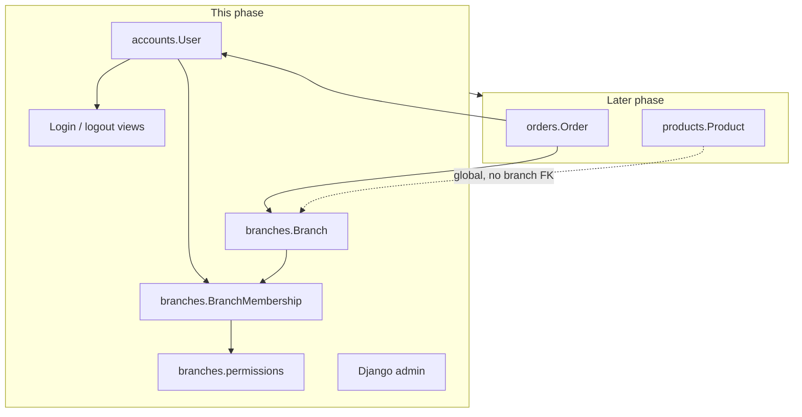
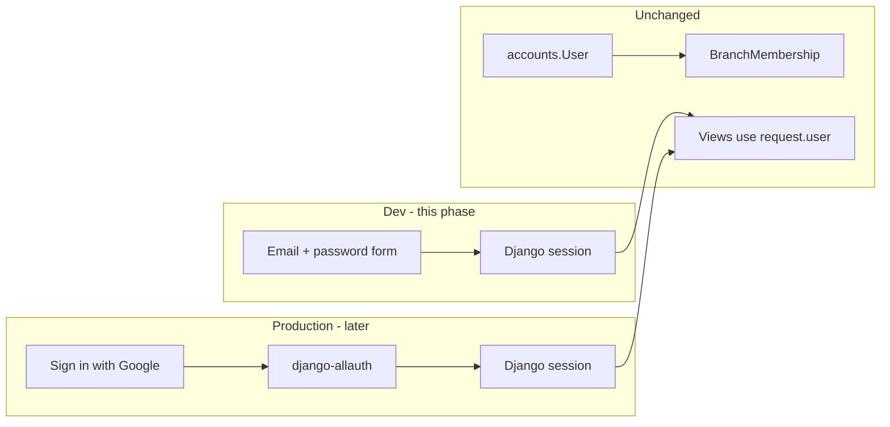

# Auth & Tenancy Foundation (Greenfield)

## Recommendation

**Yes — do this before orders.** Your instinct matches the design in [`docs/warehouse-tenancy-setup.md`](docs/warehouse-tenancy-setup.md) and the current project state:

- Orders will belong to a **branch** and **user**; building them without tenancy means retrofitting every queryset and view later.
- `AUTH_USER_MODEL` must be set **before** the first migration that depends on it — painful to change later, trivial on a fresh DB.
- The catalogue (`Product`) stays **central/global** (warehouse stock for all branches). Only **orders** (future) get `branch_id` — no change to [`products/models.py`](products/models.py) in this phase.

Greenfield (deleted DB) is the ideal moment: one clean `migrate` with the correct user model from day one.



---

## Scope (this phase)

**In:**
- `accounts` app — custom `User` (email login, no username)
- `branches` app — `Branch`, `BranchMembership`, role enum, `permissions.py` helpers
- `config/settings.py` updates — `AUTH_USER_MODEL`, `INSTALLED_APPS`, auth URLs, `LOGIN_REDIRECT_URL`
- Session login/logout (plain HTML templates, Django `LoginView` / `LogoutView`)
- Active branch in session (picker when user has multiple memberships)
- `@login_required` on catalogue page and API (first real use of auth)
- Django admin for `User`, `Branch`, `BranchMembership`
- Fresh migrations + seed instructions

**Out (next phase):**
- `Order` model and order views/API
- Offline order queue, cart, stock reservation
- Public signup / password reset (admin creates users for now)
- **Google OAuth** (production login) — not scaffolded in dev (see below)

---

## Google OAuth (production) — scaffold now?

**No — not during this dev phase.**

Reasons:
- Google OAuth adds setup noise (Google Cloud console, client ID/secret, redirect URIs, HTTPS, `django-allauth` or similar) that does not help you test branches, roles, or tenancy today.
- Local email + password via Django's built-in session auth is enough to develop and manually test all foundation behaviour.
- Your planned custom `User` with **email as `USERNAME_FIELD`** is the right shape for Google later — Google always provides an email, and `django-allauth` links social accounts to existing users by email.

**What we do now to stay Google-ready (no OAuth code):**

| Decision | Why |
|----------|-----|
| Email-only `User` (no username field) | Matches Google identity |
| Django sessions after login (`request.user`) | OAuth providers also end in a session; views/middleware don't care how login happened |
| Admin creates users + assigns `BranchMembership` | No public self-signup — in production, first Google login can match a pre-provisioned email or be rejected if no membership |
| Document production intent in README / `settings.example.py` | Comment block for future `GOOGLE_OAUTH_CLIENT_ID` env vars — no packages installed yet |

**Production phase (later, separate):**
- Add `django-allauth` (or `social-auth-app-django`)
- Configure Google provider; restrict to your Google Workspace domain if applicable
- Login page shows "Sign in with Google" instead of (or in addition to) password form
- Optional: disable password login in production via settings flag; keep password login in dev only



**Security note:** In production, Google OAuth replaces the *login mechanism*, not the *authorization model*. `BranchMembership` and `permissions.py` still gate what each user can do per branch — Google only proves identity.

---

## Greenfield migration strategy

Because the database is empty:

1. Ensure [`config/settings.py`](config/settings.py) sets `AUTH_USER_MODEL = "accounts.User"` **before** running `migrate`.
2. Keep existing [`products/migrations/0001_initial.py`](products/migrations/0001_initial.py) — it has no `User` FK, so order is fine: `accounts` → `branches` → `products` (or all in one `migrate`).
3. Run:

```bash
python manage.py makemigrations accounts branches
python manage.py migrate
python manage.py createsuperuser   # email + password
```

No need to delete `products` migrations unless `django.contrib.auth` default-user tables were already created in this DB (you said DB is deleted, so we're clean).

---

## New apps and files

### 1. `accounts` app

| File | Purpose |
|------|---------|
| `accounts/models.py` | `User` + `UserManager` per design doc (email-only `USERNAME_FIELD`) |
| `accounts/admin.py` | `UserAdmin` with email fieldsets |
| `accounts/urls.py` | `login/`, `logout/` |
| `accounts/views.py` | Thin wrappers or defaults around Django auth views |
| `accounts/templates/accounts/login.html` | Plain HTML login form |

### 2. `branches` app

| File | Purpose |
|------|---------|
| `branches/models.py` | `Branch`, `BranchMembership` (roles: admin, manager, user) |
| `branches/admin.py` | List/filter for branches and memberships |
| `branches/permissions.py` | `get_membership`, `can_create_order`, `can_edit_or_delete_order`, `can_manage_branch_users` (ready for orders; unused until then) |
| `branches/middleware.py` or `branches/context.py` | Resolve `request.active_branch` from session; redirect to branch picker if ambiguous |
| `branches/views.py` | `select_branch` view + template |
| `branches/templates/branches/select_branch.html` | Simple branch picker |

### 3. Settings ([`config/settings.py`](config/settings.py) — local, gitignored)

Add to existing local settings:

```python
INSTALLED_APPS = [
    # ...
    "django.contrib.auth",
    "django.contrib.contenttypes",
    "django.contrib.sessions",
    "django.contrib.messages",
    "django.contrib.staticfiles",
    "accounts",
    "branches",
    "products",
]

AUTH_USER_MODEL = "accounts.User"

LOGIN_URL = "/accounts/login/"
LOGIN_REDIRECT_URL = "/"
LOGOUT_REDIRECT_URL = "/accounts/login/"

MIDDLEWARE = [
    # ...
    "django.contrib.sessions.middleware.SessionMiddleware",
    "django.contrib.auth.middleware.AuthenticationMiddleware",
    "branches.middleware.ActiveBranchMiddleware",  # new
]
```

Also add [`config/settings.example.py`](config/settings.example.py) to the repo (no secrets) so setup is documented without committing credentials.

### 4. URL wiring ([`config/urls.py`](config/urls.py))

```python
path("accounts/", include("accounts.urls")),
path("branches/", include("branches.urls")),
```

### 5. Protect catalogue ([`products/views.py`](products/views.py))

- Add `@login_required` to `product_list` (API) and `product_page`
- Unauthenticated API returns 401/403 JSON; browser redirects to login

**Note:** Service Worker and offline catalogue still work for logged-in users; login page itself requires network on first visit (acceptable for this phase).

---

## Active branch behaviour

| Scenario | Behaviour |
|----------|-----------|
| User has 0 memberships | Logged in but shown a "no branch access" message |
| User has 1 membership | Auto-set `request.session["active_branch_id"]` |
| User has 2+ memberships | Redirect to `/branches/select/` until one is chosen |
| User switches branch | Picker updates session; future order views will use this |

Helper: `get_active_branch(request)` used by views/middleware.

---

## Manual test checklist (after implementation)

1. `migrate` on empty DB succeeds
2. `createsuperuser` prompts for email (not username)
3. `/admin/` — create 2 branches, 2 branch users, memberships with different roles
4. One user with memberships in **two** branches — confirm picker appears
5. Logged-out user hitting `/` or `/api/products/` is redirected / denied
6. Logged-in user with membership sees catalogue as before
7. Permission helpers importable from `branches.permissions` (no orders to test yet)

---

## Docs to update after implementation

- [`README.md`](README.md) — move auth/branches from "not built" to "built"; note `settings.example.py`
- [`AGENTS.md`](AGENTS.md) — reflect `accounts` and `branches` apps exist
- [`.cursor/rules/tenancy-future.mdc`](.cursor/rules/tenancy-future.mdc) — narrow scope to orders-only (tenancy foundation will be done)

---

## Why not orders yet

Keeps this phase focused on one concept (identity + tenancy). When orders arrive, they plug into existing `Branch`, `BranchMembership`, `permissions.py`, and `active_branch` session — no auth rework.
