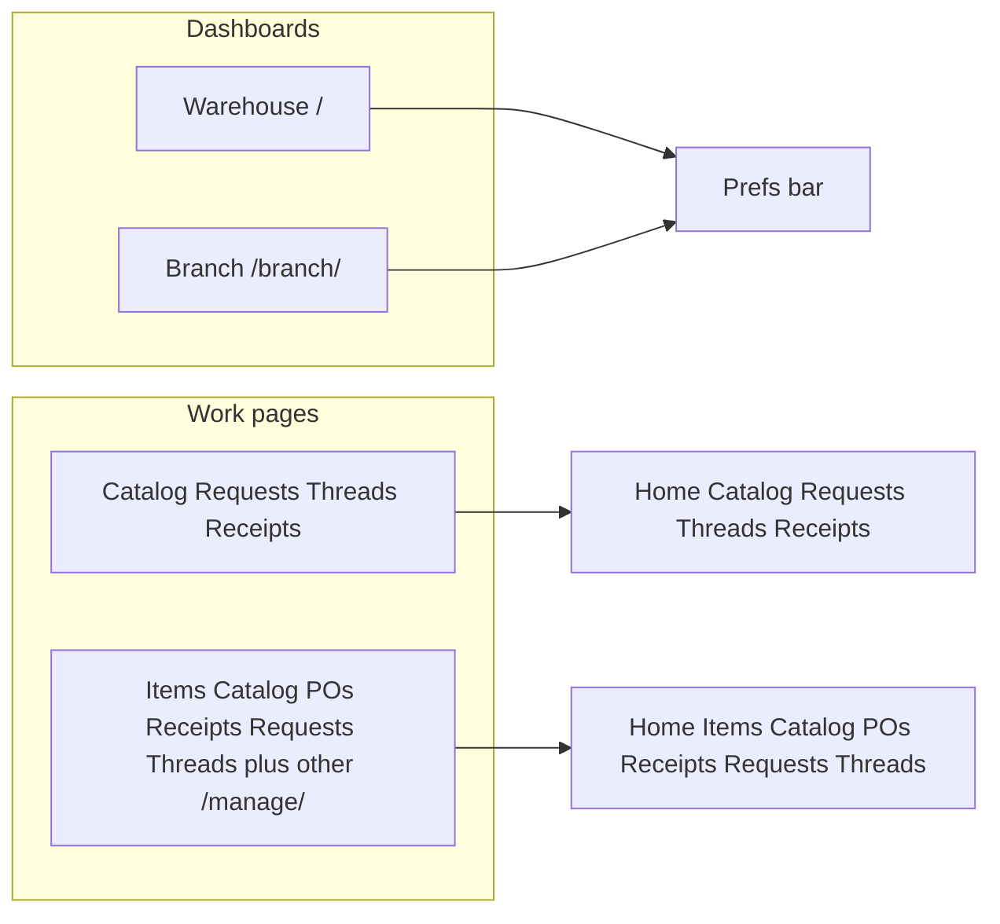

# Dashboard vs work-page chrome (greenfield)

Treat existing chrome as replaceable. Two explicit header variants, used on **both** sides — no `active_nav` boolean soup, and no “Phase 8 later” deferral for this strip.

**Dashboards** (`/` and `/branch/`): language + theme + Settings. Navigation is the **card grid** only.

**Work pages**: sibling URL strip + Settings. No language/theme controls (choice from the dashboard still applies via `localStorage`).

## 1. Branch — two includes

Replace the one-size [`branch_page_header.html`](branches/templates/branches/includes/branch_page_header.html) with:

- **Dashboard header** — heading, prefs bar, Switch branch, Settings. Used only by [`branches/templates/branches/dashboard.html`](branches/templates/branches/dashboard.html).
- **Work-page header** — heading, sibling nav (Home / Catalog / Requests / Threads / Receipts), Switch branch, Settings. Used by catalog, requests, threads, receipts.

Shared bits (eyebrow, role line, Switch branch, Settings) can live in a tiny third include so the two headers do not copy-paste the whole block. Keep loading [`preferences_bar.js`](products/static/products/js/preferences_bar.js) on work pages: `bind()` already no-ops missing `#pref-language` / `#pref-theme`, and `applyStaticI18n()` still translates nav + Settings.

## 2. Warehouse — sibling nav on every `/manage/` console

New include e.g. [`products/templates/products/includes/warehouse_page_nav.html`](products/templates/products/includes/warehouse_page_nav.html), placed in the existing `.topbar` (flex-wrap; item console already has Families / Suppliers there).

**Strip destinations** (same six operational cards as the warehouse dashboard, plus Home). Admin-only limits, Django admin, cost trends, and Company Voice stay **dashboard cards only** — same as Company Voice on the branch side.

| Label | URL |
|-------|-----|
| Home | `/` |
| Items | `/manage/items/` |
| Catalog | `/manage/catalog/` |
| POs | `/manage/purchase-orders/` |
| Receipts | `/manage/goods-receipts/` |
| Requests | `/manage/internal-requests/` |
| Threads | `/manage/threads/` |

Include the strip on all current topbar consoles so you can leave them: item console, manager catalog, POs, goods receipts, internal requests, warehouse threads, **plus** cost trends, PO limits, and branch caps. Mark `aria-current="page"` via an `active_nav` passed from each view (or a `` at the include site).

**Remove the one-off links** that the strip replaces:

- [`orders/templates/orders/internal_requests.html`](orders/templates/orders/internal_requests.html) “Branch caps”
- [`orders/templates/orders/branch_approval_limits.html`](orders/templates/orders/branch_approval_limits.html) “Requests”

Reuse `.topbar-nav-link` / a small `.warehouse-nav` in [`console.css`](products/static/products/css/console.css) (bump `?v=18` everywhere that stylesheet is referenced).

**Not in this strip:** Company Voice, branch picker, `/admin/` (its own chrome).

## 3. i18n and cache-bust

Warehouse consoles walk **all** `[data-i18n]` and `t()` missing keys into the key name. Add short `navWarehouse*` keys (EN + PT) to:

- [`preferences_bar.js`](products/static/products/js/preferences_bar.js)
- each dict that applies to the whole document: [`console.js`](products/static/products/js/console.js), [`catalog.js`](products/static/products/js/catalog.js), [`purchase_orders.js`](procurement/static/procurement/js/purchase_orders.js), [`goods_receipts.js`](inventory/static/inventory/js/goods_receipts.js), [`cost_trends.js`](products/static/products/js/cost_trends.js), warehouse threads inline i18n

Pages with **no** page-level i18n (internal requests, both limits consoles) keep [`preferences_bar.js`](products/static/products/js/preferences_bar.js) so the strip still translates.

Bump `?v=` on every changed JS/CSS in **every** template that references it (including the branch Service Worker list if `preferences_bar.js` changes).

## 4. Tests

- Branch dashboard: `pref-language` / `pref-theme` present; `branch-nav` / `navBranchCatalog` absent; card hrefs stay.
- Branch catalog / requests / threads: nav present; `pref-language` absent.
- Warehouse dashboard: still has prefs; **no** warehouse sibling nav.
- One warehouse work page (e.g. item console or catalog): strip present, `pref-language` absent; `aria-current` on the right link.
- Internal-requests / branch-caps: one-off cross-links gone; shared strip present.

## 5. Manuals (EN + matching pt-PT)

- [`04-internal-requests.md`](docs/user-manuals/en/04-internal-requests.md) §2: dashboard = cards only; work pages keep the five-link strip. Language/theme only on `/` and `/branch/`. Fix the screenshot caption (“card grid and top navigation”).
- Warehouse manuals that describe the top bar ([`01-items.md`](docs/user-manuals/en/01-items.md), [`02-purchase-orders.md`](docs/user-manuals/en/02-purchase-orders.md), [`03-goods-receipts.md`](docs/user-manuals/en/03-goods-receipts.md), [`07-manager-catalog.md`](docs/user-manuals/en/07-manager-catalog.md), [`08-request-threads.md`](docs/user-manuals/en/08-request-threads.md)): sibling strip on `/manage/…` pages; language/theme still only on the dashboards. Point “branch catalog” language sentences at `/branch/`.

## 6. Verification

- `.venv/bin/python manage.py test products accounts procurement inventory branches orders threads --noinput`
- Browser: warehouse `/` (prefs, no strip) → `/manage/items/` (strip, no prefs, Families still work); branch `/branch/` (prefs, no strip, cards) → `/branch/catalog/` (strip, no prefs, language from dashboard still applies).
