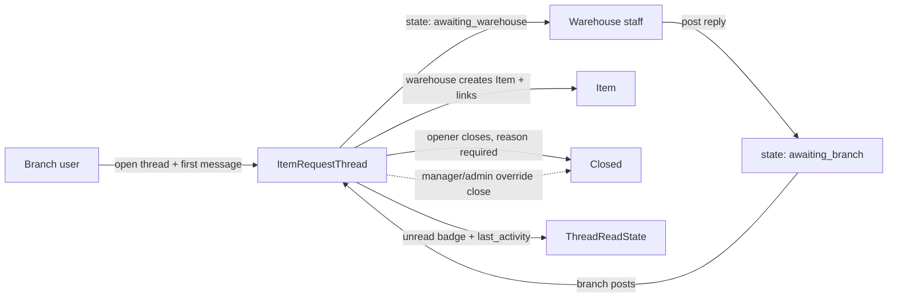

# Branch request threads (catalogue-gap requests)

**Status:** **Spec approved by Pedro (23 Aug 2026) — not yet implemented.** New feature; no code exists for this yet.

**Origin:** Gap in the existing loops. Today a branch can only requisição items that **already exist** in the `Item` table. When the branch needs something the warehouse has never catalogued, there is no written channel to get it created. This plan adds a **thread** (conversation) between the originating branch and main office to agree the request in writing; the warehouse then creates the item.

**Third-opinion review:** An independent design review was run on 23 Aug 2026 (see §12). Its five HIGH + four MEDIUM findings are **folded into this spec** — they are decisions here, not open questions.

---

## Goal

A branch user opens a **thread**, describes the needed item in free text (no item picker — it does not exist yet), and sends it to the warehouse. Warehouse staff engage in the thread; both sides exchange messages until they understand each other. The warehouse creates the item (normal catalogue workflow) and the thread can be **linked** to it. The thread stays open while the branch's need is unsatisfied. **Only the person who opened the thread can close it** (with a reason); branch managers/admins (and warehouse admin) may force-close as an override in exceptional circumstances. Unread state and a last-activity signal make the conversation visible on both sides without email.

---

## Locked decisions (from Pedro + review, 23 Aug 2026)

| Topic | Choice |
|-------|--------|
| Purpose | Written channel for items **not in the `Item` table** — the warehouse will procure/create the item discussed |
| Thread open | Any branch user (operator/manager/admin) of the originating branch opens it; **branch must be active** (mirror `_ensure_branch_active` in `orders/services.py`) |
| Who posts | **Anyone with access** — that branch's users + warehouse staff (all warehouse groups) |
| Who closes | **Only the opener** (normal path). **Override:** branch manager/admin may force-close in exceptional circumstances; warehouse **admin** may also force-close (abandoned/duplicate threads) — reason required on every close. Override checks the **closer's** role, never the opener's (a deactivated opener must not block a legitimate close) |
| Close reason | **Required**. Default choice **"Request Satisfied"**; alternative **"Other"** with a textbox (≤ 255 chars) |
| States | Open with **awaiting** sub-states: **Awaiting warehouse** / **Awaiting branch** (a post flips to the other side's turn; same-side posts keep state). **Closed** = terminal |
| Initial state | **Awaiting warehouse** (the thread is addressed to them) |
| Visibility | Originating branch + main office only. Other branches get **nothing** — invisible (404 pattern, same as existing branch isolation). Warehouse sees **all** threads **including inactive-branch threads, flagged** (they are not zombies) |
| Read / unread | **In-app read-cursor:** `ThreadReadState(thread, user, last_read_at)` + `RequestThread.last_activity_at`; unread badge + "needs your attention" sort. No email in this phase |
| Turn/side | **Explicit** `side` (branch|warehouse) passed into `post_message` from the view — never inferred from identity (dual warehouse+branch users exist, e.g. `branch.dual@`) |
| Traceability | Plain **M2M to `Item`** + mandatory changelog entry (`item_linked` with who/when). Through-model only if needs grow. **Linking allowed after close** (opener may close right as the item lands). UI nudges to link on close |
| Messages | Append-only (no edit/delete) — audit-by-design. Changelog is **lifecycle-only** (`created`, `item_linked`, `closed`) — messages themselves are the conversation audit |
| Thread → requisição | **No auto-convert.** Once the item exists, the branch opens a normal `InternalRequest` (documented in the manual). Optional `linked_request` FK = future nice-to-have |
| Warehouse gate | **Capability-based, not Django-perm-based** — `sync_warehouse_groups()` only syncs `products, procurement, inventory, orders` (`accounts/groups.py` `CATALOG_APP_LABELS`), so a new `threads` app has **no** group perms. Use `is_warehouse_staff()` (= warehouse group + active) and `can_force_close_thread()` (= warehouse admin), mirroring `can_adjust_stock`. Do **not** touch `sync_warehouse_groups` |
| Stale threads | Surface awaiting-age on both lists; **oldest-awaiting first** so nothing rots; override close is the remedy |
| Lists | Server-side **pagination** (M7 pattern) + branch/status filters on the warehouse list; per-thread assignment = nice-to-have (awaiting-warehouse = de-facto unassigned queue) |
| Scope | Conversation only. No offline, no email notifications, no item creation inside the thread (the warehouse creates items via the existing item console) |
| Naming | Model `ItemRequestThread` (avoids conceptual collision with `InternalRequest`); UI term **Request thread** / pt-PT term picked during Slice 2 i18n (suggest **"Fio de pedido"** or **"Conversa de pedido"** — confirm with Pedro) |
| i18n bar | Follow the **item-console** `CONSOLE_I18N` pattern (EN + pt-PT), not the English-only branch console |



---

## Why a new app

`branches` owns tenancy; `orders` owns priced requisições against existing items. A thread is neither: it is an **unpriced, free-text conversation** about an item that does not exist yet. A dedicated app keeps the state machine, isolation, and read-state in one place and avoids overloading `orders`.

**App name:** `threads` (models: `ItemRequestThread`, `ThreadMessage`, `ThreadReadState`, `ItemRequestThreadChangeLog`). Registered in `INSTALLED_APPS` + `config/urls.py` (Slice 1 — do not forget wiring; the plan's todos include it).

---

## 3. Models (proposed)

### `ItemRequestThread`

| Field | Type | Notes |
|-------|------|-------|
| `branch` | FK → `Branch`, `PROTECT` | originating branch |
| `opened_by` | FK → `accounts.User`, `PROTECT` | the opener — only they close (normal path) |
| `subject` | `CharField` | short title, required, trimmed, e.g. "Need a 25mm brass valve" |
| `status` | `CharField` choices | `awaiting_warehouse` / `awaiting_branch` / `closed`; add `.open()`/`.closed()` helpers |
| `last_activity_at` | `DateTimeField` | denormalized (D5 philosophy) — set on every create/post/close; ordering key |
| `message_count` | `PositiveIntegerField` | denormalized counter |
| `closed_by` | FK → `User`, nullable | opener, or override (manager/admin/warehouse admin) |
| `closed_at` | `DateTimeField`, nullable | |
| `close_reason` | `CharField` choices, nullable | `request_satisfied` (default) / `other` |
| `close_reason_text` | `CharField(255)`, blank | required when reason = `other` |
| `items` | M2M → `Item`, blank | traceability — linked by warehouse once created (allowed post-close) |
| timestamps | auto | |

Indexes: `(branch, status)`, `-last_activity_at`.

### `ThreadMessage`

| Field | Type | Notes |
|-------|------|-------|
| `thread` | FK → `ItemRequestThread`, `CASCADE` | |
| `author` | FK → `User`, `PROTECT` | |
| `side` | `CharField` choices | `branch` / `warehouse` — set **explicitly by the view** (dual-user rule) |
| `body` | `TextField` | free text, required, trimmed |
| `created_at` | auto | append-only |

### `ThreadReadState`

| Field | Type | Notes |
|-------|------|-------|
| `thread` | FK → `ItemRequestThread`, `CASCADE` | |
| `user` | FK → `User`, `CASCADE` | |
| `last_read_at` | `DateTimeField` | updated when the user opens the thread |
| `unique(thread, user)` | | one cursor per participant |

### `ItemRequestThreadChangeLog`

Mirror the house pattern (`user`, `action`, `changes` JSON, `reason`, `created_at`). Actions: `created`, `item_linked`, `closed`. (Messages are not logged here — they are their own audit.)

---

## 4. State machine

```text
opened (awaiting_warehouse) ──warehouse posts──▶ awaiting_branch
awaiting_branch ──branch posts──▶ awaiting_warehouse
awaiting_* ──opener closes (reason)──▶ closed
awaiting_* ──branch manager/admin override──▶ closed   (reason required)
awaiting_* ──warehouse admin override──▶ closed        (reason required)
```

- A post by the **same side that already holds the turn** keeps the state unchanged (e.g. two warehouse replies in a row stay `awaiting_branch`).
- **Closed is terminal** — no reopen, no new messages (new thread instead). No cancel/delete of a thread.
- **Concurrency:** `post_message` and `close_thread` both `select_for_update().get()` the thread; `post_message` re-checks `status != closed` and raises `ThreadClosedError` if closed (post-vs-close race — the reviewer's HIGH #2).

---

## 5. Permissions (capability-based)

| Capability | Branch user (originating branch) | Warehouse staff | Other branches |
|-----------|:---:|:---:|:---:|
| List own threads | ✅ (own branch only) | ✅ (all, incl. inactive-branch flagged) | ❌ 404 |
| Open thread | ✅ (branch active) | ❌ (not a branch feature) | — |
| Post message | ✅ (explicit `side=branch`) | ✅ (`side=warehouse`) | ❌ 404 |
| Link created item(s) | ❌ | ✅ (warehouse) | — |
| Close (normal) | ✅ **opener only** | ❌ | — |
| Close (override) | ✅ branch **manager/admin** | ✅ warehouse **admin** (`can_force_close_thread`) | — |

- Branch access = membership in `thread.branch` (reuse `branches` tenancy; other branches → **404**, never 403).
- Warehouse access = **capability** `is_warehouse_staff(user)` = `warehouse_group_name(user) is not None` + `is_active` — **not** Django `threads.*` permissions (they don't exist; `sync_warehouse_groups` covers only the four catalog apps).
- `can_force_close_thread(user)`: branch → `branch_role(user, thread.branch) in {manager, admin}`; warehouse → `warehouse_group_name(user) == "warehouse_admins"` (mirror `can_adjust_stock`).
- All mutations through `threads/services.py` (house convention).

---

## 6. Services (`threads/services.py`)

- `create_thread(branch, opened_by, subject, first_message)` → validate **branch active** (`_ensure_branch_active`), non-empty trimmed subject/body; status `awaiting_warehouse`; write thread + first `ThreadMessage(side="branch")` + changelog; set `last_activity_at`/`message_count`.
- `post_message(thread, user, body, side)` → lock thread (`select_for_update`); reject closed (`ThreadClosedError`); append message; flip state to the other side (or keep if same side); bump `last_activity_at`/`message_count`.
- `close_thread(thread, user, reason, reason_text="")` → lock; **opener only**, or **override** (branch manager/admin of that branch via closer's role, or warehouse admin). Reason required; `other` requires text. Sets `closed_by`/`closed_at`; changelog with reason.
- `link_items(thread, user, items)` → warehouse staff only; attach `Item`(s) (allowed post-close); changelog `item_linked` with who/when.
- `mark_read(thread, user)` → upsert `ThreadReadState.last_read_at = now`.
- `unread_count(user)` / `needs_attention(user)` → threads with `last_activity_at > last_read_at` (or no row), for badges + sorting.
- QuerySet helpers: `.for_branch(branch)`, `.for_user_branches(user)`, `.for_warehouse()` — mirror `orders`/`branches` tenancy patterns.

---

## 7. URLs / UI

| URL | Audience | Purpose |
|-----|----------|---------|
| `/branch/threads/` | branch | List own threads (unread badge, awaiting-age) + **New thread** (subject + first message) |
| `/branch/threads/<id>/` | branch | Thread view + reply box + close dialog (opener / manager / admin) |
| `/manage/threads/` | warehouse | List **all** threads (all branches **incl. inactive, flagged**; branch + status filters; pagination; oldest-awaiting-first sort) |
| `/manage/threads/<id>/` | warehouse | Thread view + reply box + link-item (once created, also post-close) + admin force-close |
| `/api/branch/threads/` | JSON | Branch list/create/messages/mark-read |
| `/api/manage/threads/` | JSON | Warehouse list/messages/link/force-close |

- Console style: plain JS, drawers/dialogs, `Escape` to close, per-user timezone, item-console **i18n pattern** (EN + pt-PT), author badges showing **branch vs warehouse** provenance per message.
- Settings-gear: follow the simpler header used by the internal-requests console (no gear there yet); don't restyle `/`.
- Dashboard `/` gains links to `/manage/threads/` and `/branch/threads/` (both consoles are already listed on `/` — add the new ones).

---

## 8. Slices (one per session; suite green before next)

**Slice 1 — Models + services + wiring.** `threads` app, `INSTALLED_APPS` + `config/urls.py`, migrations (incl. `ThreadReadState`, `last_activity_at`, `message_count`, indexes), state machine, close rules (opener vs override incl. deactivated-opener), `ThreadClosedError` + row locks on post/close, explicit `side`, access helpers. Tests: state flips, opener-only close, override matrix, reason required (`other` ⇒ text), other-branch 404, post-vs-close race, capability gating.

**Slice 2 — Branch UI.** `/branch/threads/` list + create + thread view + reply + mark-read + unread badge. Tests: branch user flow, posting flips state, no access to other branches.

**Slice 3 — Warehouse UI.** `/manage/threads/` all-branches list (incl. inactive-branch flagged) + filters + pagination + thread view + reply. Tests: warehouse sees all, posts flip to `awaiting_branch`, branch-only user 403/404 on manage URL, inactive-branch threads visible.

**Slice 4 — Close + override UX.** Close dialog with reason (default "Request Satisfied" / "Other" + textbox); override buttons visible only for branch manager/admin and warehouse admin; stale-awaiting cue (age shown, oldest-awaiting-first). Tests: UI-level close paths + permission guards.

**Slice 5 — Traceability.** Warehouse links created `Item`(s) to the thread (incl. post-close); item links shown in both views; link nudge on close. Tests: link permission, link visible branch-side, audit row, post-close link.

**Slice 6 — Polish + docs + seed.** Seed sample thread (North branch, awaiting warehouse); user manual `08-request-threads.md` (incl. the **no-auto-convert** thread→requisição note); tick handoff (test command + dashboard links) / PROJECT-PLAN / README / AGENTS. Full suite green.

---

## 9. Test command

```bash
.venv/bin/python manage.py test products accounts procurement inventory branches orders threads --noinput
```

---

## 10. Out of scope (this phase)

- Item creation inside the thread (warehouse uses the existing item console).
- Email / push notifications on new posts (Phase 6 pattern — optional later; the read-cursor is the in-app substitute).
- Reopen, edit/delete messages, thread deletion, per-branch thread visibility to warehouse subsets.
- Attachments, offline/PWA, reactions, typing indicators.
- Per-thread assignment to a specific warehouse user (awaiting-warehouse is the shared queue; nice-to-have later).
- `linked_request` FK (thread → requisição) — nice-to-have later; document the manual handoff instead.

---

## 11. Notes for the implementer

- Follow the house rules: all mutations via `services.py`; audit-by-design; `select_for_update()` on both `post_message` and `close_thread` (lock the thread row); EN + pt-PT via the item-console i18n pattern; plain JS; no new frameworks.
- `close_reason` default "Request Satisfied" matches Pedro's wording — the UI should pre-select it.
- Override close is an **exceptional** path: log who overrode and why (change log `reason`), and surface it in the thread history so the opener sees it was force-closed.
- **Do not** add `threads` to `accounts/groups.py` `CATALOG_APP_LABELS` or `sync_warehouse_groups()` — the warehouse gate is capability-based by design.

---

## 12. Third-opinion review (23 Aug 2026) — findings & disposition

Independent design review run against the repo (read-only). All findings are **resolved in this spec**:

| # | Sev | Finding | Disposition |
|---|-----|---------|-------------|
| 1 | HIGH | No read/unread/notification | `ThreadReadState` + `last_activity_at`, badge + sort — Slice 1 (§3, §6) |
| 2 | HIGH | Post/close race, closed-post | Lock on post, `ThreadClosedError`; `link_items` allowed post-close (§4, §6) |
| 3 | HIGH | Warehouse gate breaks (no `threads.*` perms) | Capability gate `is_warehouse_staff()` / `can_force_close_thread()`; verified `CATALOG_APP_LABELS = products, procurement, inventory, orders` (§5, §11) |
| 4 | HIGH | Inactive-branch zombies | Warehouse list includes them (flagged); `create_thread` validates active branch (§2, §5, Slice 3) |
| 5 | HIGH | Stale awaiting unsurfaced | Show age, order oldest-awaiting first (§2, Slice 4) |
| 6 | MED | Dual-user side ambiguity | Explicit `side` param into `post_message` (§2, §6) |
| 7 | MED | Traceability model | Plain M2M + mandatory changelog; through-model later; link nudge (§2, §3) |
| 8 | MED | Thread→requisição undocumented | Document no-auto-convert; `linked_request` NTH (§2, Slice 6) |
| 9 | MED | List pagination/filter/assignment | Server pagination + filters (M7); assignment NTH (§2, §7) |
| 10 | MED | Denormalize activity/count | `last_activity_at`/`message_count`, index `(branch, status)` (§3) |
| 11–18 | LOW | deactivation, validation, naming, i18n bar, author badge, gear, changelog redundancy, app registration | All folded into §2/§3/§5/§7/§8 |
| 19–22 | NICE | cross-link, assignment, read-audit, email seam | Deferred (§10) |

**Review verdict (adopted):** *Conditionally ready — implement, but fold the five HIGH items + the dual-user side rule into the spec before/within Slice 1.* The dedicated `threads` app, single `status` with three choices, and six-slice decomposition stand; no locked D-decision is violated (close-reason maps to D19; denormalization mirrors D5; isolation reuses the 404 pattern).
