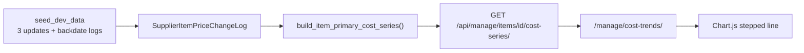

# Cost price trends — demo graph

## Design goal (inflation-first)

This is **graph 1 of 2**. Graph 2 (later) will show **inflation % over the same filtered range**, derived from graph 1. The admin/manager use case is: *“How much did our reference purchase cost for this SKU move over the period I selected?”* — not supplier comparison, not PO negotiation noise, not retail selling price (that lives in `ItemChangeLog` and is a separate future metric).

**Recommended metric for graph 1:** **effective primary buying cost** — a single stepped line replayed from [`SupplierItemPriceChangeLog`](products/models.py), using the same rule the app already uses for catalogue buying cost (`primary=True` row’s `cost_price`).

**Why this is the best single line for inflation:**

| Option | Inflation fit | Verdict |
|--------|---------------|---------|
| Primary effective cost (change-log replay) | Matches “reference purchase price” used across catalogue/PO defaults; one clean series; inflation = `(cost_at_end − cost_at_start) / cost_at_start` on carry-in + in-range points | **Use this** |
| One fixed supplier’s cost only | Pure supplier quote trend, but breaks when primary changes; requires extra supplier picker | Secondary / future toggle |
| All suppliers as multiple lines | Useful for sourcing, not one inflation number | Too busy for v1 |
| PO line `unit_cost` | Reflects deals/discounts; sparse; hard to “roll” continuously | Wrong series for catalogue inflation |
| Retail / selling price (`ItemChangeLog`) | Margin / customer-price inflation, not input cost | **Separate graph later** if needed |

**Caveat to document for admins:** if **primary supplier switches** mid-range, a step may reflect *sourcing change* (cheaper supplier promoted) rather than *market inflation*. Graph 1 should expose `supplier_name` per point so a future UI can flag primary switches; inflation graph 2 should use **start vs end effective primary cost** in the selected window (same boundaries as the filter) and optionally show a note when primary changed inside the range.

**Prepare graph 2 now (API only, no UI):** return `summary: { start_cost, end_cost, change_pct }` alongside `points` so inflation is computed once server-side from the same replay — client graph 2 reuses it.

## Scope

- **Metric:** primary supplier **effective buying cost** (inflation-first; user confirmed primary over multi-supplier lines).
- **Data source:** existing [`SupplierItemPriceChangeLog`](products/models.py) — no schema change.
- **Audience:** warehouse staff on [`staff_dashboard`](products/views.py) (`@catalog_required`, same gate as manager catalog).
- **Not in scope (v1):** inflation % chart UI, branch UI, PO overlay, retail-price series, presentation deck mocks.

## Architecture



**Replay logic** (new in [`products/services.py`](products/services.py)):

1. Load all `SupplierItemPrice` rows for the item with `change_logs` ordered by `created_at` ascending.
2. Walk logs chronologically; maintain per-row `cost_price` and which row is **primary**.
3. On `CREATED`: set row cost from `changes["cost_price"]`; if `primary`, that becomes effective buying cost.
4. On `UPDATED`: apply `cost_price` old/new; apply `primary` old/new (including demotions logged by `_clear_other_primaries`).
5. Emit a point whenever **effective primary cost** changes: `{at, cost, supplier_id, supplier_name}`.
6. For a requested window, prepend a **carry-in** point at `range_start` if the last known cost before the window differs from the first in-window event (stepped chart reads correctly at left edge).

**Period presets** (query param `period`, validated server-side; boundaries in **user timezone** via existing [`UserTimezoneMiddleware`](accounts/middleware.py)):

| `period` value | Window |
|----------------|--------|
| `calendar_year` | 1 Jan 00:00 – 31 Dec 23:59:59 of **current calendar year** |
| `last_6_months` | now − 6 months → now |
| `last_3_months` | now − 3 months → now |
| `last_30_days` | now − 30 days → now |
| `last_7_days` | now − 7 days → now |
| `last_1_day` | now − 24 hours → now |

Return `{range: {start, end, period}, item: {...}, points: [...], summary: {start_cost, end_cost, change_pct, primary_switched_in_range}}` from API (`change_pct` null when `start_cost` is 0 or missing; `primary_switched_in_range` bool for future inflation footnotes).

## 1. Seed demo history

In [`products/management/commands/seed_dev_data.py`](products/management/commands/seed_dev_data.py), add idempotent `_seed_cost_trends_demo(warehouse_user)` after catalogue seed:

- Target item: **`CEM-50`** (already has Genesis primary via [`genesis_primary_for_item`](products/seed_catalog_data.py)).
- Skip if primary SIP already has **≥ 4** cost-related log entries (CREATED + 3 UPDATED) tagged by a fixed seed reason or by checking cost values.
- Apply **3** updates via `update_supplier_item_price` (e.g. `8.50 → 8.75 → 9.10 → 9.45`) using the warehouse admin seed user.
- **Backdate** the four cost log rows’ `created_at` (direct `.update()` in seed only) to ~120d, ~90d, ~60d, ~30d ago so all presets except possibly `last_1_day` show a visible stepped line.
- Extend [`products/tests.py`](products/tests.py) seed test to assert CEM-50 has exactly 4 cost datapoints in replay output.

## 2. API + web page

**API** — [`products/console_views.py`](products/console_views.py) + [`products/urls.py`](products/urls.py):

- `GET /api/manage/items/<item_id>/cost-series/?period=last_30_days`
- 404 unknown item; 400 bad `period`; empty `points` allowed with message when no primary history in range.

**Page** — new [`products/templates/products/cost_trends.html`](products/templates/products/cost_trends.html):

- Reuse manage-console chrome: [`console_eyebrow.html`](products/templates/products/includes/console_eyebrow.html), [`console.css`](products/static/products/css/console.css), preferences bar pattern from [`catalog.html`](products/templates/products/catalog.html).
- **Toolbar (top):**
  - Period `<select>` with the six presets above.
  - Item `<select>` populated from existing `GET /api/manage/items/?status=active&page_size=200` (code + description labels); default **`CEM-50`** when present.
- **Chart:** `<canvas>` + vendored **Chart.js** at `products/static/products/vendor/chart.umd.min.js` (MIT; no npm toolchain).
- Stepped line (`stepped: 'after'`), EUR-formatted Y axis, tooltips with date + supplier name + cost (supplier name matters when interpreting inflation vs sourcing change).
- Subtitle copy: “Reference purchase cost (primary supplier)” — sets expectation for admin/inflation use.
- New JS: [`products/static/products/js/cost_trends.js`](products/static/products/js/cost_trends.js) + [`cost_trends_i18n.js`](products/static/products/js/cost_trends_i18n.js) (EN + pt-PT); bump `?v=` in template.

**Route** — [`products/web_urls.py`](products/web_urls.py): `manage/cost-trends/` → `cost_trends_console` view.

## 3. Dashboard card

In [`products/views.py`](products/views.py) `warehouse_cards`, insert after Manager catalog:

```python
{
    "title_key": "cardCostTrends",
    "desc_key": "cardCostTrendsDesc",
    "title": "Cost trends",
    "desc": "Primary supplier cost over time (demo chart)",
    "url": "/manage/cost-trends/",
}
```

Add i18n keys in [`products/static/products/js/preferences_bar.js`](products/static/products/js/preferences_bar.js) (dashboard card strings). Extend existing dashboard i18n test in [`products/tests.py`](products/tests.py).

## 4. Tests

| Area | Cases |
|------|--------|
| `build_item_primary_cost_series` | CREATED only; CREATED + 3 UPDATED; primary switch between two suppliers; carry-in before range |
| API | warehouse user 200; bad period 400; branch-only user 403/redirect; anonymous 401 |
| Page | warehouse GET 200; card href present on dashboard |
| Seed | CEM-50 replay returns 4 points after seed |

Run: `.venv/bin/python manage.py test products --noinput` and `node --check` on new JS.

## 5. Docs (minimal — new user-visible page)

- EN: short § in [`docs/user-manuals/en/07-manager-catalog.md`](docs/user-manuals/en/07-manager-catalog.md) or new tiny § in [`01-items.md`](docs/user-manuals/en/01-items.md) describing Cost trends page, periods, primary-cost meaning.
- Mirror in `docs/user-manuals/pt/`.
- Note demo seed in [`docs/handoff.md`](docs/handoff.md) (not a locked decision — client demo slice).

## Verification (manual)

1. Fresh seed: `./scripts/seed_dev_data.sh`
2. Log in as `armazem.admin@centcompras.dev` → dashboard → **Cost trends** card
3. Select **CEM-50**, try `last_6_months` / `last_30_days` — stepped line with 4 levels
4. Change period to `last_1_day` — likely flat/empty (expected unless a change landed in last 24h)
