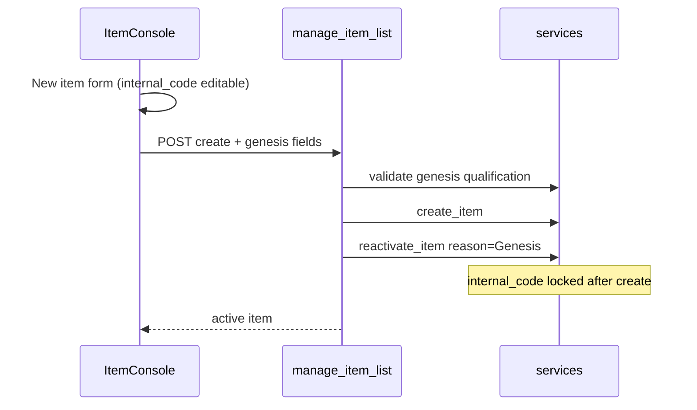

# Internal code — format rules + Genesis lifecycle

## Your decisions (locked)

| Topic | Choice |
|-------|--------|
| Charset | Letters, digits, hyphen, underscore (`^[A-Za-z0-9_-]+$`) |
| Draft mutability | Editable only in the **new-item form before first POST** |
| Lock moment | **On first successful Save** (item row exists in DB) |
| Genesis | **Mandatory** — cannot leave a new item inactive |
| Genesis qualification | `internal_code`, `description`, `unit_of_measure`, `vat_rate`, `family`, `retail_price > 0` |
| retail_price | Must be **> 0** (not just ≥ 0) |
| Server-side drafts | **Deferred** — ship Phase 1+2 first; revisit only if staff report losing half-filled forms across sessions |

### Reconciling "draft" vs "lock on first save"

There is **no server-side draft state** today. A POST to `/manage/items/` immediately persists an `Item` row (`is_active=False`). Under your rules:

- **Draft** = client-side only while `field-id` is empty (New item drawer, before first POST).
- **First POST** = item is saved **and** `internal_code` is locked forever (even if later deactivated).
- **Genesis** = mandatory activation in the same create flow, after qualification passes.



---

## Phasing recommendation: **two phases (less error-prone)**

| | Phase 1 | Phase 2 |
|---|---------|---------|
| Scope | Format charset only | Immutability + Genesis gates + mandatory activation |
| Risk | Low — no workflow change | Medium — changes create UX, validation, API contract |
| Can ship alone | Yes | Builds on Phase 1 |
| Migration | None | None (lock inferred from `item.pk`) |

**Why split:** Phase 1 is a pure validation add-on with one clear rule. Phase 2 changes *when* items become active, *what* is required on create, and *whether* `internal_code` can be edited — touching services, console API, JS flow, admin, CLI, and tests. Shipping Phase 1 first gives a safe checkpoint; Phase 2 can be reviewed as a workflow change on its own.

Doing both in one PR is possible but harder to test and review because failures could come from either charset rules or lifecycle rules.

---

## Phase 1 — Format validation (unchanged core)

### Service ([`products/services.py`](products/services.py))

- `InvalidInternalCodeError` (`code="invalid_internal_code"`)
- `validate_internal_code_format()` inside `validate_internal_code_available`
- Empty still allowed **for now** (Phase 2 makes it required on create)

### API / admin / UI / tests

As in original plan: error codes in [`console_views.py`](products/console_views.py), admin catch in [`admin.py`](products/admin.py), `pattern` + i18n in console, tests for rejected/accepted formats.

---

## Phase 2 — Immutability + mandatory Genesis

### 1. Genesis qualification helper

In [`products/services.py`](products/services.py):

```python
def validate_item_genesis_ready(item):
    # internal_code non-empty + format valid
    # description non-empty
    # unit_of_measure set
    # vat_rate set
    # family set and active
    # retail_price > 0
```

Raise `ItemGenesisNotReadyError` (`code="item_genesis_not_ready"`) with a clear message listing what's missing.

Call from `reactivate_item` when activating an item that has **never been active** (first activation). Also call from the create path before activation.

### 2. Immutability on first save

In `update_item`: if `"internal_code" in fields` and normalized value differs from `item.internal_code`, raise `InternalCodeImmutableError` (`code="internal_code_immutable"`).

No DB column needed — any item with a pk is already saved.

**Grandfathering:** existing dev DB items keep their codes; they simply cannot be renamed via update going forward.

### 3. Mandatory Genesis — atomic create flow

**Problem today:** [`console.js`](products/static/products/js/console.js) POSTs create, *then* shows Genesis dialog; Cancel leaves an inactive orphan (`createdInactive` banner).

**Fix:**

- **Backend:** New service `create_and_activate_item(...)` (or extend `manage_item_list` POST) that runs in `transaction.atomic`:
  1. `validate_item_genesis_ready` on incoming payload
  2. `create_item` (still `is_active=False` internally for audit consistency, or document change)
  3. `reactivate_item(user, item, reason="Genesis")`
  4. Return active item
- If step 3 fails, roll back step 2 (no orphan inactive rows).
- **Frontend:** Remove the post-create Cancel path. Genesis dialog becomes a **pre-submit confirmation** (or stays post-POST but failure rolls back — pre-submit is simpler UX).
- `internal_code` required on new-item form (client + server).

### 4. Console UI

- **New item:** `internal_code` required; charset `pattern`; retail price must be > 0 before Save.
- **Edit existing item:** `#field-internal-code` `readOnly` / `disabled` (still displayed).
- i18n for `internal_code_immutable`, `item_genesis_not_ready`, update help text.

### 5. Admin + CLI

- [`admin.py`](products/admin.py): block `internal_code` change on update (service layer already enforces).
- [`add_item`](products/management/commands/add_item.py): require `--internal-code` and retail > 0 if `--activate` (or always require code).

### 6. Tests (Phase 2)

- `update_item` rejects `internal_code` change on existing item.
- Create without genesis fields → 400 with `item_genesis_not_ready`.
- Create with `retail_price=0` → rejected.
- Create without `internal_code` → rejected.
- Successful create returns `is_active=True`.
- No inactive orphan after failed genesis (transaction rollback).

---

## Files touched (both phases)

| File | Phase 1 | Phase 2 |
|------|:-------:|:-------:|
| [`products/services.py`](products/services.py) | format | genesis + immutability + atomic create |
| [`products/console_views.py`](products/console_views.py) | error codes | atomic create POST |
| [`products/admin.py`](products/admin.py) | format catch | — |
| [`products/static/products/js/console.js`](products/static/products/js/console.js) | — | mandatory genesis, disable code on edit |
| [`products/static/products/js/console_i18n.js`](products/static/products/js/console_i18n.js) | format | genesis + immutable strings |
| [`products/templates/products/item_console.html`](products/templates/products/item_console.html) | pattern | required + readonly |
| [`products/tests.py`](products/tests.py) | format | lifecycle |
| [`products/management/commands/add_item.py`](products/management/commands/add_item.py) | format | required code |

---

## Advisory: true server-side draft rows

### What problem does each approach solve?

| Risk | Client draft + atomic create (Phase 2 plan) | Server-side draft rows |
|------|---------------------------------------------|------------------------|
| Orphan inactive items after Cancel | Fixed (transaction rolls back) | Fixed (draft stays draft until Genesis) |
| Browser closed mid-form — work lost | **Not fixed** | **Fixed** (row persisted) |
| `internal_code` changed after "commit" | Fixed (lock on first POST) | Depends on lock rule (see below) |
| Complexity | Low | Medium–high |

Today's real bug is the **orphan inactive row** after skipping Genesis — Phase 2 fixes that without drafts.

### Server drafts conflict with "lock on first save"

With a DB draft row, **first Save creates a row** — so "lock on first save" would lock `internal_code` immediately, defeating "mutable while drafting."

Server drafts naturally pair with **lock on Genesis** instead:

```text
draft row (internal_code editable, partial fields OK)
    └── Genesis (qualification passes) ──▶ active row (internal_code locked)
```

If you adopt server drafts, you should **revisit the lock moment** to Genesis, not first POST.

### What server drafts would require (if added later)

Mirror the existing PO / requisição pattern (`procurement.Status.DRAFT`, `orders._ensure_draft`):

- Add `Item.lifecycle_status` (or reuse/extend `is_active` — not recommended; conflates "deactivated" with "never published")
- Draft rows: excluded from branch catalog, PO line pickers, goods receipt
- `internal_code` uniqueness: only enforce among **non-draft** items (multiple drafts may have empty code)
- Services: `save_item_draft()`, `publish_item()` (Genesis), `_ensure_draft(item)` for field edits
- UI: "Save draft" vs "Confirm Genesis"; drafts filter/tab; abandoned-draft cleanup policy
- Migration + backfill: existing `is_active=False` rows → draft or inactive?

Estimated scope: **~2× Phase 2** (model, migration, service split, catalog/PO query filters, console UX, tests).

### Recommendation

**Do not add server-side drafts in Phase 2.**

1. The item form is small (~10 fields) — staff typically complete it in one sitting.
2. Phase 2 atomic create+Genesis already gives the robustness that matters most (no orphans, server-enforced qualification).
3. Server drafts add state-machine surface area and query-filter churn across `products`, `procurement`, `inventory`, `branches`, `orders` for modest UX gain.

**If save-and-resume becomes a real need**, prefer this order:

| Option | Cost | Robustness gain |
|--------|------|-----------------|
| **A. localStorage autosave** on new-item form | ~1 hour | Survives refresh/close; no DB changes |
| **B. Server drafts (Phase 3)** | Large | Survives refresh + cross-device; audit trail |

Only choose **B** if operators confirm they routinely abandon half-filled items across sessions. Until then, **A** is the best cost/benefit middle ground.

**Decision (agreed):** proceed with Phase 1+2 only. No server drafts now. If the pain point appears in production, try localStorage autosave first; server drafts remain a possible Phase 3.

### Grandfathering (unchanged)

For existing inactive rows with empty `internal_code`, allow **one-time set-if-empty** before locking — applies regardless of draft choice.

---

## Out of scope (unless requested)

- DB `CheckConstraint` for charset
- User manual updates
- Server-side draft rows (deferred — see advisory; revisit after operational feedback)
- localStorage form autosave (optional lightweight follow-up if needed)
