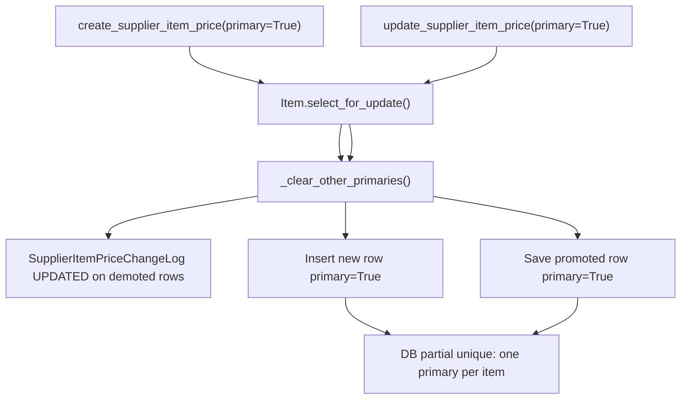

# Item creation overhaul — primary supplier at Genesis

## What you asked for

- **Greenfield:** DB can be dropped/recreated when done — no data migration path required.
- **Field-model change only:** keep Family → optional SubFamily, internal code, selling prices, Genesis rules as today.
- **New rule:** every **new item** (console Genesis / `create_and_activate_item`) must include:
  - one **active supplier**
  - a **cost price > 0**
  - that supplier/price row is created as **`primary=True`**

## Yes — one primary supplier is already enforced

This is **not new behaviour to invent**. It is already implemented in [`products/services.py`](products/services.py) and must be **reused**, not duplicated.



**Three layers today (keep all three):**

| Layer | Mechanism |
|-------|-----------|
| DB | `unique_primary_supplier_item_price` partial unique on `item` where `primary=True` ([`products/models.py`](products/models.py)) |
| Service | `_clear_other_primaries()` sets other rows `primary=False` **before** insert/promotion; audited as UPDATED with `primary: true → false` |
| Tests | `test_setting_primary_clears_other_primaries`, `test_update_primary_audits_cleared_primaries` ([`products/tests.py`](products/tests.py)) |

**Implication for this overhaul:**

- **At item create:** call existing `create_supplier_item_price(..., primary=True)` after Genesis activation — no other primaries exist yet, so `_clear_other_primaries` is a no-op but still correct.
- **After create (unchanged):** staff add more supplier prices via existing drawers/API; marking another row primary still auto-demotes the old one and writes audit logs — **no UI or service changes needed** for that flow.
- **Do not** add a second primary flag on `Item` or bypass `_clear_other_primaries`.

## Core design problem (D22 chicken-and-egg)

Today `create_supplier_item_price` calls `_ensure_item_active(item)` — inactive items cannot get a price row. Genesis currently: create inactive → validate → activate.

**Fix (minimal):** reorder inside `create_and_activate_item` to:

1. `create_item` (inactive)
2. validate Genesis inputs (existing fields + **supplier + cost > 0**)
3. `reactivate_item` (now active)
4. `create_supplier_item_price(supplier, item, cost_price, primary=True, user=user)` — reuses existing primary logic

All in one `@transaction.atomic` — rollback on any failure (same guarantee as today’s atomic Genesis).

## Service-layer changes ([`products/services.py`](products/services.py))

### Extend `create_and_activate_item`

New required kwargs: `supplier`, `cost_price`.

- Resolve supplier; `_ensure_supplier_active(supplier)`.
- Validate `cost_price > 0` at Genesis (stricter than existing `_validate_cost_price` which allows 0 for later edits). Add a dedicated error, e.g. `CostPriceGenesisRequiredError` / code `cost_price_genesis_required`.
- Extend `validate_item_genesis_ready(item, *, supplier=None, cost_price=None)` **or** validate supplier/cost in `create_and_activate_item` before activation — Genesis error message should list missing supplier / cost alongside existing fields.
- After `reactivate_item`, call `create_supplier_item_price(..., primary=True)` — **never** insert with `primary=False` on create.

### Leave standalone paths narrower

| Path | Supplier at create |
|------|-------------------|
| Console POST / Genesis | **Required** (supplier + cost > 0) |
| `add_item --activate` | **Required** (`--supplier`, `--cost-price`) |
| `create_item` / `add_item` without `--activate` | Optional (inactive dev/admin rows) — unchanged |
| `update_supplier_item_price` / set-primary later | Unchanged — demotion + audit as today |

### Item created audit log

Optionally include primary supplier + cost in the `ItemChangeLog` CREATED payload (or rely on the separate `SupplierItemPriceChangeLog` CREATED row — document whichever we choose in manuals).

## API ([`products/console_views.py`](products/console_views.py))

`POST /api/manage/items/` (already calls `create_and_activate_item`):

- Require `supplier_id` and `cost_price` in JSON body.
- Map validation errors to stable codes (`inactive_supplier`, `cost_price_genesis_required`, etc.) consistent with existing API style.

Console payload already loads suppliers via `SUPPLIER_API` in [`console.js`](products/static/products/js/console.js) — reuse that list.

## Console UI ([`item_console.html`](products/templates/products/item_console.html), [`console.js`](products/static/products/js/console.js), [`console_i18n.js`](products/static/products/js/console_i18n.js))

On **New item** drawer only (hidden on edit):

- **Supplier** `<select>` — active suppliers only
- **Cost price** `<input>` — required, min > 0

Client-side checks before Genesis dialog (mirror retail-price check):

- supplier selected
- cost price > 0

Include `supplier_id` + `cost_price` in POST payload via `formPayload()`.

Hide `#item-supplier-prices` section on new-item form (no item id yet); show after save as today.

**Cache-buster:** bump `console.js?v=21` → `?v=22` (and i18n if changed) in [`item_console.html`](products/templates/products/item_console.html).

## CLI & seed (pt-PT only — English archives untouched)

**Your question:** yes — seeding must give **every active catalogue item at least one primary supplier** at Genesis. Inactive seed rows (e.g. `CEM-OLD`, `LEG-*`) stay on the bare `create_item` path with no supplier.

**Current gap (must fix):** live pt-PT data in [`products/seed_catalog_data.py`](products/seed_catalog_data.py) has ~60 `ITEMS` but only ~22 `SUPPLIER_ITEM_PRICES` rows, and only ~10 items with `primary=True`. After D36, `./scripts/seed_dev_data.sh` would fail on Genesis for most active items.

**Out of scope:** archived English seed (`products/seed_catalog_data_en.py.old`, `products/management/commands/seed_dev_data_en.py.old`, `scripts/seed_dev_data_en.sh.old`) — **not updated** (per your choice).

### Restructure [`seed_catalog_data.py`](products/seed_catalog_data.py)

Extend the `ITEMS` tuple (or add a parallel map keyed by `internal_code`) so each **active** row carries:

- `primary_supplier` — supplier name from `SUPPLIERS` (active)
- `primary_cost` — decimal string **> 0**

Keep `SUPPLIER_ITEM_PRICES` for **secondary** supplier rows only (`primary=False`). Remove duplicate primary rows from that tuple (they move into `ITEMS`).

Assign sensible defaults by family where no alternate supplier existed (e.g. cement → Cimentos Nacionais, tools → ConstruSupply Lda, misc → FixAll Fixações).

### Refactor [`seed_dev_data.py`](products/management/commands/seed_dev_data.py)

Replace the two-step pattern:

```text
create_item → reactivate_item   # then later loop adds prices
```

with, for each **active** item:

```text
create_and_activate_item(..., supplier=..., cost_price=..., reason="Genesis")
```

Then run the existing `SUPPLIER_ITEM_PRICES` loop **only** for non-primary rows via `create_supplier_item_price(..., primary=False)` (item is already active — D22 OK).

**Idempotent re-runs:** when an item already exists, ensure it has a primary `SupplierItemPrice` (create or update if missing); do not rely on the old separate loop for primaries.

**Seed test:** extend [`products/tests.py`](products/tests.py) seed idempotency tests to assert every active seeded item has exactly one primary supplier price.

### [`add_item.py`](products/management/commands/add_item.py)

Add `--supplier` (name) + `--cost-price`; required when `--activate`.

## Admin ([`products/admin.py`](products/admin.py))

Superuser create path still uses bare `create_item` (inactive) — acceptable for dev. Optional: add supplier/cost fields on add form wired to `create_and_activate_item` — low priority unless you want admin parity.

## Tests

**Products (primary focus):**

- Genesis create without supplier / cost → `ItemGenesisNotReadyError` or dedicated errors; no item row left active without primary price.
- Genesis create success → exactly one `SupplierItemPrice`, `primary=True`, cost > 0.
- Rollback: genesis failure after partial work still leaves no orphan item (extend existing `test_create_and_activate_item_rolls_back_on_genesis_failure`).
- **Regression:** existing `test_setting_primary_clears_other_primaries` / audit tests stay green — create path must not break demotion behaviour.

**Test helpers:** update `ItemTestCaseMixin.create_test_item` in [`products/tests.py`](products/tests.py) to supply a default supplier + cost (or create primary price after activate) so downstream apps keep working:

- [`inventory/tests.py`](inventory/tests.py)
- [`procurement/tests.py`](procurement/tests.py)

## User manuals (required — behaviour change)

Update EN + pt-PT in same session:

- [`docs/user-manuals/en/01-items.md`](docs/user-manuals/en/01-items.md) §5.1 — new fields, Genesis checklist
- [`docs/user-manuals/en/05-edge-cases-and-limits.md`](docs/user-manuals/en/05-edge-cases-and-limits.md) — new error strings
- [`docs/user-manuals/en/02-purchase-orders.md`](docs/user-manuals/en/02-purchase-orders.md) §Q2 — clarify primary is set at item create; changing primary later still demotes the previous one (existing behaviour, now worth stating)
- Mirror in `docs/user-manuals/pt/`

## Living docs (session handoff)

Record new locked decision **D36** in [`docs/PROJECT-PLAN.md`](docs/PROJECT-PLAN.md) and [`docs/handoff.md`](docs/handoff.md):

> **D36:** New catalogue items (Genesis) require an active supplier and cost price > 0; the first `SupplierItemPrice` is always `primary=True`. One primary per item (D14) unchanged; promotion/demotion via existing `_clear_other_primaries` + audit.

## Out of scope (confirmed)

- UX wizard / multi-step page
- Barcode / auto-generated codes
- Create-from-thread
- Bulk import
- Changing primary-supplier demotion logic (already correct)
- Phase 7 deploy / OAuth / email

## Verification

```bash
.venv/bin/python manage.py test products accounts procurement inventory branches orders threads company_voice --noinput
node --check products/static/products/js/console.js
```

Fresh DB smoke after implementation:

```bash
dropdb centcompras_db && createdb centcompras_db  # or project’s usual reset
.venv/bin/python manage.py migrate
./scripts/seed_dev_data.sh
```

Manual: `/manage/items/` → New item → pick supplier + cost → Genesis → item drawer shows one primary supplier price; add second supplier price elsewhere and set primary → first row demoted with history.
