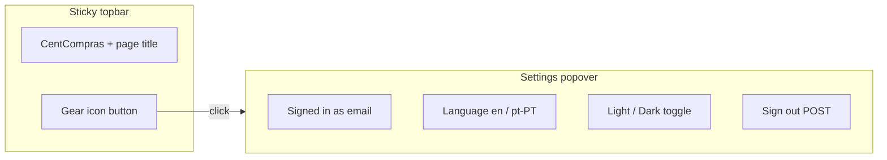

# Manage header — settings cog + popover

**Status:** plan only — do not implement until Pedro approves this file.

**Goal:** make the sticky header less busy. Left stays `CentCompras` + page title. Right becomes one icon button (gear). Click opens a small popover with the existing account controls.

---

## Locked decisions (from this Cloud session)

| Topic | Choice |
|-------|--------|
| Control | Ghost **icon button** with an inline SVG gear (cog). No icon library. |
| Panel type | **Popover** anchored under the button — **not** a `.drawer`, **not** a `.dialog` |
| Popover contents | Signed in as `{email}` · Language select · Theme toggle (keep one-click Light/Dark) · Sign out |
| Header left | Unchanged: eyebrow `CentCompras` + `h1` |
| Header right | Cog only (email leaves the bar) |
| Backdrop | None — work drawers stay visible |
| Close | Cog again, click outside, Escape |
| In scope | `/manage/items/`, `/manage/catalog/`, `/manage/purchase-orders/`, `/manage/goods-receipts/` |
| Out of scope | `/` staff dashboard, all `/branch/…` pages, `/manage/approval-limits/`, `/manage/internal-requests/`, `/manage/branch-approval-limits/` |
| Toolbar | Untouched (search, Families, New item, etc.) |
| Theme UX | Keep the existing toggle button inside the popover |
| Shared chrome / Phase 6 | Do not start |



---

## Why not a drawer

`/manage/items/` already has three full-height right drawers (item, families, suppliers) plus centered `.dialog`s for confirms. From [`products/static/products/css/console.css`](products/static/products/css/console.css):

- `.topbar` — `position: sticky; z-index: 5`
- `.drawer` — `position: fixed; top: 0; right: 0; width: min(32rem, 100%); height: 100%; z-index: 9`
- `.dialog` — centered modal, `z-index: 13`

A fourth drawer would stack a 32rem panel on top of an open item form. Settings are four small controls, not a work form. A popover is the lightest pattern and does not steal the form.

Note: an open work drawer already covers the top-right of the header (`top: 0; height: 100%`). That is existing behaviour. The cog is used when the work drawer is closed.

---

## Current header (what we replace)

All four in-scope templates copy this block today ([`products/templates/products/item_console.html`](products/templates/products/item_console.html)):

```html
<div class="topbar-actions">
    <p class="user-line">
        <span data-i18n="signedInAs">Signed in as</span>
        <strong>{{ user.email }}</strong>
    </p>
    <label class="control-inline">
        <span data-i18n="language">Language</span>
        <select id="language-select" aria-label="Language">
            <option value="en">English</option>
            <option value="pt-PT">Português</option>
        </select>
    </label>
    <button type="button" id="theme-toggle" class="btn btn-ghost"></button>
    <form method="post" action="">
        
        <button type="submit" class="btn btn-ghost" data-i18n="signOut">Sign out</button>
    </form>
</div>
```

Same markup lives in:

- [`products/templates/products/catalog.html`](products/templates/products/catalog.html)
- [`procurement/templates/procurement/purchase_orders.html`](procurement/templates/procurement/purchase_orders.html)
- [`inventory/templates/inventory/goods_receipts.html`](inventory/templates/inventory/goods_receipts.html)

They already share [`products/static/products/css/console.css`](products/static/products/css/console.css). Language/theme JS is duplicated in `console.js`, `catalog.js`, `purchase_orders.js`, `goods_receipts.js`.

---

## Target markup

Replace `.topbar-actions` contents with a single settings cluster. Keep the same element **ids** (`language-select`, `theme-toggle`) so existing listeners keep working.

```html
<div class="topbar-actions">
    <div class="settings-menu">
        <button
            type="button"
            id="settings-toggle"
            class="btn btn-ghost settings-toggle"
            aria-expanded="false"
            aria-controls="settings-popover"
            aria-haspopup="true"
            data-i18n-aria="settings"
        >
            <svg class="settings-icon" width="20" height="20" viewBox="0 0 24 24" aria-hidden="true" focusable="false">
                <!-- simple gear: circle + 6 teeth; stroke=currentColor; no fill library -->
            </svg>
        </button>
        <div id="settings-popover" class="settings-popover" hidden role="dialog" aria-labelledby="settings-popover-title">
            <p id="settings-popover-title" class="settings-popover-title" data-i18n="settings">Settings</p>
            <p class="user-line">
                <span data-i18n="signedInAs">Signed in as</span>
                <strong>{{ user.email }}</strong>
            </p>
            <label class="control-inline">
                <span data-i18n="language">Language</span>
                <select id="language-select" aria-label="Language">
                    <option value="en">English</option>
                    <option value="pt-PT">Português</option>
                </select>
            </label>
            <button type="button" id="theme-toggle" class="btn btn-ghost"></button>
            <form method="post" action="">
                
                <button type="submit" class="btn btn-ghost" data-i18n="signOut">Sign out</button>
            </form>
        </div>
    </div>
</div>
```

**Do not put `data-i18n` on `#settings-toggle`.** `applyStaticI18n()` does `node.textContent = t(...)` for every `[data-i18n]`, which would **wipe the SVG**. Use `data-i18n-aria="settings"` and set `aria-label` in JS (new small loop next to the existing `data-i18n-placeholder` loop).

---

## CSS (add to `console.css`)

Keep it small. Align the panel to the right edge of the cog. `z-index` above work drawers (9) so if both were ever open the menu still wins — use `15`.

```css
.settings-menu {
    position: relative;
}

.settings-toggle {
    display: inline-flex;
    align-items: center;
    justify-content: center;
    padding: 0.35rem;
}

.settings-icon {
    display: block;
}

.settings-popover[hidden] {
    display: none !important;
}

.settings-popover {
    position: absolute;
    top: calc(100% + 0.4rem);
    right: 0;
    min-width: 16rem;
    padding: 0.85rem 1rem;
    display: grid;
    gap: 0.75rem;
    background: var(--surface);
    border: 1px solid var(--border);
    border-radius: 8px;
    box-shadow: var(--shadow);
    z-index: 15;
}

.settings-popover-title {
    margin: 0;
    font-size: 0.85rem;
    font-weight: 600;
}
```

Bump the cache query on the four templates (`console.css?v=12` → `?v=13`).

---

## JS — shared popover only

Add [`products/static/products/js/console_settings_menu.js`](products/static/products/js/console_settings_menu.js) and load it on the four pages **before** each page's own script. Do **not** move `setLanguage` / `setTheme` here — those refresh page-specific tables and drawers.

```javascript
(function () {
    function bindSettingsMenu() {
        const toggle = document.getElementById("settings-toggle");
        const popover = document.getElementById("settings-popover");
        if (!toggle || !popover) {
            return;
        }

        function setOpen(open) {
            popover.hidden = !open;
            toggle.setAttribute("aria-expanded", open ? "true" : "false");
        }

        toggle.addEventListener("click", (event) => {
            event.stopPropagation();
            setOpen(popover.hidden);
        });
        document.addEventListener("click", (event) => {
            if (popover.hidden) {
                return;
            }
            if (popover.contains(event.target) || toggle.contains(event.target)) {
                return;
            }
            setOpen(false);
        });
        document.addEventListener("keydown", (event) => {
            if (event.key === "Escape" && !popover.hidden) {
                setOpen(false);
                toggle.focus();
            }
        });
    }

    if (document.readyState === "loading") {
        document.addEventListener("DOMContentLoaded", bindSettingsMenu);
    } else {
        bindSettingsMenu();
    }
})();
```

Keep each page's existing listeners:

```javascript
document.getElementById("language-select").value = currentLang();
document.getElementById("language-select").addEventListener("change", (event) => {
    setLanguage(event.target.value);
});
document.getElementById("theme-toggle").addEventListener("click", () => {
    setTheme(currentTheme() === "dark" ? "light" : "dark");
});
```

In each `applyStaticI18n()`, after the placeholder loop:

```javascript
document.querySelectorAll("[data-i18n-aria]").forEach((node) => {
    node.setAttribute("aria-label", t(node.getAttribute("data-i18n-aria")));
});
```

Guard `themeButton` with `if (themeButton)` so a missing toggle cannot throw. Today it is always present on these four pages.

---

## i18n

Add to all four dictionaries (`console_i18n.js`, `catalog_i18n.js`, `purchase_orders_i18n.js`, `goods_receipts_i18n.js`):

| Key | EN | pt-PT |
|-----|----|--------|
| `settings` | Settings | Definições |

Existing keys stay: `signedInAs`, `language`, `themeLight`, `themeDark`, `signOut`.

---

## Tests

No dedicated header tests exist today. [`ItemConsoleViewTests.test_staff_can_open_console`](products/tests.py) only checks table/form ids.

Add thin `assertContains` / `assertNotContains` on GET HTML (Django `TestCase`, no browser):

| Page | Must contain | Must not contain (as always-visible chrome) |
|------|----------------|---------------------------------------------|
| `/manage/items/` | `settings-toggle`, `settings-popover`, `language-select`, `theme-toggle`, user email, logout form | — |
| `/manage/catalog/` | same | — |
| `/manage/purchase-orders/` | same | — |
| `/manage/goods-receipts/` | same | — |
| `/` dashboard | existing email / sign-out chrome | `settings-toggle` |
| `/branch/catalog/` (branch user) | existing branch header | `settings-toggle` |

Assert the popover markup includes `hidden` in the initial HTML.

Do **not** add Playwright/Selenium. Manual check after code: open `/manage/items/`, confirm a quiet header, open cog, switch language/theme, sign out still POSTs.

---

## User manuals (same session as the code)

Per [`.cursor/rules/user-manuals.mdc`](.cursor/rules/user-manuals.mdc) — this is user-visible chrome.

| Manual | What to change |
|--------|----------------|
| [`docs/user-manuals/01-items.md`](docs/user-manuals/01-items.md) §1.2–1.4, §3.A, §11 | Sign out / language / theme are behind the **Settings** (gear) button, not “top-right” as inline controls. Sign out remains a **button** inside the panel. |
| [`docs/user-manuals/07-manager-catalog.md`](docs/user-manuals/07-manager-catalog.md) §3.A, §8 | Same |
| [`docs/user-manuals/03-goods-receipts.md`](docs/user-manuals/03-goods-receipts.md) §3.A, §8 | Same |
| [`docs/user-manuals/02-purchase-orders.md`](docs/user-manuals/02-purchase-orders.md) language note | One line: language/theme/sign out live in the Settings gear |

Do **not** change [`04-internal-requests.md`](docs/user-manuals/04-internal-requests.md) (branch / internal-request chrome is out of scope).

---

## Implementation order (after approval)

1. CSS + markup on `/manage/items/` first (proves the pattern).
2. Shared `console_settings_menu.js` + i18n + `data-i18n-aria` in `console.js`.
3. Copy the same header cluster to catalog, POs, goods receipts; add the script tag; add i18n keys; add `data-i18n-aria` loop where `applyStaticI18n` exists.
4. Tests.
5. Manuals.
6. Manual screenshot of `/manage/items/` header closed + open (Cloud Agent can capture this).
7. Session handoff only after the code ships (not for this plan-only commit).

---

## Out of scope / do not do

- Restyle `/` or shared app chrome.
- Unify the four page JS files beyond this one small script.
- Change filter toolbars.
- Add a settings drawer or modal.
- Commit `config/settings.py` or secrets.
- Phase 6 email.

---

## Approval checkpoint

Reply to this plan with **approve** (or list deltas). Coding starts only after that. Suggested deltas if you want them before coding:

- Keep a truncated email visible in the bar as well as in the popover
- Light / Dark as two labelled options instead of the existing toggle
- Include `/manage/approval-limits/` for a cog even though it has no language/theme today
