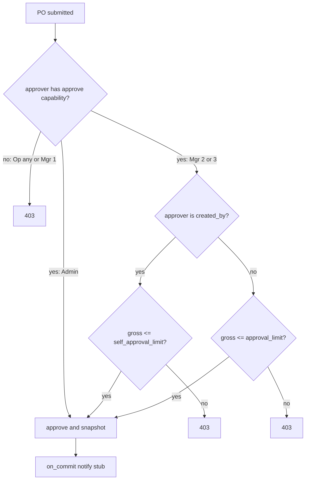

# P3 — M10 complete (grades + audit/control)

Same shape as prior review passes: service-layer rules, `TestCase` tests, `--keepdb --noinput`, then tracker. **Do not archive** [`docs/code-review-full-2026-08-20-2208.md`](docs/code-review-full-2026-08-20-2208.md) until M1 and L1–L14 are done or deferred. **No branches.** M7 stays deferred. This pass covers **every M10 row**, not only self-approval.

| M10 issue | This pass |
|-----------|-----------|
| Self-approval allowed | Grades + admin-only limit tables + `approve()` SoD |
| Manual `close()` has no server-side reason | Required reason on write-off close; system reason on auto-close |
| `adjust_stock` allows empty reason | Required non-empty reason (same pattern as item deactivate) |
| `PurchaseOrderChangeLog.reason` never populated | `_log(..., reason=)` on every status transition |
| `notify_supplier_on_approval` inside transaction | `transaction.on_commit` around the **existing stub** (not Phase 6) |

---

## Locked (from this discussion)

- Django `/admin/` stays **superuser only**. `warehouse_admins` are the operational superuser on the website.
- Keep **exactly three** Django groups. No `reports_to`, no extra groups, no per-user limit overrides.
- **Grade** refines the group: operator 1–2, manager 1–3, admin has no grades (always treated as unlimited).
- Existing seed users stay at **grade 1** so today’s behaviour is the default until someone is promoted.
- Closed circuit (create item → supplier price → draft/submit PO → receive) opens at **operator 2 / manager 1**. Operators **never** approve. Any eligible manager/admin may approve any submitted PO.
- Self-approval uses **PO gross (EUR, VAT included)** from `po.totals()`. Admins: no cap. Others: `created_by == approver` only if gross ≤ that grade’s `self_approval_limit`.
- Policy rows are **admin-only** (website).
- On `assign_warehouse_group`, always reset `warehouse_grade` to **1** (explicit promotion via `set_warehouse_grade`).

Capability matrix:

- **Operator 1** — view only (current operator).
- **Operator 2** — add/change catalogue, prices, draft/submit PO, receive goods. No approve, delete, or `adjust_stock`.
- **Manager 1** — same as operator 2. No approve.
- **Manager 2** — + approve others; self-approve ≤ 100.00; others’ POs ≤ 5_000.00 (seed defaults, admin-editable).
- **Manager 3** — + higher caps (seed: self 500.00, others 50_000.00).
- **Admin** — delete, `can_adjust_stock`, edit policy, approve anything including own.

### Reason policy (medium company — required where a human is writing off or saying no)

| Action | Reason |
|--------|--------|
| `reject` | **Required** (non-empty after strip, max 255) |
| `close` from the PO console (short shipment) | **Required** |
| `close` from `receive_goods` when fully received | System: `"Fully received"` |
| `adjust_stock` | **Required** |
| `submit` / `approve` / `reopen` | Optional, but **wired** — console/API may send it; empty allowed |
| `receive` (inventory) | System: `"Goods received"` |

Do not require a typed reason on submit/approve — the act plus SoD/limits is the control. Do require it on reject/close/adjust, matching item deactivate.



---

## 1. Grade on the user

Add `warehouse_grade` (`PositiveSmallIntegerField`, default `1`) on [`accounts/models.py`](accounts/models.py). Validate in a small service: operator 1–2, manager 1–3, admin forced to 1.

Extend [`assign_warehouse_group`](accounts/groups.py) to reset grade to 1. Add `set_warehouse_grade(user, grade)` for admin/tests/seed.

## 2. Coarse Django perms + capability helper

Today operators are view-only and managers lack `can_approve`. Grade 2+ cannot work unless the **group** has the coarse perm.

In [`accounts/groups.py`](accounts/groups.py) `_codenames_for_group`:

- **operators** — view + add + change (same mutate set as managers; still no delete / `can_approve` / `can_adjust_stock`).
- **managers** — existing add/change **plus** `can_approve`.
- **admins** — unchanged.

Add [`accounts/capabilities.py`](accounts/capabilities.py) as the **website source of truth** (group + grade): `can_mutate_catalog`, `can_receive_goods`, `can_approve_purchase_order`, `can_adjust_stock`, `can_edit_approval_policy`.

Wire it so operator 1 cannot sneak through `has_perm`:

- [`products/permissions.py`](products/permissions.py) `catalog_permissions` + `deny_unless`
- [`procurement/permissions.py`](procurement/permissions.py) `deny_unless` (and the approve flag on [`procurement/templates/procurement/purchase_orders.html`](procurement/templates/procurement/purchase_orders.html))
- [`inventory/permissions.py`](inventory/permissions.py) for receive / adjust

Update existing tests that assert “operator has no `add_item`” / “manager has no `can_approve`” to assert **capabilities** (grade 1 still denied).

## 3. Approval-limit tables (admin-only)

New models in `procurement`:

- `ApprovalLimit` — `group_name`, `grade`, `approval_limit`, `self_approval_limit`, unique `(group_name, grade)`.
- `ApprovalLimitChangeLog` — who changed what.

No currency column; document EUR. Seed **only manager 2 and 3** rows if missing (do not overwrite admin edits).

Services: `list_approval_limits`, `update_approval_limit` (warehouse admin only).

Minimal website: JSON API + `/manage/approval-limits/`. GET for users who can view POs; PUT/PATCH only if `can_edit_approval_policy`. No chrome polish.

## 4. Enforce in `approve()`

In [`procurement/services.py`](procurement/services.py) `approve(po, user, reason="")` after the row lock:

1. Require `user`.
2. If not `can_approve_purchase_order(user)` → `ValidationError` with a stable code.
3. `gross` from `po.totals()` (same figure stored as `approved_gross`).
4. If `user.pk == po.created_by_id` and not warehouse admin: `gross <= self_approval_limit` for `(manager, grade)`.
5. If someone else: `gross <= approval_limit` for that manager grade. Admin skips both caps.
6. Pass `reason` into `_log` (optional).
7. Schedule the email stub with `on_commit` (section 7). Keep the D13 snapshot.

## 5. Seed

Keep the three current logins at grade 1. Add:

- `warehouse.operator2@centcompras.dev` — operators, grade 2
- `warehouse.manager2@centcompras.dev` — managers, grade 2
- `warehouse.manager3@centcompras.dev` — managers, grade 3

Password `devpass123`. Idempotent. Seed default `ApprovalLimit` rows if absent.

## 6. M10 reasons

**`close(po, user=None, reason="")`** in [`procurement/services.py`](procurement/services.py):

- If remaining unordered qty **> 0** (manual write-off): reject blank/`"   "` with `code="close_reason_required"` (mirror [`deactivate_item`](products/services.py)).
- If remaining is **0** (full receipt): default reason `"Fully received"` when empty.

[`inventory/services.py`](inventory/services.py) `receive_goods` already calls `close(po, user)` when `_is_fully_received`; pass `reason="Fully received"` explicitly. [`receive()`](procurement/services.py) logs with `reason="Goods received"`.

**`reject(po, user=None, reason="")`**: require non-empty reason; `_log` it.

**`adjust_stock`** in [`inventory/services.py`](inventory/services.py): `(reason or "").strip()` empty → `ValidationError` `code="adjust_reason_required"`. Console already has `#adjust-reason`; keep the field and surface the error.

**`_log` / other status fns:** `submit`, `approve`, `reopen` take optional `reason` and pass it. Today `_status_action` POSTs `{}` and never reads a body reason — extend it (and [`performStatusAction`](procurement/static/procurement/js/purchase_orders.js)) so reject/close prompt (`window.prompt` is enough; match `confirmClose`, no new chrome) and send `{ "reason": "..." }`.

Existing close/reject tests that call services with no reason must pass a reason or expect the new error.

## 7. M10 `on_commit` (stub only)

In `approve()`, after save/`_log`, replace the in-transaction call:

```python
transaction.on_commit(lambda po_id=po.pk: notify_supplier_on_approval(po_id))
```

Adjust [`notify_supplier_on_approval`](procurement/services.py) to accept a PO instance **or** pk (fetch if int). Still logs only — **do not** build Phase 6 email. Test: mock/spy that the stub is not invoked if `approve()` raises after the schedule would have been registered but the atomic block rolls back (a `TestCase` that patches the stub and forces a failure after `on_commit` registration is enough; skip a second `TransactionTestCase` unless that cannot be shown otherwise).

## 8. Tests

Prefer `TestCase`. Cover at least:

- Operator 1: 403 on create item / create PO / receive.
- Operator 2: can create item + submit PO; cannot approve.
- Manager 1: cannot approve (own or others).
- Manager 2: self-approve at 100.00 ok, 100.01 denied; others’ PO at 5_000 ok, over denied.
- Manager 3: higher caps.
- Admin: self-approve with no cap; can edit limits; manager cannot.
- Role change resets grade to 1.
- `close` without reason on a partial PO → error; with reason → changelog has it.
- Full `receive_goods` auto-close → reason `"Fully received"`.
- `reject` without reason → error; with reason → changelog.
- `adjust_stock` with `""` / whitespace → error.
- `submit`/`approve` still work with empty reason; if a reason is passed it is stored.
- Email stub not called when `approve()` rolls back.

```bash
.venv/bin/python manage.py test products accounts procurement inventory --keepdb --noinput
```

## 9. Docs after green

- [`docs/code-review-full-2026-08-20-2208.md`](docs/code-review-full-2026-08-20-2208.md) — **all five M10 bullets Done**. Tracker M10 → ✅. Do **not** archive (M1 + L* remain).
- [`docs/handoff.md`](docs/handoff.md) + [`docs/project-plan-2026-08-20.md`](docs/project-plan-2026-08-20.md) — **D18** (grades + approval limits); **D19** (PO/stock reason rules + `on_commit` stub). Next: P4 = M1 + L1–L14.
- [`AGENTS.md`](AGENTS.md) / [`README.md`](README.md) — extra seed users; managers need grade ≥ 2 to approve; close/reject/adjust require a reason.
