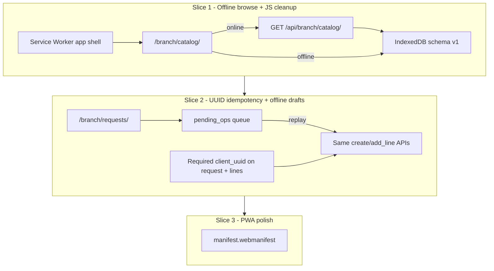
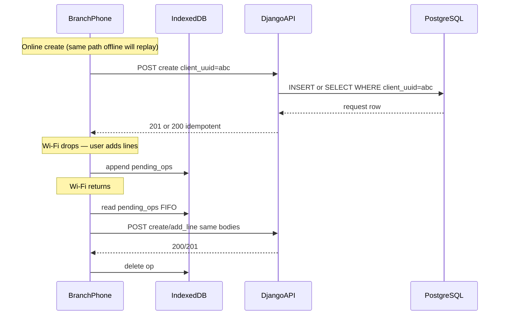

# Phase 6 — Branch offline catalogue and sync (revised)

> **Revision:** greenfield dev — no production database. Prefer clean schema and unified APIs over backward-compatible nullable fields. After Slice 2 schema work: **drop DB → `migrate` → `./scripts/seed_dev_data.sh`**.

---

## Context (what exists today)

Branch staff use phone-friendly pages under `/branch/…`:

| Page | Purpose | Offline today |
|------|---------|---------------|
| [`/branch/catalog/`](branches/templates/branches/catalog.html) | Browse items (cost hidden, availability hint) | **No** |
| [`/branch/requests/`](orders/templates/orders/requests.html) | Requisição interna | **No** |
| [`/branch/threads/`](threads/templates/threads/branch_threads.html) | Catalogue-gap threads | **No** (out of scope) |
| [`/branch/receipts/`](inventory/templates/inventory/branch_receipts.html) | Branch goods receipt | **No** (out of scope) |

Offline layer was **removed** after early MVP ([`.cursor/rules/offline-frontend.mdc`](.cursor/rules/offline-frontend.mdc)). [`orders/models.py`](orders/models.py) has integer PKs only — no `client_uuid` yet.

**Non-negotiables:** PostgreSQL = truth; SW caches shell only (never `/api/`); plain JS; `127.0.0.1` for SW dev; warehouse `/manage/` stays online-only.

---

## Dev environment assumption (new)

| Fact | Plan impact |
|------|-------------|
| No production DB | **Required** `client_uuid` fields — no nullable/backfill migration |
| DB restart acceptable | One new orders migration; no data-preservation gymnastics |
| Re-seed after migrate | Update [`scripts/seed_dev_data.sh`](scripts/seed_dev_data.sh) / seed commands to pass UUIDs on sample requisições |
| Tests use fresh DB | `manage.py test` already recreates test DB; no `--keepdb` after schema change |

**Dev reset recipe (after Slice 2 lands):**

```bash
# Option A — drop and recreate (preferred when migrations stack oddly)
dropdb centcompras_db && createdb -O appuser centcompras_db
.venv/bin/python manage.py migrate
./scripts/seed_dev_data.sh

# Option B — flush (keeps DB shell)
.venv/bin/python manage.py flush --no-input
./scripts/seed_dev_data.sh
```

Cloud snapshot: `.cursor/start.sh` already runs migrate + seed on boot — a fresh pod picks up new schema automatically.

---

## Recommended sequencing (unchanged — three slices)



---

## Slice 1 — App shell + offline catalogue browse

**Goal:** After one online visit, `/branch/catalog/` works with Wi-Fi off.

### 1.1 Service Worker (root scope)

| File | Role |
|------|------|
| [`branches/static/branches/js/register_sw.js`](branches/static/branches/js/register_sw.js) | Register on branch pages |
| [`branches/templates/branches/service_worker.js`](branches/templates/branches/service_worker.js) | SW template (served at root) |
| [`branches/views.py`](branches/views.py) + [`config/urls.py`](config/urls.py) | `GET /service-worker.js` |

**Precache:** branch HTML pages + shared static (`settings_menu.css`, `preferences_bar.js`, `console_settings_menu.js`, new `db.js`, `branch_catalog.js`, `register_sw.js`).

**Bypass network-only:** `/api/`, `/accounts/`, `/admin/`.

### 1.2 IndexedDB — full schema v1 upfront

Define all stores in [`branches/static/branches/js/db.js`](branches/static/branches/js/db.js) from Slice 1 (Slice 2 only adds queue writers, not schema migration):

```text
centcompras_branch  (DB_VERSION = 1)
├── catalog_items     keyPath: id
├── catalog_meta      keyPath: key   (last_updated, branch_id)
└── pending_ops       keyPath: op_id  (Slice 2 — empty until then)
```

Greenfield benefit: one `onupgradeneeded` handler; no IndexedDB version churn mid-project.

### 1.3 Extract branch inline JS (greenfield cleanup)

While touching templates, extract inline `<script>` IIFEs to static files — reduces SW cache invalidation pain and matches warehouse console patterns:

| Template | New static file |
|----------|-----------------|
| `branches/catalog.html` | `branch_catalog.js` |
| `orders/requests.html` | `branch_requests.js` (wired in Slice 1 shell; offline logic in Slice 2) |
| Others | SW registration only in Slice 1; full extract optional |

Bump `?v=` on **every** branch template static reference ([`AGENTS.md`](AGENTS.md) rule).

### 1.4 Catalogue offline UX

1. Online: fetch → save IndexedDB → render
2. Offline with cache: render + banner **"Offline — last updated {time}. Availability may be outdated."**
3. Offline, empty cache: **"No cached catalogue. Connect to Wi-Fi to download."**

---

## Slice 2 — UUID idempotency + offline drafts (greenfield design)

**Goal:** Draft requisição offline; reconnect syncs without duplicates. **One API surface** for online and offline — no parallel `/sync/` endpoint.

### 2.1 Schema — required UUIDs from day one

Add to [`orders/models.py`](orders/models.py) + migration `orders/0003_client_uuid.py`:

```python
import uuid

class InternalRequest(models.Model):
    client_uuid = models.UUIDField(default=uuid.uuid4, unique=True, editable=False)
    # ... existing fields

class InternalRequestLine(models.Model):
    client_uuid = models.UUIDField(default=uuid.uuid4, unique=True, editable=False)
    # ... existing fields
```

**Greenfield choices (vs original plan):**

| Original (prod-safe) | Revised (dev greenfield) |
|----------------------|--------------------------|
| `client_uuid` nullable, optional on lines | **Required** on request **and** line |
| Separate `POST …/sync/` endpoint | **Replay existing APIs** with UUID in body |
| Server PK unchanged only | Server still uses integer PK; UUID is idempotency key |

**Why required everywhere:** online UI also sends `client_uuid` / `client_line_uuid` (generated in browser before each POST). Server `default=uuid.uuid4` covers admin/seed/CLI only.

### 2.2 Service-layer idempotency

Extend [`orders/services.py`](orders/services.py):

- `create_internal_request(..., client_uuid=None)` → if `client_uuid` provided and row exists, **return existing**; else create
- `add_line(..., client_uuid=None)` → same for lines on `(request, client_uuid)`

Update [`orders/console_views.py`](orders/console_views.py):

- `POST /api/branch/requests/create/` body: `{ "client_uuid": "<uuid>", "notes": "…" }` — **required**
- `POST /api/branch/requests/<id>/lines/` body: `{ "client_uuid": "<uuid>", "item_id": N, "quantity": "…" }` — **required**

Responses: **201** on create, **200** on idempotent replay (include `"idempotent": true` in JSON so client can drop queue entry).

**Seed update:** sample requisições in seed must include explicit UUIDs (or rely on model default — fine for server-side seed).

### 2.3 Offline queue — replay, don't fork

[`branches/static/branches/js/sync_queue.js`](branches/static/branches/js/sync_queue.js):

```text
pending_ops entry:
  op_id          (local uuid — queue row key)
  method         POST
  url            /api/branch/requests/create/  or  …/lines/
  body           { client_uuid, … }
  status         pending | syncing | failed
  last_error
  created_at
```

On `window "online"` (and after successful online actions):

1. Drain queue FIFO
2. POST each op to the **same URL** the online UI uses
3. On 200/201 → remove op; on 4xx → mark failed, show banner

**Offline UX on `/branch/requests/`:**

- Create draft → queue `create` op + show **"Pending sync"** in list
- Add lines → queue `add_line` ops (reference local `client_request_uuid` until server id known)
- **Disable** Submit / Approve / Reject / Cancel when offline
- Item picker searches `catalog_items` in IndexedDB

No separate sync protocol — less tangled code, same validation paths online and offline.

### 2.4 What stays online-only

| Action | Why |
|--------|-----|
| Submit / approve / reject / cancel | Workflow, caps, D32 reservation |
| Threads / receipts | Out of scope |
| Login / branch select | First visit needs network |

### 2.5 Tests + manuals

- `orders.tests`: duplicate `client_uuid` on create → one row; duplicate line uuid → one line; replay returns 200 + same ids
- [`docs/user-manuals/04-internal-requests.md`](docs/user-manuals/04-internal-requests.md): offline draft FAQ
- [`docs/user-manuals/05-edge-cases-and-limits.md`](docs/user-manuals/05-edge-cases-and-limits.md): new error codes if any

---

## Slice 3 — PWA manifest + polish

Unchanged from v1: `manifest.webmanifest`, icons, shared offline banner, HTTPS note in DEPLOYMENT.

Deferred: Background Sync API, push notifications.

---

## Architecture (revised — unified API)



---

## Risks (updated)

| Risk | Mitigation |
|------|------------|
| Required UUID breaks old browser tabs mid-dev | Acceptable in dev; document reset. Production first deploy will ship UUID + offline together. |
| Queue order: add_line before create synced | Queue processor creates parent first; local draft holds `client_request_uuid` → map to server id after create replay |
| Stale catalogue misleads | Last-updated banner |
| SW stale JS | `CACHE_NAME` bump + `?v=` on static |
| Nullable-field debt avoided | Greenfield required UUIDs — simpler services, no `if client_uuid` branches for legacy null |

---

## What we dropped from v1 plan

- ~~Nullable `client_uuid`~~ → required
- ~~Separate `POST /api/branch/requests/sync/`~~ → replay existing endpoints
- ~~"Optional follow-up: line UUIDs"~~ → ship line UUIDs in Slice 2
- ~~Conservative migration/backfill notes~~ → drop DB + re-seed

---

## Out of scope (unchanged)

- Offline threads / receipts / submit / approve
- Warehouse offline
- Phase 7 chrome, Phase 8 email

---

## Post-implementation

Run `/session-handoff` after each slice. Fix stale PROJECT-PLAN §13 note about UUIDs already existing.
