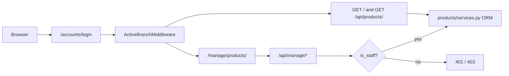

# Products app security audit (pre-production)

Readonly review of [`products/`](products/) plus the wrappers that protect it: [`products/permissions.py`](products/permissions.py), [`accounts/views.py`](accounts/views.py), [`branches/middleware.py`](branches/middleware.py), [`config/settings.example.py`](config/settings.example.py). Scope matches your request: SQL injection and common web vulnerabilities before pre-prod testing.

After you approve this plan, the only follow-up is a findings canvas beside chat (no code, no config edits).

## Verdict

Application-layer posture is sound for an MVP: ORM-only queries, staff-gated mutations, CSRF wired on the console, and DOM writes via `textContent`. The items that would actually hurt a pre-prod deploy are **settings copied from the example**, **missing HTTPS cookie flags**, and **no login brute-force control**.

## Attack surface reviewed

- **Branch catalogue:** `GET /` (`login_required`), `GET /api/products/` (session, 401 if anonymous), public `GET /service-worker.js`
- **Staff console:** `GET /manage/products/` and all `/api/manage/` product, family, supplier, history, bulk endpoints — every one wrapped in `@staff_required`
- **Auth:** `POST /accounts/login/`, `POST /accounts/logout/`; Django `CsrfViewMiddleware`; no `@csrf_exempt`
- **Admin:** `/admin/products/` gated by `can_manage_catalog` (`is_authenticated` and `is_staff`); product hard-delete disabled

## What is already solid

- **SQL injection:** no `.raw()`, `extra()`, `RawSQL`, or `cursor.execute`. Filters use the ORM (`name__iexact`, `pk__in`, `select_for_update`). Sort is client-side in [`console.js`](products/static/products/js/console.js), not `order_by(user_input)`.
- **XSS:** catalogue and console JS use `createElement` + `textContent` only (no `innerHTML`). Templates have no `|safe` / `mark_safe`. History JSON is rendered as text.
- **CSRF:** console sends `X-CSRFToken` from `<meta name="csrf-token">` with `credentials: "same-origin"` ([`console.js` ~129–137](products/static/products/js/console.js)). Login/logout use ``.
- **Authz / mass assignment:** branch users cannot open the console or manage APIs (covered by tests). Product PATCH allowlists fields; `is_active` is not in that list — lifecycle goes through deactivate/reactivate with a required reason. Unknown JSON keys are ignored.
- **IDOR:** catalogue is global by design (no `branch_id` on `Product`). Manage IDs are staff-only; Django `<int:...>` converters on URLs.
- **Logout:** POST form (Django 6.1 `LogoutView`). Login redirect uses Django’s host allowlist.

## Findings (by severity)

**High — example settings are unsafe to copy into pre-prod**

[`config/settings.example.py`](config/settings.example.py) has `SECRET_KEY = "change-me-in-production"`, `DEBUG = True`, and a placeholder DB password. A known secret key forges sessions; DEBUG dumps traces, paths, and query context.

Pre-prod must use a unique secret, `DEBUG=False`, tight `ALLOWED_HOSTS`, and env-based DB credentials. Do not reuse seed password `devpass123` on a shared/staging host with real data.

**Medium — no HTTPS cookie / HSTS / CSRF origin hardening**

The settings template has none of `SESSION_COOKIE_SECURE`, `CSRF_COOKIE_SECURE`, `SECURE_SSL_REDIRECT`, `SECURE_HSTS_*`, or `CSRF_TRUSTED_ORIGINS`. Django defaults leave session/CSRF cookies sendable over HTTP.

**Medium — no login rate limiting**

[`accounts/templates/accounts/login.html`](accounts/templates/accounts/login.html) is a standard form with a generic error (good against user enumeration). There is no lockout, throttle, or fail2ban. Seed emails are documented, so online guessing is the realistic threat.

**Medium — Service Worker cache-first for `/`**

[`products/templates/products/service_worker.js`](products/templates/products/service_worker.js) pre-caches `/` and uses cache-first for every non-`/api/` request. `/api/` is correctly bypassed; `/manage/` is not in the shell (so manage HTML is not stored today). Residual: after logout a shared browser can still show a stale catalogue shell; security fixes in cached JS wait on a `CACHE_NAME` bump. IndexedDB only stores the public active catalogue (same for all branches), not staff payloads.

**Low — emails and catalogue text in application logs**

INFO logs include `request.user.email` and product identifiers ([`products/views.py`](products/views.py), [`products/console_views.py`](products/console_views.py)). Restrict `logs/` permissions and retention in pre-prod.

**Low — `is_staff` is the only catalogue write boundary**

Any staff account can mutate products, families, suppliers, and read audit history (including other staff emails). Acceptable for this MVP; audit who has `is_staff` before opening the host.

**Info — defense in depth missing**

No CSP, no `Cache-Control: private, no-store` on authenticated JSON, CSRF-negative tests use Django’s default client (CSRF not enforced in the suite), bulk `ids` list is unbounded (staff DoS only).

## Pre-prod checklist (ops, not code in this pass)

1. Unique `SECRET_KEY`; `DEBUG=False`; `ALLOWED_HOSTS` = the real hostname only
2. HTTPS: secure cookies, HSTS, `CSRF_TRUSTED_ORIGINS`
3. Strong unique passwords; never seed `devpass123` on the shared host
4. Rate-limit `/accounts/login/` at the reverse proxy (or django-axes later)
5. Restrict `/admin/` (VPN / IP allowlist) until OAuth/MFA exists
6. Confirm `config/settings.py` and `.env` stay gitignored
7. Bump SW cache name if you ship JS security fixes; do not add `/manage/` to `APP_SHELL`

## Deliverable after approval

Write a findings canvas (open beside chat) with severity, location, and the checklist above. No repository edits.