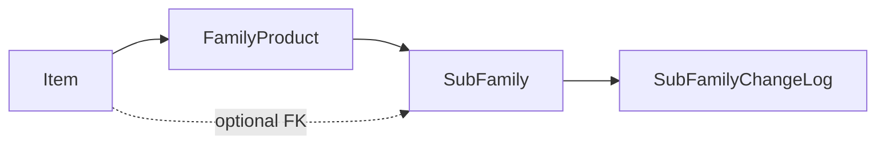

# Sub-families (Family → SubFamily)

## What exists today

[`FamilyProduct`](products/models.py) is a flat master: `name` (CI-unique, **immutable** after create), `is_active`, [`FamilyChangeLog`](products/models.py). [`Item.family`](products/models.py) is a **required** `PROTECT` FK.

Family is wired through:

- Services: `create_family` / `update_family` (`FAMILY_UPDATABLE_FIELDS = ("is_active",)` only), `_ensure_family_active`, Genesis (`validate_item_genesis_ready` requires an **active family**).
- Console: item form + toolbar filter + Families drawer + APIs under `/api/manage/families/`.
- Manager catalog filter + column; branch catalog **column only** (no family filter).
- D16: deactivating a family does **not** cascade-deactivate items; you cannot assign/reactivate items onto an inactive family; `get_catalog(active_only=True)` requires `family__is_active=True`.

There is no sub-family anywhere today.

## Locked decisions (this slice)

- **Two levels only:** `FamilyProduct` → `SubFamily`. No nested sub-families.
- **Item keeps `family` required.** Add optional `Item.sub_family`. If set, `sub_family.family_id` must equal `item.family_id` (service + admin form).
- **Optional forever** for Genesis/create/activate. Family remains the only required grouping.
- **Name:** case-insensitive unique **per parent family**; immutable after create (D21 for sub-families).
- **Activity:** mirror D16 — own `is_active`; **no cascade** to items or sibling sub-families when parent family is deactivated. Cannot assign an item to an inactive sub-family, or to a sub-family whose parent is inactive. Catalog/PO keep filtering on **family** activity only.
- **Parent locked:** cannot move a sub-family to another family after create.
- **Audit:** `SubFamilyChangeLog` (created / updated / deactivated / reactivated), same shape as `FamilyChangeLog`.
- **Surfaces:** item console (form, filter, management drawer) + Django admin + manager catalog (column + filter) + branch catalog (column only).
- **Greenfield seed:** add sample sub-families; assign **some** seed items, leave others without. You will drop/recreate the DB; we still ship a normal migration.

## 1. Model + migration

In [`products/models.py`](products/models.py):

- New `SubFamily`: `family` FK → `FamilyProduct` (`PROTECT`, `related_name="sub_families"`, `db_index=True`), `name` (max 255), `is_active`, timestamps.
- `UniqueConstraint(Lower("name"), "family", name="unique_subfamily_name_ci_per_family")`.
- New `SubFamilyChangeLog` (mirror `FamilyChangeLog`; FK `PROTECT`).
- On `Item`: `sub_family = ForeignKey(SubFamily, null=True, blank=True, on_delete=PROTECT, related_name="items")`.
- Django cannot CHECK that `item.sub_family.family_id == item.family_id`; enforce in services + admin `clean`.

One products migration. No data migration (greenfield).

## 2. Services (source of truth)

Mirror family in [`products/services.py`](products/services.py):

- Errors (exact console strings, also for manuals): `SubFamilyNameRequiredError`, `DuplicateSubFamilyNameError`, `InactiveSubFamilyError`, `SubFamilyFamilyMismatchError`.
- `create_sub_family(name, family, is_active=True, user=None)` — reject empty name, duplicate CI name **in that family**, inactive **parent** family.
- `update_sub_family` — `SUBFAMILY_UPDATABLE_FIELDS = ("is_active",)` only (name and parent rejected like family name).
- `get_sub_families(active_only=True, family=None)`, `get_sub_family_history`.
- `_ensure_sub_family_usable(sub_family, item_family)`: sub-family active, parent family active, `sub_family.family_id == item_family.pk`.
- `create_item` / `update_item` / `create_and_activate_item`: optional `sub_family`; if provided, run `_ensure_sub_family_usable`. If `family` changes and existing `sub_family` no longer matches, reject unless the same call sets a matching or null sub-family. **Do not** require sub-family in `validate_item_genesis_ready`.
- `get_items` / `get_catalog`: optional `sub_family` filter; `select_related("sub_family")`. Catalog `active_only` still keys off family, not sub-family.
- `_serialize_value`: include `SubFamily` as `{id, name, family_id}`.

## 3. Permissions

Django will create `products.add_subfamily` etc.

- [`accounts/groups.py`](accounts/groups.py): add `"subfamily"` to `CATALOG_MODELS`; `"subfamilychangelog"` to `CATALOG_VIEW_ONLY_MODELS`; `ADD_SUBFAMILY` / `CHANGE_SUBFAMILY` constants.
- [`accounts/capabilities.py`](accounts/capabilities.py): add those to `MUTATE_PERMISSIONS`; expose `add_sub_family` / `change_sub_family` flags (same grade gate as families).
- Console views: `deny_unless` on those perms, same as families.

## 4. Console API + UI

APIs in [`products/urls.py`](products/urls.py) + [`products/console_views.py`](products/console_views.py), cloned from families:

- `GET/POST /api/manage/sub-families/`
- `GET/PATCH /api/manage/sub-families/<id>/`
- `GET /api/manage/sub-families/<id>/history/`
- Item create/update: optional `sub_family_id` (`null` clears). Item list: `?sub_family_id=`.
- `_serialize_item` / `_serialize_catalog_item`: `"sub_family": {id, name} | null`.
- Manager catalog: `?sub_family_id=` passed into `get_catalog`.

UI (mirror Families drawer, do not restyle `/`):

- [`products/templates/products/item_console.html`](products/templates/products/item_console.html): optional `#field-sub-family` (after family; empty = none); toolbar `#sub-family-filter`; **Sub-families** button + drawer (name, parent family, item count, status, history). Create form requires parent family picker.
- [`products/static/products/js/console.js`](products/static/products/js/console.js): changing family resets sub-family select to options for that family only (plus empty). Filter: sub-family list scoped to the selected family filter when one is set.
- i18n EN + pt-PT in [`console_i18n.js`](products/static/products/js/console_i18n.js) (`Sub-family` / `Sub-família`, error codes).
- Manager catalog: column + `#catalog-sub-family` filter in [`catalog.html`](products/templates/products/catalog.html) / [`catalog.js`](products/static/products/js/catalog.js) / [`catalog_i18n.js`](products/static/products/js/catalog_i18n.js). When family filter is set, only that family’s sub-families appear.
- Branch: [`branches/console_views.py`](branches/console_views.py) add `"sub_family": item.sub_family.name if item.sub_family_id else ""`; extra column in [`branches/templates/branches/catalog.html`](branches/templates/branches/catalog.html). No branch filter.

## 5. Admin

- `SubFamilyAdmin` mirroring [`FamilyProductAdmin`](products/admin.py): create-only name; parent family readonly after add; autocomplete parent = **active** families; no delete.
- `SubFamilyChangeLogAdmin` read-only.
- `ItemAdminForm`: include `sub_family`; `clean` mismatch + inactive sub-family; autocomplete; `save_model` passes `sub_family` into create/update.

## 6. Seed + CLI

- [`products/seed_catalog_data.py`](products/seed_catalog_data.py): e.g. Cement → Bags / Bulk; Pipes → Steel / PVC; Electrical → Cables; Safety → PPE. Assign a subset of items (e.g. `CEM-50` → Bags, `PIPE-20` → Steel, `PIPE-50` → PVC); leave others `sub_family=None`. Skip sub-families under inactive **Legacy stock**.
- [`seed_dev_data.py`](products/management/commands/seed_dev_data.py): create-or-get sub-families (idempotent, same pattern as families); set `sub_family` on the chosen items.
- [`add_item`](products/management/commands/add_item.py): optional `--sub-family` (name, resolved within `--family`).

## 7. Tests + manuals

Service + console tests in [`products/tests.py`](products/tests.py) (mirror `FamilyProductServiceTests` / family API tests):

- Per-parent uniqueness (same name under two families OK; duplicate in one family not).
- Name/parent immutable.
- Optional on create/Genesis; mismatch rejected; inactive sub-family / inactive parent rejected.
- Deactivate sub-family does not deactivate items; catalog still lists the item if family is active.
- Console 400 codes; manager catalog filter; branch payload includes name or `""`.

Docs (user-visible behaviour): [`01-items.md`](docs/user-manuals/01-items.md) §7, [`05-edge-cases-and-limits.md`](docs/user-manuals/05-edge-cases-and-limits.md) (exact error strings), [`07-manager-catalog.md`](docs/user-manuals/07-manager-catalog.md). Session end: `/session-handoff` (PROJECT-PLAN tracker: this slice now, Phase 6 still next after it).

## Out of scope

- Phase 6 email, shared chrome, restyling `/` or `/branch/…` beyond one catalog column.
- Cascading deactivate, renaming, moving parent, required sub-family, N-level trees.
- Branch-catalog filter (branch has no family filter today).
