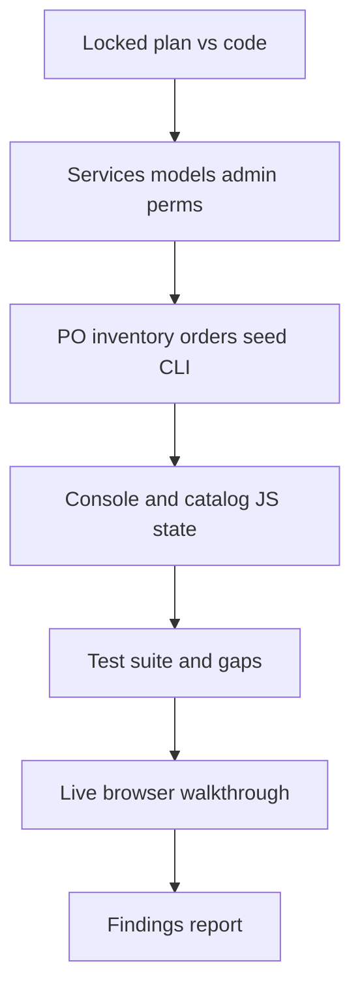

# Sub-family stitch-in review

Findings-only. No product-code changes. Verification: code + existing tests + live browser on item console, manager catalog, and branch catalog.

Scope is this working tree’s sub-family slice (vs family-only behaviour on the parent branch), not a re-open of the archived 1303/2208 reviews and not Phase 6 / chrome / restyling.

Deliverable: a severity-ranked table in chat (same shape as the 1303 review: severity, area, summary, repro, impact). Optionally a timestamped archive note under [`docs/archive/`](docs/archive/) if you want it kept; I will not write that file unless you say so after the report.

## Surfaces in scope

| Surface | Files | Expected behaviour (locked) |
|---|---|---|
| Model / services | [`products/models.py`](products/models.py), [`products/services.py`](products/services.py), [`products/migrations/0009_subfamily.py`](products/migrations/0009_subfamily.py) | Optional `Item.sub_family`; CI-unique name per parent; name/parent immutable; D16 no cascade; mismatch rejected |
| Console API + UI | [`products/console_views.py`](products/console_views.py), [`products/urls.py`](products/urls.py), [`item_console.html`](products/templates/products/item_console.html), [`console.js`](products/static/products/js/console.js), i18n | Form + filter + drawer; family change resets sub-family options; `null` clears |
| Manager catalog | [`catalog.html`](products/templates/products/catalog.html), [`catalog.js`](products/static/products/js/catalog.js) | Column + filter; filter scoped to selected family |
| Branch catalog | [`branches/console_views.py`](branches/console_views.py), [`branches/templates/branches/catalog.html`](branches/templates/branches/catalog.html) | Column only; cost still hidden; no sub-family filter |
| Admin / perms / seed | [`products/admin.py`](products/admin.py), [`accounts/groups.py`](accounts/groups.py), [`accounts/capabilities.py`](accounts/capabilities.py), seed + [`add_item.py`](products/management/commands/add_item.py) | Mutations via services; grade gates match families |

Out of scope as *bugs*: required sub-family, cascade deactivate, rename/move parent, N-level trees, adding a branch-catalog filter. Those were locked out of the slice. I will only flag them if the code accidentally implements the opposite of the lock.

---

## What I will look for

### A. Spec / stitch-in (plan vs code)

- Family still required; sub-family optional on create, update, Genesis (`validate_item_genesis_ready` must **not** require it).
- `_ensure_sub_family_usable`: active sub-family, active parent family, `sub_family.family_id == item.family_id`.
- Changing an item’s family while a mismatched sub-family remains must reject unless the same call sets a matching sub-family or `null`.
- `SUBFAMILY_UPDATABLE_FIELDS = ("is_active",)` only; parent locked after create.
- Catalog `active_only` still keys off **family** activity, not sub-family (item with inactive sub-family still listed if family is active).
- PO / catalog pickers still filter on family activity only (no accidental new sub-family gate).
- Django cannot CHECK the family match: confirm admin `clean` and services both enforce it, and that no other write path (CLI, seed) skips it.

### B. Operational / integration bugs

- **Serialization drift:** console item payload is `{id, name}` (+ nested family on the sub-family list); branch payload is a string or `""`. Confirm each consumer matches its own shape (JS already has a dual `family` / `family_id` helper — a sign of drift risk).
- **Sibling consoles that still show family:** PO item picker ([`procurement/static/procurement/js/purchase_orders.js`](procurement/static/procurement/js/purchase_orders.js)), internal-request / goods-issue UIs. Missing sub-family on those screens is OK if family-only was the old UX; a **break** is if they now assume a nested `sub_family` object, or if inactive-sub-family items disappear from pickers incorrectly.
- **Reactivate / assign onto inactive sub-family** (same class as the old family N5 bug): `reactivate_item`, admin save, console PATCH.
- **Deactivate parent family** with children sub-families: no cascade; cannot create new sub-families under it; existing items keep their FKs.
- **Permissions:** `add_sub_family` / `change_sub_family` grade gates match families; operator grade 1 cannot mutate; branch users cannot hit manage APIs; changelog is view-only; no delete in admin/console.
- **Seed / CLI:** `--sub-family` resolved **inside** `--family`; duplicate CI names across families allowed; Legacy-stock family skipped; `seed_dev_data` idempotent; subset of items left `null`.
- **Admin `save_model`:** exceptions mapped (no 500 on `InactiveSubFamilyError` / mismatch), autocomplete parent = active families only, name/parent readonly after add.

### C. Refresh, filter, and client-state edge cases (primary JS pass)

These are the “stitched in” bugs you called out. I will trace [`console.js`](products/static/products/js/console.js) and [`catalog.js`](products/static/products/js/catalog.js), then reproduce in the browser.

**Item console**

- Change **family** on the item form: sub-family `<select>` rebuilds to that family only + empty; previously selected value must not silently stick if it belongs to the old family.
- Save after family change without picking a new sub-family: expect 400 `sub_family_family_mismatch` or a cleared `null`, not a 500 / silent wrong FK.
- Toolbar: family filter then sub-family filter (and the reverse). Changing family filter must drop a now-invalid sub-family filter (catalog.js already has this; console.js needs the same).
- After **creating** a sub-family in the drawer: item-form and toolbar selects refresh without a full page reload; new row appears in the drawer with correct parent + item count 0.
- After **deactivating** a sub-family: confirm dialog copy; items keep the assignment; form still shows the current value (inactive labelled); **new** assignments cannot pick it; catalog still lists those items.
- Language switch / settings popover: drawer title, filter label, select options, and `data-i18n` must not wipe the `<select>` or the gear SVG.
- History panel: race (`subFamilyHistoryRequestId`) — switching rows quickly must not show the previous entity’s history.
- Search/sort by sub-family column; empty name shown as `—`; search haystack includes sub-family name.
- Full **page refresh (F5)** on `/manage/items/`: form empty, filters reset, lists reload from API; no leftover drawer state; permissions flags still applied.
- Create-item vs edit-item: empty sub-family is valid; `sub_family_id: null` clears an existing assignment.

**Manager catalog**

- Family filter restricts sub-family options; stale `state.subFamilyId` cleared when family changes.
- Client-side filter vs `?sub_family_id=` API param: same result after F5 (reload loses client state — confirm that is intended and does not 400).
- Column renders `—` when null; i18n EN / pt-PT.

**Branch catalog**

- Extra column only; no new filter control.
- `""` vs missing key; layout on a narrow viewport (column squeeze, not a restyle pass).
- Cost still absent. F5 still shows names.

### D. Tests and manuals (gap analysis, not extra test writing)

- Run `.venv/bin/python manage.py test products accounts procurement inventory branches orders --noinput`.
- Map each locked rule to an existing test; list **untested** paths (especially JS-only refresh/filter, family-change-on-item, reactivate+inactive sub-family, F5).
- Exact error strings vs [`docs/user-manuals/05-edge-cases-and-limits.md`](docs/user-manuals/05-edge-cases-and-limits.md) / [`01-items.md`](docs/user-manuals/01-items.md) §7 / [`07-manager-catalog.md`](docs/user-manuals/07-manager-catalog.md). Doc drift is a finding, not a silent edit.

### E. Live browser pass (after code read)

Seed users, password `devpass123`. Exercise as a staff member, not a screenshot:

1. `warehouse.admin@centcompras.dev` — `/manage/items/`: create sub-family, assign, change family, filters, deactivate, history, EN↔pt-PT, F5.
2. Same user — `/manage/catalog/`: column + family/sub-family filter combo, F5.
3. `branch.operator.north@centcompras.dev` — `/branch/catalog/`: column visible, no filter, F5.
4. Spot-check a **manager** and **operator** on the item console for permission-gated drawer actions.
5. If a flow fails, fix nothing; record repro steps.

If the dev server is not up I will start `runserver` for the pass only.

### F. Severity rubric (report only)

- **High** — wrong FK persisted, 500 on a normal console path, catalog/PO hiding items incorrectly, permission bypass.
- **Medium** — stale filter/select after family change, drawer not refreshing after create, reactivate/admin 500, i18n wiping controls.
- **Low** — label/copy drift, untested-but-correct paths, docs vs string mismatch, branch column layout tightness.
- **Not a bug** — locked out-of-scope behaviour (no cascade, optional forever, no branch filter).

---

## Method

1. Read the slice against the locked plan (models → services → views → JS → admin → seed).
2. Diff-minded integration grep on procurement / inventory / orders / branch payloads.
3. Run the full test suite; note gaps, do not add tests in this pass.
4. Browser walkthrough of the three pages + F5 / filter / family-change / language.
5. Write the findings table in chat. Wait for you before any fix or archive file.
