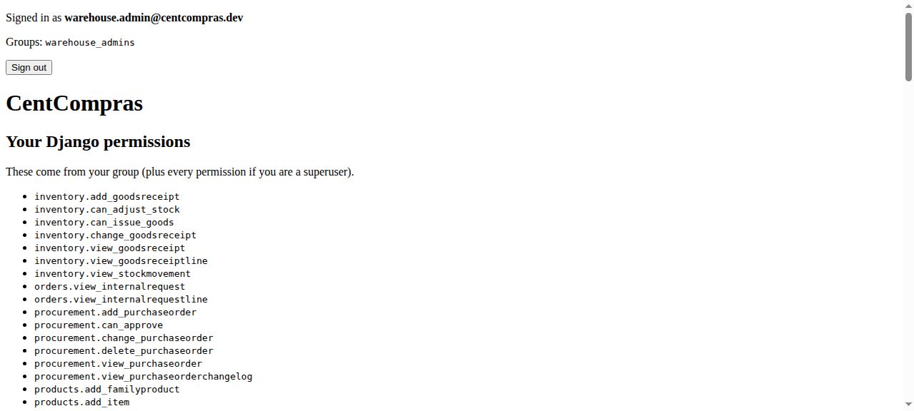
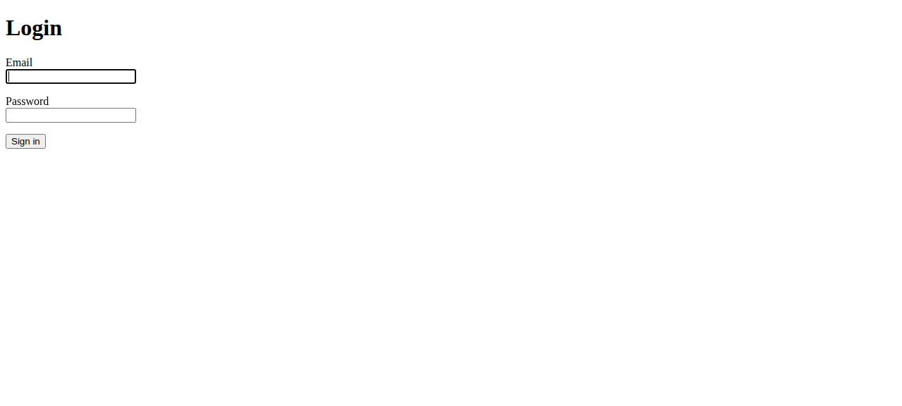
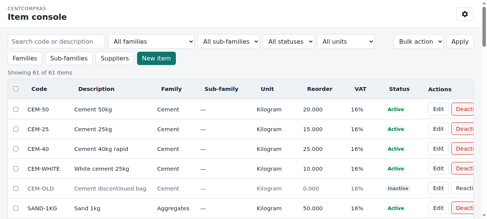
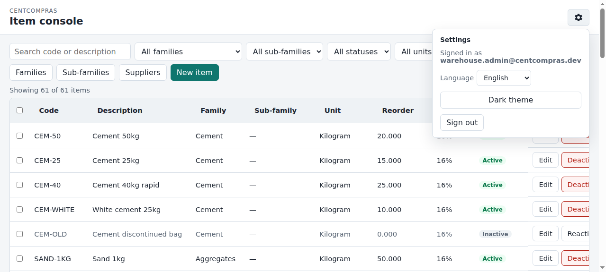

# CentCompras — User Manual

**The Item Console** · Version 1.0 · For warehouse staff (admin / manager / operator)

> **Also available:** [Purchase orders](02-purchase-orders.md) at `/manage/purchase-orders/` · [Goods receipt & stock](03-goods-receipts.md) at `/manage/goods-receipts/` · [Manager catalog](07-manager-catalog.md) at `/manage/catalog/` · [Branches & Requisição interna](04-internal-requests.md) at `/branch/…` · [Edge cases & limits](05-edge-cases-and-limits.md) · [Admin & Superuser Reference](06-admin-reference.md).

---

## Where do I go?

> **Open your browser and go to:**
>
> **`https://<your-domain>/`**
>
> *(During development on your own machine, use: `http://127.0.0.1:8015/`)*

You'll be taken to the **login page**. After signing in you land on the dashboard (`/`). That page lists every warehouse console (items, catalog, purchase orders, **approval limits**, goods receipts, **internal requests**, **branch approval limits**) plus branch pages (`/branch/select/`, catalog, requisição, receipts) and the JSON APIs.

 The main catalogue working screen is the **Item console** at:

> **`https://<your-domain>/manage/items/`**

Bookmark the console URL — it's where the day-to-day catalogue work happens.

---

## 1. Getting started

### 1.1 Signing in

1. Enter your **email** in the *Email* field.
2. Enter your **password** (the one your administrator gave you).
3. Click **Sign in**.

If you mistype, you'll see *"Invalid email or password."*

### 1.2 Signing out

Open the **Settings** gear (top-right of the console) and click **Sign out**. Signing out is always a button, never a link you can trigger by accident.

### 1.3 Language

The whole console works in two languages. Set **Language** on the staff dashboard (`/`) — the control sits in the top-right bar, next to theme:

- **English**
- **Português**

The choice is remembered in this browser and applies to every warehouse console, Company Voice, and request threads. Branch staff set the same control on the branch catalog (`/branch/catalog/`). The **Settings** gear is for signed-in email, **Sign out**, and **Help** only.

### 1.4 Light / dark theme

Use the **theme** button on the staff dashboard (`/`) — next to **Language** — to switch between **Light theme** and **Dark theme**. Also remembered in this browser. Branch staff use the same control on the branch catalog (`/branch/catalog/`).

---

## 2. Your role — what you can do

There are three warehouse roles. The buttons you see depend on your role — a feature that's missing from your screen is simply **not part of your role**, not a bug.

| Role | See items | Add / edit | Deactivate / reactivate | Delete |
|------|:---:|:---:|:---:|:---:|
| **Admin** (`warehouse_admins`) | ✅ | ✅ | ✅ | ✅ |
| **Manager** (`warehouse_managers`) | ✅ | ✅ | ✅ | ❌ |
| **Operator** (`warehouse_data_operators`) | ✅ (read-only) | ❌ | ❌ | ❌ |

- **Operator** sees the same list but with **View** instead of **Edit**, no checkboxes, and no save buttons.
- The Django **`/admin/`** screen is for the **site superuser only** — it is *not* part of this manual.

---

## 3. The console at a glance

The console is one screen, split into three areas.

**A. Top bar**
- App name (**CentCompras**) and title (**Item console** / *Gestão de artigos*)
- **Families**, **Sub-families**, and **Suppliers** — open the master-data drawers. On a narrow window they collapse under **Master data** (*Dados mestres*).
- **Settings** gear (top-right) — opens a panel with "Signed in as *you@company*", **Sign out**, and **Help** (placeholder). Language and theme live on the [staff dashboard](01-items.md#13-language) (`/`).

**B. Toolbar (filters & actions)**

| Control | What it does |
|---------|--------------|
| **Search** box | Find by code or description |
| **Family** dropdown | Filter by family |
| **Sub-family** dropdown | Filter by sub-family (scoped to the selected family when one is set) |
| **Status** dropdown | All / Active / Inactive |
| **Unit** dropdown | Filter by unit of measure |
| **Bulk action** + **Apply** | Deactivate/reactivate several items at once |
| **New item** | Create a new item |

**C. Items table**
- One row per item, with columns: **Code, Description, Family, Sub-family, Unit, Reorder, VAT, Status, Actions**
- **Actions** is **Edit** (or **View** if you cannot change items). Deactivate / Reactivate is not on the row — open the item drawer, or use **Bulk action** for several items.
- A checkbox column (if your role can edit) for bulk actions
- Click any row to open it

**Close a panel:** press **Escape** to dismiss the front-most overlay — the **Master data** menu, the Settings gear, a dialog (**Cancel**), or a drawer (**Close**). If a dialog is open on top of a drawer, the first Escape closes the dialog; a second Escape closes the drawer.

---

## 4. Browsing and filtering items

### 4.1 Search
Type in the **Search** box to filter by **internal code** or **description**. It filters as you type.

### 4.2 Filter by family
Choose a family from the **Family** dropdown (*Todas as famílias* = all families). Only items in that family are shown.

### 4.3 Filter by sub-family
Choose a sub-family from the **Sub-family** dropdown (*Todas as sub-famílias* = all sub-families). If a family is already selected, only sub-families under that family appear. Leave empty to show all sub-families (or all in the chosen family).

### 4.4 Filter by status
- **All statuses** — every item
- **Active** (*Ativo*) — items currently available
- **Inactive** (*Inativo*) — items removed from the catalogue

### 4.5 Filter by unit
Choose a unit (*piece, kg, g, m, m², m³, l*) to see only items measured that way.

### 4.6 Sorting
Click any column header to sort by it — click again to reverse. Sortable columns: **Code, Description, Family, Sub-family, Unit, Reorder, VAT, Status**.

### 4.7 Result count
Above the table you'll see **"Showing X of Y items"** (*A mostrar X de Y artigos*) so you always know how many match.

---

## 5. Working with items

### 5.1 Creating a new item

1. Click **New item** (*Novo artigo*).
2. Fill the form (fields below). **Internal code** and **retail price greater than zero** are required before Genesis.
3. Click **Save** (*Guardar*).
4. Confirm **Genesis** in the dialog — the item is created and activated in one step.

> **Important:** you cannot skip Genesis. If you cancel the dialog, nothing is saved. There is no inactive orphan row.

> 📷 **[SCREENSHOT — "Confirm Genesis" dialog (before save)]**

**The item form fields:**

| Field | Required | Notes |
|-------|:---:|-------|
| **Internal code** | Yes (new items) | Your own reference, e.g. `CEM-50` or `CABLE-2.5`. Must be **unique** (case-insensitive). Only **letters, digits, dots (`.`), hyphens (`-`), and underscores (`_`)** — no spaces or other symbols. Max **64** characters. **Saved as uppercase** (`cem-50` becomes `CEM-50`). **Cannot be changed after the first save** (legacy items with an empty code may set it once). |
| **Description** | Yes | What the item is. |
| **Family** | Yes | The group it belongs to (see §7). |
| **Sub-family** | No | Optional finer grouping under the family (see §7). Leave empty for none. |
| **Unit** | Yes | piece / kg / g / m / m² / m³ / l |
| **VAT rate** | Yes | 1%, 3%, 7%, 16%, Exempt |
| **Reorder level** | Yes | The level that later triggers reordering. |
| **On hand / Available** | (read-only, edit only) | Physical warehouse stock and what is still free to promise after reservations. Not editable here. |
| **Retail price** | Yes (> 0) | Selling price for Genesis (see §6). Must be **greater than zero** on create. |
| **Wholesale price** | No | Selling price (see §6). |
| **Special price** | No | Selling price (see §6). |
| **Reason** | No | A note explaining why you're changing this (stored in history). |

### 5.2 Editing an item
Click the item's row (or its **Edit** button), change any field except **internal code** (read-only after save), and **Save**. The reason field is optional but recommended.

### 5.3 Deactivating an item
Deactivation **removes the item from the active catalogue** (it isn't deleted — its history is kept).

- Open the item (click the row or **Edit**).
- In the drawer, click **Deactivate** (*Desativar*).
- Choose a reason:
  - **Temporarily unavailable** (*Indisponível temporariamente*)
  - **No longer commercialized** (*Deixou de ser comercializado*)
  - **Other** (*Outro*) — describe it
- Confirm.

Several items at once: use **Bulk action** → **Deactivate** in the toolbar (see §5.5).

### 5.4 Reactivating an item
Open the inactive item and click **Reactivate** (*Reativar*) in the drawer. Give a reason. It returns to the catalogue. Several items: **Bulk action** → **Reactivate**.

### 5.5 Bulk actions
1. Tick the checkboxes of several items.
2. Choose **Deactivate** or **Reactivate** in the **Bulk action** dropdown.
3. Click **Apply**.
4. Give a reason when asked.

---

## 6. Selling prices vs buying price

Two different kinds of price — easy to confuse.

| | **Selling prices** | **Buying / cost price** |
|---|---|---|
| What | What *we* sell the item for | What *we* pay the supplier for it |
| How many | 3 (retail, wholesale, special) | 1 per supplier |
| Who sets it | A senior person, **manually** | Pulled **automatically** from the supplier's price list |
| Where | On the item form | In the supplier prices (see §9) |

- **Retail / Wholesale / Special** are three price levels you type on the item itself. They do *not* change on their own.
- The **cost (buying) price** is the opposite: it's *dynamic*. It comes from the **supplier price list** (§9), so when a supplier's price changes there, the cost follows automatically.

---

## 7. Families

A **family** groups related items (e.g. *Cement*, *Pipes*, *Electrical*). Every item must belong to a family.

1. Click **Families** (*Famílias*) in the top bar. On a narrow window, open **Master data** (*Dados mestres*) first.
2. Click **New family** (*Nova família*), type the name, confirm.
3. Family names are unique (case-insensitive) — you can't create two families with the same name.

**Deactivate a family:** open it and choose to deactivate. Existing items keep the family; you just can't add new items to it.

**View history:** use the **History** action on a family row to see who created or changed it.

### 7.1 Sub-families

A **sub-family** is an optional second level under a family (e.g. *Cement → Bags*, *Pipes → PVC*). Items do **not** require a sub-family — family alone is enough for Genesis and activation.

1. Click **Sub-families** (*Sub-famílias*) in the top bar. On a narrow window, open **Master data** first.
2. Click **New sub-family** (*Nova sub-família*), choose the **parent family**, type the name, confirm.
3. Sub-family names are unique **within each family** (case-insensitive) — the same name under two different families is allowed.
4. On the item form, pick a sub-family only after choosing the family; changing the family clears incompatible sub-family choices.

**Deactivate a sub-family:** open the drawer and deactivate the row. Existing items keep the sub-family; you cannot assign **new** items to an inactive sub-family or to a sub-family whose parent family is inactive.

**View history:** use **History** on a sub-family row (same pattern as families).

---

## 8. Suppliers

A **supplier** is a company we buy from — master data that will be used for purchasing.

1. Click **Suppliers** (*Fornecedores*) in the top bar. On a narrow window, open **Master data** first.
2. Click **New supplier** (*Novo fornecedor*), fill the form:
   - **Name** (required, unique)
   - **Contact name**, **Email**, **Phone**, **Notes** (optional)
3. Save.

**Deactivate a supplier** to stop ordering from it (kept in history, not deleted).

---

## 9. Supplier prices (cost prices)

Each supplier × item pair can have a **cost price** — how much that supplier charges for that item.

### 9.1 Adding a cost price
1. Open **Suppliers**.
2. On the supplier's row, click **Supplier prices**.
3. Click **Add price** (*Adicionar preço*).
4. Pick the **Item**, enter the **Cost price**, and optionally tick **Primary**.
5. Save.

### 9.2 The "Primary" flag — what it means

**Primary** marks this supplier as the **preferred supplier for that item**.

- Only **one** supplier can be primary per item. If you tick a second supplier as primary, the first is automatically un-ticked.
- The item's **buying price** is taken from the **primary** supplier (if none is primary, the cheapest supplier is used).
- In the future, when we place purchase orders, the **primary** supplier will be **suggested automatically** — and you'll still be able to override it.

> 💡 *Example:* if **AquaFlow** is primary for **VALVE-15** and you later add a second supplier for VALVE-15, AquaFlow stays the default choice (and its price is the item's buying price) unless you mark the other one primary.

### 9.3 Editing a cost price
Open the supplier's prices, change the cost or toggle **Primary**, and save.

### 9.4 Seeing an item's suppliers
Open any item — its drawer shows a **Supplier prices** section listing every supplier and cost for that item (read-only). This is where you check "who supplies this, and at what cost."

---

## 10. Audit history

Every change is recorded — **who** did it, **what** changed, and **when** (with an optional reason).

- **Item history:** open an item → the **History** section at the bottom of its drawer.
- **Family / supplier history:** open the drawer → **History** action on the row.

This is your safety net: nothing is ever silently overwritten.

---

## 11. Dates, timezone, language & theme

- **Dates** are shown as **DD/MM/YYYY** (day, month, year), with a 24-hour time — e.g. `20/08/2026 10:30`.
- **Timezone:** times are shown in *your* local time, wherever you are. A colleague in Singapore sees the same event in Singapore time; you see it in Portugal time. (The system stores everything in UTC and converts automatically.) New users default to **Europe/Lisbon**.
- **Language:** English / Português — set on the staff dashboard (`/`) or branch catalog (`/branch/catalog/`); remembered in this browser.
- **Theme:** light / dark — same bar as language; remembered.

---

## 12. Related consoles

- [Purchase orders](02-purchase-orders.md) — raise and approve supplier orders.
- [Goods receipt & stock](03-goods-receipts.md) — book in deliveries; stock is a ledger, never typed on the item.
- [Manager catalog](07-manager-catalog.md) — read-only stock + prices overview (`/manage/catalog/`).
- [Branches & Requisição interna](04-internal-requests.md) — how satellite branches browse the catalogue, raise requests, and confirm arrivals.
- [Edge cases, limits & troubleshooting](05-edge-cases-and-limits.md) — the reference for error messages, numeric bounds, state-machine rules, and known gaps.
- [Admin & Superuser Reference](06-admin-reference.md) — creating users, roles, permissions, branches, and branch memberships.

---

## 13. FAQ

**Q1. What does "Primary" mean on a supplier price?**
It marks the **preferred supplier** for that item. Only one per item; it's the source of the item's buying price, and (in future) the supplier suggested when purchasing. Always overridable.

**Q2. What's the difference between selling price and buying price?**
Selling prices (retail / wholesale / special) are what we *sell for* — entered manually by a senior person. The buying/cost price is what we *pay the supplier* — taken automatically from the supplier price list.

**Q3. Why are dates shown as DD/MM/YYYY?**
That's the European convention used across the app. `05/08/2026` means **5 August 2026**, not 8 May.

**Q4. If someone in Singapore uses this, will times be wrong?**
No. Times adapt to each viewer's local timezone automatically. The system stores UTC and converts on display.

**Q5. I created an item but it says "Inactive" — why?**
New items are created **active** when you confirm **Genesis** on save. If you cancel the Genesis dialog, nothing is saved. To add an inactive row for testing, use Django admin (superuser) or the `add_item` CLI without `--activate` (with `--activate`, pass `--retail-price` greater than 0).

**Q6. I can't see the edit button / checkboxes — why?**
Your role is **operator** (read-only), or you don't have edit permission. Check §2. Ask your administrator if you think your role is wrong.

**Q7. I forgot my password.**
There's no self-service reset yet. Ask your administrator, who can reset it for you.

**Q8. What happens when I "deactivate" something?**
It's removed from the active list but **not deleted** — its history is preserved, and it can be reactivated later.

**Q9. Can two items have the same internal code?**
No — internal codes are unique (case-insensitive). You'll get an error if you try to reuse one.

**Q10. What characters can I use in an internal code?**
Letters (`A–Z`, `a–z`), digits (`0–9`), dots (`.`), hyphens (`-`), and underscores (`_`) only — for example `CEM-50`, `CABLE-2.5`, or `TIMBER_2X4`. Spaces and symbols such as `@` or `#` are rejected. **The code is stored in uppercase** — typing `cem-50` saves as `CEM-50`. **Internal code is required on new items** and **cannot be changed after the first save** (legacy rows with an empty code may set it once).

**Q11. Can I change an internal code later?**
No — after the item is saved, the code is locked. Plan the code before Genesis. Exception: an older item that still has an **empty** code may set it **once**.

**Q12. On hand and Available differ — which one is the shelf?**
**On hand** is physical warehouse stock (the ledger). **Available** is what is still free to promise after approved requisições have held their share. You cannot type either number here — change stock with a [goods receipt](03-goods-receipts.md) or (admin) Adjust stock. See [Branches & Requisição interna](04-internal-requests.md) §7.

---

## 14. Quick reference — unit & VAT

**Units of measure:** piece · kg (kilogram) · g (gram) · m (meter) · m² (square meter) · m³ (cubic meter) · l (liter)

**VAT rates:** 1% · 3% · 7% · 16% · Exempt
