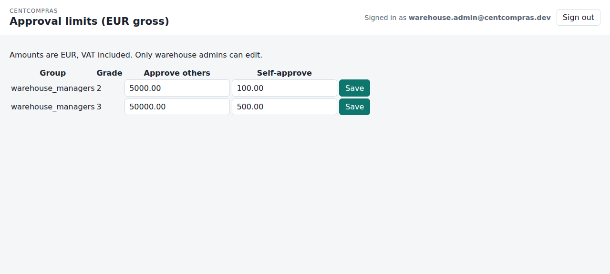

# CentCompras — Admin & Superuser Reference Guide

**Site administration** · Version 1.0 · For the **site superuser** / head office

> **Companion to the staff manuals:** [Item Console](01-items.md) · [Purchase Orders](02-purchase-orders.md) · [Goods receipt & stock](03-goods-receipts.md) · [Branches & Requisição interna](04-internal-requests.md) · [Edge cases & limits](05-edge-cases-and-limits.md) · [Manager catalog](07-manager-catalog.md) · [Request threads](08-request-threads.md) · [Company Voice](09-company-voice.md).

This guide covers the **administrative** work: logging in to Django `/admin/`, creating users, assigning roles and permissions, and managing branches and branch users. It is **not** about the day-to-day consoles — those are the 01–04 and 07 manuals.

---

## 1. Who can use `/admin/`?

The Django admin at **`/admin/`** is **superuser-only**.

| Account kind | `/admin/`? | Website consoles? |
|--------------|:---:|:---:|
| **Superuser** (`is_superuser`) | ✅ | ✅ (has every permission) |
| **Staff** (`is_staff` but *not* superuser) | ❌ | ❌ |
| **Warehouse staff** (warehouse group) | ❌ | ✅ |
| **Branch staff** (branch membership) | ❌ | ✅ (`/branch/…`) |

Warehouse staff land on **`/`** after login. That dashboard lists every website console (items, catalog, purchase orders, approval limits, goods receipts, internal requests, branch approval limits) plus branch pages and the JSON APIs. **Sign out** is in the **Settings** gear (top-right). **Help** in that panel is a placeholder.

Two rules to remember:

- The `/admin/` login check is **`is_active` *and* `is_superuser`** — a "staff" flag alone is *not* enough.
- A **superuser** also passes every website permission check, so it can drive the warehouse consoles too. In practice, keep the superuser for administration and give day-to-day staff a **warehouse group** instead.

> ⚠️ **Do not** hand a superuser login to a branch user, and do not add branch staff to `/admin/`. Head office (superuser) is the only party that manages users and branches.

---

## 2. Logging in & creating the superuser

### 2.1 Logging in

1. Go to **`https://<your-domain>/admin/`** (dev: `http://127.0.0.1:8015/admin/`).
2. Enter your **email** + **password**.
3. You land on the Django admin index.

Log out with the **Log out** link at the top-right.

### 2.2 Creating the first superuser

There is no sign-up page. Create the superuser from the server command line:

```bash
source .venv/bin/activate
python manage.py createsuperuser
```

It prompts for **email** and **password** (there is **no username** field — login is by email). The dev seed (`./scripts/seed_dev_data.sh`) creates warehouse and branch users but **does not** create a superuser.

---

## 3. The User record — what each field means

Open **`/admin/` → Users**. A user has:

| Field | Meaning |
|-------|---------|
| **Email** | The login identifier (unique). There is no username. |
| **Password** | Hashed; you can set/reset it here. |
| **First / Last name** | Optional display names. |
| **Timezone** | IANA name (default `Europe/Lisbon`). Invalid names are rejected on save. Dates render in this user's timezone. |
| **Warehouse grade** | 1–3 for warehouse staff (see §4). Ignored for warehouse admins and branch users. |
| **is_active** | Untick to disable the account (they get "Account is inactive" and are signed out). |
| **is_staff** | "Django admin login". Only superusers should have this (see §1 — staff alone can't log into `/admin/`). |
| **is_superuser** | Full access to `/admin/` and every permission. |
| **Groups** | Django groups (the three warehouse groups — see §5). |
| **User permissions** | Per-user permissions. Leave empty — use groups. |

---

## 4. Warehouse users — create + role + grade

A **warehouse user** works on the website (`/manage/…`). To create one:

1. **`/admin/` → Users → Add user**.
2. Enter **email** + **password** (leave `is_staff` / `is_superuser` **off**).
3. Set **timezone** and **warehouse grade**.
4. In **Groups**, add the user to **exactly one** warehouse group:
   - `warehouse_admins`
   - `warehouse_managers`
   - `warehouse_data_operators`
5. Save.

### 4.1 The three warehouse roles

| Group | Catalogue | Purchase orders | Stock | Approve |
|-------|-----------|-----------------|-------|:---:|
| **Admin** (`warehouse_admins`) | full (view/add/change/delete) | any | receipt, issue, adjust | any amount |
| **Manager** (`warehouse_managers`) | mutate (no delete) | create/submit | receipt, issue, short-close (g2+) | grade 2+ within caps |
| **Operator** (`warehouse_data_operators`) | view-only (g1) / mutate (g2) | read | receipt, issue (g2) | never |

### 4.2 Grades

The **grade** is the fine-grained lever inside a group:

| Group | Valid grades | Effect |
|-------|:---:|--------|
| `warehouse_admins` | always **1** | ignored — admins are unlimited |
| `warehouse_managers` | **1–3** | grade 1 = no approve; **grade 2+** = approve (within caps); grade 3 = higher caps |
| `warehouse_data_operators` | **1–2** | grade 1 = read-only; **grade 2** = mutate the closed circuit |

The approval caps themselves live at **`/manage/approval-limits/`** (warehouse admin), not in `/admin/`. Defaults: manager grade 2 = self €100 / others €5,000; grade 3 = self €500 / others €50,000.

### 4.3 Two important cautions

- **One group per user.** The system's own tooling (`assign_warehouse_group`, used by the seed) enforces this — it removes the user from any other warehouse group and **resets the grade to 1**. If you hand-add a user to *several* warehouse groups in `/admin/`, the code resolves it by order: **admins → managers → operators**, first match wins. Keep it to one group.
- **Grade resets.** Assigning a group (via the code path) resets grade to **1**; set the grade *after* assigning the group.

### 4.4 Seeded dev users (reference)

`./scripts/seed_dev_data.sh` creates (all password `devpass123`):

| Email | Group | Grade |
|-------|-------|:---:|
| `warehouse.admin@centcompras.dev` | admins | 1 |
| `warehouse.manager@centcompras.dev` | managers | 1 |
| `warehouse.manager2@centcompras.dev` | managers | 2 |
| `warehouse.manager3@centcompras.dev` | managers | 3 |
| `warehouse.operator@centcompras.dev` | operators | 1 |
| `warehouse.operator2@centcompras.dev` | operators | 2 |

---

## 5. Warehouse groups & permissions (code-owned)

The three warehouse groups are **managed in code**, not by hand.

- On every `migrate`, the app runs `sync_warehouse_groups()` and **replaces** each group's permissions with the code-defined set.
- **Any permission you add by hand in `/admin/` is wiped on the next migrate.** Do not grant extras on these three groups.

**Rule of thumb:** you do **not** edit warehouse-group permissions. You only decide *which group* a user belongs to (and their *grade*). The group already carries the right permissions.

---

## 6. Branch users & memberships

A **branch user** works on `/branch/…`. They have **no warehouse group**, and instead get a **`BranchMembership`** (which branch + which role).

### 6.1 Create a branch user

1. **`/admin/` → Users → Add user** — email + password, `is_staff`/`is_superuser` **off**, and **no** warehouse group.
2. **`/admin/` → Branch memberships → Add** — pick the **User**, the **Branch**, and the **Role**.
3. Save.

### 6.2 Branch roles

| Role | Can do |
|------|--------|
| **Operator** | Browse catalogue, raise/edit/submit/cancel-draft, confirm arrivals |
| **Manager** | + approve (within caps), reject, cancel-approved, branch short-close |
| **Admin** | + unlimited approve, **adjust branch stock** |

### 6.3 Membership rules

- **One role per user per branch** — `(user, branch)` is unique.
- A user **may belong to several branches** (different roles allowed). They'll get a **branch picker** after login.
- **Warehouse and branch are separate.** A user with both a warehouse group *and* a branch membership lands on the warehouse dashboard after login (warehouse wins) but can still reach `/branch/…` by URL.
- **Head office creates branch users and memberships** in `/admin/` (lock 10). Branch staff never create logins, and never see `/admin/`.

> 💡 *Seed reference:* North has `branch.operator.north`, `branch.manager.north`, `branch.admin.north`; South has `branch.operator.south`, `branch.manager.south`; `branch.dual` is a member of both (to exercise the picker). Password `devpass123`.

---

## 7. Managing branches

Open **`/admin/` → Branchs** (Branches).

| Field | Meaning |
|-------|---------|
| **Name** | Unique, **case-insensitive** |
| **is_active** | Untick to **deactivate** the branch |

- **Deactivating a branch** blocks *new* work (no new requests, lines, submit, or approve), but **in-flight** requests can still be issued, received, and closed — stock in transit isn't stuck.
- There is no "delete branch" — deactivate it. History is preserved.

---

## 8. Approval limits (where they live)

Approval caps are **not** set in `/admin/` — they have their own website consoles (warehouse admin only):

| What | Console | Model |
|------|---------|-------|
| Warehouse PO caps (per grade) | `/manage/approval-limits/` | `ApprovalLimit` (group + grade → self/others) |
| Branch manager caps (global) | `/manage/branch-approval-limits/` | `BranchApprovalLimit` (role `manager` → self/others) |



In `/admin/` these tables are **read-only**. Defaults are auto-created on migrate and never overwrite your edits.

---

## 9. What is read-only in `/admin/`

Most business tables in `/admin/` are **read-only on purpose** — day-to-day changes go through the website consoles and the app's service layer (which also writes the audit trail). In `/admin/` you can *view* but not add/change/delete:

| Model | Where to actually change it |
|-------|-----------------------------|
| Items, families, suppliers, supplier prices, VAT | `/manage/items/` |
| Purchase orders | `/manage/purchase-orders/` |
| Approval limits | `/manage/approval-limits/` |
| Goods receipts, stock movements | `/manage/goods-receipts/` |
| Internal requests, goods issues | `/manage/internal-requests/` + `/branch/…` |
| Branch receipts, branch stock | `/branch/receipts/` |
| Request threads | `/branch/threads/` + `/manage/threads/` (admin is inspect-only) |
| Company Voice | `/company-voice/` (admin is inspect-only; **no hard delete**) |
| Change logs (all `*ChangeLog`) | Read-only everywhere (audit) |

The **only** tables you normally edit in `/admin/` are: **Users**, **Groups** (membership only, see §5), **Branches**, and **Branch memberships**.

Warehouse staff also have a **read-only** stock + prices overview at `/manage/catalog/` — see [Manager catalog](07-manager-catalog.md). Edits still go through `/manage/items/` and `/manage/goods-receipts/`.

---

## 10. Timezone, dates & locale

- **Dates** are DD/MM/YYYY, 24-hour time, shown in each user's **timezone** (default `Europe/Lisbon`). Stored in UTC.
- Set a user's timezone on the **User** form (IANA name, e.g. `Europe/Lisbon`, `Asia/Singapore`). Invalid names are rejected.

---

## 11. Password reset & deactivation

- **No self-service password reset exists.** To reset, open the user in `/admin/` → **Password** → set a new one. Tell them to sign out and back in.
- **Deactivate** a user by unticking **is_active**. They are signed out automatically and see *"Account is inactive"* on the next request. Re-tick to restore.

---

## 12. Authentication & permissions (incl. Google OAuth)

Two distinct things, managed separately:

| | **Authentication** (who you are) | **Authorization** (what you may do) |
|---|---|---|
| **Dev** | Email + password (local) | warehouse group + grade / branch role (local — §4–§6) |
| **Production** | **Google OAuth** | still local — **Google never assigns roles** |

### 12.1 When you create a user

Decide the type first, then create the record accordingly:

| If they will… | Create | Also set |
|---------------|--------|----------|
| Administer the site | Superuser (`createsuperuser`) | — |
| Work in the warehouse | User + **warehouse group** + grade | §4 |
| Work at a branch | User (no group) + **BranchMembership** | §6 |

The **email** you enter becomes their login. In production this **must equal the Google account they sign in with** (see below).

### 12.2 Signing in — dev vs production (Google OAuth)

- **Development:** users sign in with **email + password** at `/accounts/login/`.
- **Production (Phase 6–7):** users sign in with **Google OAuth** — their Google account, e.g. `xpt-user@gmail.com` — for **increased security** (strong Google authentication, no app-stored passwords).

### 12.3 How OAuth and permissions interact

1. The user signs in with Google; Google returns the account's **email**.
2. CentCompras looks up the **`User` whose `email` equals that address** and signs them into that record.
3. Their **permissions come from that local record** — the warehouse group + grade, or the branch membership + role — **never from Google**.

Consequences:

- **Create the `User` first, with the same email.** Onboard: head office creates the account (email + group/role) in `/admin/`, then the person signs in via OAuth and is matched to it.
- **Google does not assign roles.** OAuth only proves *who you are*; §4–§6 still decide *what you can do*.
- **Use a company email, not personal Gmail** (a locked plan decision). The address must equal the `User.email` on record.
- **No auto-provisioning.** If the Google email matches no `User`, the person gets **no access** — head office must create the account first.

### 12.4 Permissions management (summary)

Everything in §4–§6 is unchanged by OAuth. Permissions live in **groups** (warehouse) and **memberships** (branch), are set in `/admin/`, and are synced by code (§5). OAuth only changes the *sign-in* step.

---

## 13. FAQ

**Q1. I created a staff user but they can't open `/admin/` — why?**
`/admin/` requires `is_superuser`, not just `is_staff`. Make them a superuser, or (better) give them a warehouse/branch role and send them to the website consoles.

**Q2. Can a branch user log into `/admin/`?**
No — never. Branch staff get a `BranchMembership`, not a superuser login.

**Q3. I added an extra permission to a warehouse group and it disappeared — why?**
Warehouse groups are **code-owned** and re-synced on migrate; hand-added permissions are wiped. Change a user's *group* or *grade* instead, not the group's permissions.

**Q4. A user is in two warehouse groups — what happens?**
Avoid it. If it happens, the code picks the first in order: **admins → managers → operators**. Assign exactly one group.

**Q5. How do I give someone "approve" rights?**
Warehouse: put them in `warehouse_managers` and set grade **2+** (grade 3 for higher caps). Branch: give them the **manager** role on that branch.

**Q6. How do I let a branch user correct branch stock?**
The branch **admin** role can `adjust_branch_stock` (on `/branch/receipts/`), with a reason. Operators and managers cannot.

**Q7. Can I delete a branch?**
No — **deactivate** it (unset `is_active`). History is kept and in-flight requests still finish.

**Q8. Where do I set the approval caps?**
Not in `/admin/`. Warehouse PO caps → `/manage/approval-limits/`; branch manager caps → `/manage/branch-approval-limits/`. Warehouse admin only.

**Q9. Why does the User form ask for a timezone?**
Every user has a timezone so server-rendered dates are correct for them. Default is `Europe/Lisbon`; only valid IANA names are accepted.

**Q10. The seed didn't create a superuser — how do I get one?**
Run `python manage.py createsuperuser` (email + password). The seed deliberately creates only warehouse + branch users.
