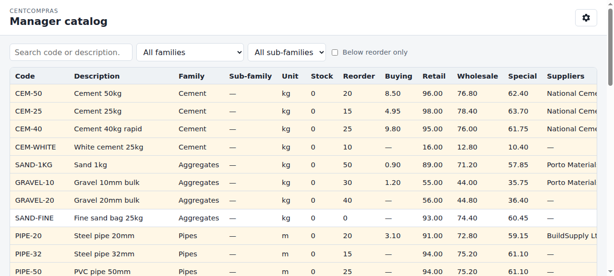

# CentCompras — User Manual: Manager Catalog

**The Manager catalog** · Version 1.0 · For warehouse staff (admin / manager / operator)

> **Also available:** [Item Console](01-items.md) at `/manage/items/` · [Purchase orders](02-purchase-orders.md) · [Goods receipt & stock](03-goods-receipts.md) · [Branches & Requisição interna](04-internal-requests.md) · [Edge cases & limits](05-edge-cases-and-limits.md) · [Admin & Superuser Reference](06-admin-reference.md).

This is the warehouse **read-only** overview: stock, reorder level, selling prices, buying price, and suppliers on one page. You do **not** edit items here — that is the [Item Console](01-items.md).

---

## Where do I go?

> **Open your browser and go to:**
>
> **`https://<your-domain>/manage/catalog/`**
>
> *(During development on your own machine: `http://127.0.0.1:8015/manage/catalog/`)*

Sign in with your warehouse email + password. The dashboard at `/` lists this page (and the other warehouse / branch consoles) as *manager catalog (stock + prices)*.

Branch staff do **not** use this URL. They browse the [branch catalogue](04-internal-requests.md) at `/branch/catalog/` (cost hidden, stock as a hint only).

---

## 1. Your role — what you can do

| Role | Open the page | See cost (buying price) | Edit anything here |
|------|:---:|:---:|:---:|
| **Admin** (`warehouse_admins`) | ✅ | ✅ | ❌ |
| **Manager** (`warehouse_managers`) | ✅ | ✅ | ❌ |
| **Operator** (`warehouse_data_operators`) | ✅ | ✅ | ❌ |
| **Branch staff** | ❌ | — | — |

- The whole page is **view-only** for every warehouse role — there is no Save, no New item, no Adjust stock.
- **Cost is warehouse-confidential.** That is why this page exists separately from `/branch/catalog/`.
- A button or column missing is **not a bug**; branch users who open `/manage/catalog/` are refused (*Catalogue view permission required*).
- The Django **`/admin/`** screen is for the **site superuser only** — it is *not* part of this manual.

To change an item, a price, or stock, use the consoles in §7.

---

## 2. What this page is (and is not)

```text
Item console (/manage/items/)     →  create / edit catalogue
Goods receipt (/manage/goods-receipts/)  →  stock goes UP
Goods issue (/manage/internal-requests/) →  stock goes DOWN
        ↓
Manager catalog (/manage/catalog/)  →  read the joined picture
```

| This page **does** | This page **does not** |
|--------------------|------------------------|
| Show **active** items in **active** families | Show deactivated items, or items whose family is inactive |
| Show the **cached** on-hand quantity | Let you type a quantity (stock is a ledger — see [goods receipt](03-goods-receipts.md)) |
| Show buying + three selling prices | Let you change prices (use the [item console](01-items.md)) |
| Flag items at or below reorder | Raise a purchase order (use [purchase orders](02-purchase-orders.md)) |
| List suppliers that have a price for the item | Open a drawer or history |

Clicking a row does nothing — there is no detail drawer.

---

## 3. The console at a glance



**A. Top bar**
- Title: **Manager catalog** (*Catálogo do gestor*)
- **Settings** gear (top-right) — signed in as *you@company*, language (English / Português), theme toggle, **Sign out**

**B. Toolbar (filters)**

| Control | EN | pt-PT | What it does |
|---------|----|-------|----------------|
| Search | *Search code or description…* | *Pesquisar código ou descrição…* | Filters as you type (internal code **or** description) |
| Family | *All families* | *Todas as famílias* | Restrict to one family |
| Sub-family | *All sub-families* | *Todas as sub-famílias* | Restrict to one sub-family (list scoped to the family filter when set) |
| Checkbox | **Below reorder only** | **Só abaixo do ponto de encomenda** | Hide items that are OK |

Filters combine. They run in the browser on the loaded list — you do not need to click Search.

**C. Table columns**

| Column | Meaning |
|--------|---------|
| **Code** | Internal code (or — if empty on a legacy row) |
| **Description** | What the item is |
| **Family** | Family name |
| **Sub-family** | Sub-family name, or **—** if none |
| **Unit** | Unit of measure |
| **On hand** | Cached physical quantity (from the stock ledger) |
| **Reserved** | Quantity held for approved / fulfilling requisições |
| **Available** | On hand minus reserved — what is still free to ship today |
| **Reorder** | Reorder level set on the item |
| **Buying** | Cost we pay — see §5 |
| **Retail / Wholesale / Special** | The three **manual** selling prices |
| **Suppliers** | Suppliers that have a price for this item; the **primary** is marked ★ |
| **Status** | **Below reorder** (warning pill) or **OK** |

Rows at or below reorder are highlighted with a warning tint **and** a Status pill. The tint follows the theme: pale amber on light, dark amber on dark, so the row text stays readable.

---

## 4. Stock and “below reorder”

**On hand** is the same cached physical balance as everywhere else: goods receipts add, goods issues subtract, admin **Adjust stock** corrects. **Reserved** is stock already promised to approved requisições. **Available** is on hand minus reserved. This page only **displays** these figures. If on-hand looks wrong, trust **Stock movements** on the [goods receipt console](03-goods-receipts.md) — that is the ledger.

**Below reorder** is true when:

- the item’s **reorder level is greater than zero**, **and**
- **available ≤ reorder level**.

A reorder level of **0** means “no reorder trigger” — the status stays **OK** even if available is 0.

Use **Below reorder only** when you want a shortlist of items that need procuring.

---

## 5. Buying price and suppliers

Selling prices (retail / wholesale / special) are **manual** — they come from the item. Buying price is **dynamic** — it comes from the supplier price list.

The **Buying** column is one number per item:

1. If the item has a **primary** supplier (★) that is still active, that supplier’s cost is shown.
2. Otherwise the **cheapest** cost among **active** suppliers is shown.
3. If no active supplier has a price, Buying is **—**.

The **Suppliers** column lists names (comma-separated). Deactivated suppliers are omitted. **—** means no active supplier price yet — add one in the item console before you can raise a purchase order for that supplier.

Prices here are **not** a frozen PO snapshot; they follow the live supplier list. Approved purchase-order totals stay frozen on the PO — see [purchase orders](02-purchase-orders.md) §8.

---

## 6. Empty states and errors

| Message (exact, EN) | Why | What to do |
|---------------------|-----|------------|
| `No items to show.` | There are no active items in active families | Create/activate items in the [item console](01-items.md) |
| `No items match these filters.` | Search, family, sub-family, or “below reorder only” hid every row | Clear search, set family/sub-family to *All*, untick the checkbox |
| `Could not load the catalog.` | The catalog API failed | Refresh the page; if it persists, ask an administrator |
| `The request could not be completed.` | A request failed without a specific message | Refresh; try again |
| `Catalogue view permission required` | You are not a warehouse user (typical for branch-only logins) | Use `/branch/catalog/` instead, or ask head office for a warehouse group |

The family dropdown can include **inactive** families (it reuses the families list). The table never lists items under an inactive family, so picking one of those families yields *No items match these filters.*

---

## 7. Related consoles

- [Item Console](01-items.md) — create/edit items, families, suppliers, selling prices, supplier prices.
- [Purchase orders](02-purchase-orders.md) — restock from suppliers when the catalog shows low stock.
- [Goods receipt & stock](03-goods-receipts.md) — book deliveries; that is what updates **Stock**.
- [Branches & Requisição interna](04-internal-requests.md) — branch catalogue (cost hidden) and the request / issue / receipt loop.
- [Edge cases, limits & troubleshooting](05-edge-cases-and-limits.md) — error messages and numeric bounds.
- [Admin & Superuser Reference](06-admin-reference.md) — who may use which URL.

---

## 8. Language, theme & dates

Same as the other warehouse consoles:

- **Language:** English / Português (Settings gear; remembered).
- **Theme:** light / dark (Settings gear; remembered). Below-reorder row highlighting follows the theme (it is not a fixed pale yellow).
- **Dates** are not shown on this page (no created/updated column). Quantity and money use a plain decimal format.

---

## 9. FAQ

**Q1. Why can’t I edit a price or the stock number here?**
This page is an overview. Change selling prices and supplier costs in the [item console](01-items.md). Change stock with a [goods receipt](03-goods-receipts.md) or (admin only) **Adjust stock**.

**Q2. Why is Buying “—” when I know we have a supplier?**
That supplier is **inactive**, or there is no supplier price for this item. Add an active supplier price in the item console (Suppliers → Supplier prices).

**Q3. What does the star (★) on a supplier mean?**
That supplier is the item’s **primary** (preferred). Its cost is the Buying figure. Only one primary per item.

**Q4. Why does this page show exact stock but the branch catalogue does not?**
Deliberate. Warehouse staff see on-hand, reserved, and available here. Branch staff see only **In stock / Low / None** on `/branch/catalog/` (from **available**, not raw on-hand) — see [Branches & Requisição interna](04-internal-requests.md) §3.

**Q5. I deactivated an item and it vanished from this list — is it deleted?**
No. Deactivated items (and items whose family is inactive) are excluded from this view. Reactivate in the item console to bring them back.

**Q6. On hand is 0 but Status says OK — is that a bug?**
Not if **Reorder** is 0. A zero reorder level means “do not flag”. Set a reorder level greater than 0 on the item if you want the warning. Status uses **available**, so 10 on hand with 10 reserved also flags as below reorder when reorder > 0.

**Q7. On hand is 10 but Available is 0 — where did the stock go?**
It is **reserved** for approved requisições. The warehouse queue at `/manage/internal-requests/` shows who holds it.

**Q8. I am a warehouse operator — should I see cost?**
Yes. Every warehouse group that can open this page sees buying price. Cost is hidden only on the **branch** catalogue.

**Q9. Can two items have the same internal code?**
No — codes are unique (case-insensitive) and stored **uppercase**. That rule is enforced in the item console, not here. See [Item Console](01-items.md) FAQ.

**Q10. Why are some rows tinted amber?**
Those items are **Below reorder**. Status **OK** keeps the normal table background. The tint follows the theme (pale amber in light, dark amber in dark) so the text stays readable.
