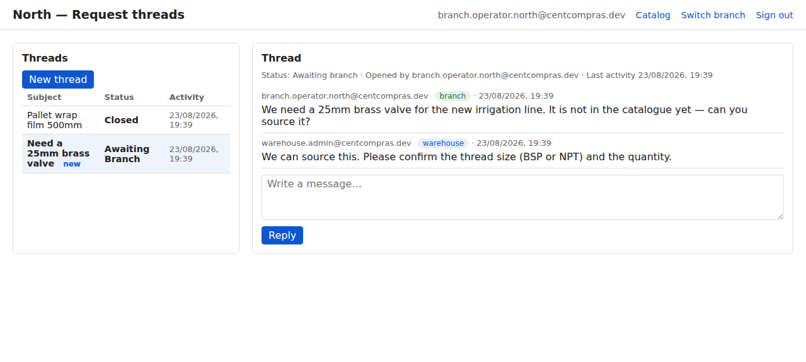
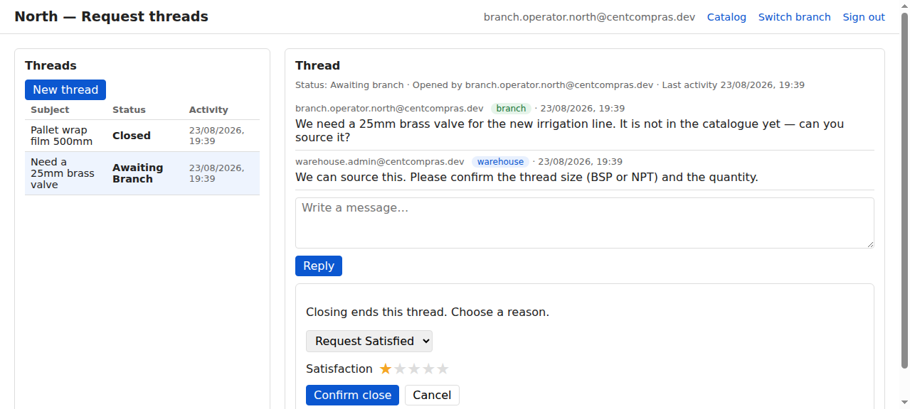
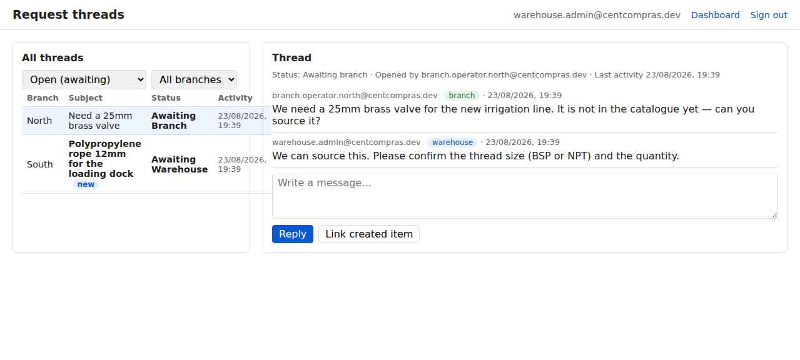

# CentCompras — User Manual: Request Threads

**Written requests for items not in the catalogue** · Version 1.0 · For branch staff **and** warehouse staff

> **Also available:** the [Item Console manual](01-items.md) · [Purchase Orders](02-purchase-orders.md) · [Goods receipt & stock](03-goods-receipts.md) · [Branches & Requisição interna](04-internal-requests.md) · [Edge cases & limits](05-edge-cases-and-limits.md) · [Admin & Superuser Reference](06-admin-reference.md) · [Manager catalog](07-manager-catalog.md).
>
> This manual covers the **Request thread** console — the written channel a branch uses when the item it needs **does not exist in the catalogue yet**.

---

## Where do I go?

> **Open your browser and go to:**
>
> **`/branch/threads/`** (branch side) or **`/manage/threads/`** (warehouse side)
>
> *(During development on your own machine: `http://127.0.0.1:8015/branch/threads/` and `http://127.0.0.1:8015/manage/threads/`.)*

| Who | Page | What for |
|-----|------|----------|
| Branch (any role) | `/branch/threads/` | Open a thread, read replies, reply, close your own thread |
| Warehouse (any group) | `/manage/threads/` | See **all** branches' threads, reply, link created items |
| Warehouse admin | `/manage/threads/` | Force-close an abandoned / duplicate thread (override) |

The header keeps **Catalog** / **Switch branch** (branch) or **Dashboard** (warehouse). **Sign out** is in the **Settings** gear (top-right). **Help** in that panel is a placeholder.

---

## The big picture

A normal **Requisição interna** (see [04](04-internal-requests.md)) only works for items that **already exist** in the `Item` table — you pick the item from the catalogue. But sometimes a branch needs something the warehouse has never catalogued. In that case:

```text
Branch opens a thread   (subject + first message, in writing)
        ↓
Warehouse engages        (reply, ask questions, back-and-forth)
        ↓
Both sides understand     (the warehouse will create / procure the item)
        ↓
Warehouse creates the item   (via the normal item console)
        ↓
Branch closes the thread      (reason + satisfaction rating)
```

The thread is a **conversation**, not a purchase order and not a requisição. The item is created by the warehouse in the normal catalogue workflow — never inside the thread.



---

## 1. Your role — what you can do

### 1.1 Branch roles

| Capability | Operator | Manager | Admin |
|-----------|:---:|:---:|:---:|
| Open a thread, reply, read the conversation | ✅ | ✅ | ✅ |
| Close a thread **you opened** | ✅ | ✅ | ✅ |
| Force-close any thread (override, with reason) | ❌ | ✅ | ✅ |

### 1.2 Warehouse roles

| Capability | Operator | Manager | Admin |
|-----------|:---:|:---:|:---:|
| See all branches' threads, reply | ✅ | ✅ | ✅ |
| Link created item(s) to a thread | ✅ | ✅ | ✅ |
| Force-close any thread (override, with reason) | ❌ | ❌ | ✅ |

---

## 2. Opening a thread (branch)

1. Go to **`/branch/threads/`**.
2. Click **New thread** (*Novo fio*).
3. **Subject** — a short title, e.g. *"Need a 25mm brass valve"*.
4. **First message** — describe the item in your own words: what it is, what it's for, rough quantity. There is **no item picker** — the item does not exist yet.
5. Click **Create**.

The thread opens in state **Awaiting warehouse** — the ball is in the head office's court.

> A thread can only be opened from an **active** branch. If the branch is deactivated, new threads are blocked.

---

## 3. The conversation

**Anyone with access can post**: every user of the originating branch, and every warehouse user.

Each message shows **who** wrote it, **which side** (branch / warehouse) it came from, and **when**.

The thread always shows whose turn it is:

| State | Meaning |
|-------|---------|
| **Awaiting warehouse** | The warehouse should respond next |
| **Awaiting branch** | The branch should respond next |
| **Closed** | Done — no more messages |

A post flips the turn to the other side. Two posts in a row by the same side keep the state (the other side still owes a reply).

**Unread:** new activity on a thread you haven't opened yet shows a **"new"** badge next to it. **Clicking the thread in the list** marks it read and clears the badge. The first thread is previewed when the page loads, but that preview does **not** mark it read (so a shared warehouse queue does not lose the badge just because someone opened the page).

---

## 4. Closing a thread

Only the person who **opened** the thread can close it — with a **reason** and a **satisfaction rating**:

| Reason | When |
|--------|------|
| **Request Satisfied** | The item was created / procured and the need is met (default) |
| **Other** + textbox | Any other reason (duplicate, no longer needed, …) |

**Satisfaction (1–5 stars):** the close dialog always includes a star rating. It **defaults to 1 star** and is editable — so even when the request wasn't properly attended, the branch can signal it through the rating. Pick the number of stars that matches how well the request was handled, then confirm.



Closing ends the thread — **no further messages can be posted**. If the need comes back later, open a new thread.

> **Why default 1 star?** An unanswered / poorly handled request should be able to *signal* dissatisfaction without extra steps. The opener can always raise the rating before confirming.

### Override close (exceptional)

In exceptional circumstances a thread can be force-closed by someone who did **not** open it:

| Who | When |
|-----|------|
| Branch **manager / admin** of that branch | Abandoned, duplicate, no longer needed |
| Warehouse **admin** | Abandoned / duplicate threads on the warehouse side |

The override still requires a reason, and the thread history records **who** force-closed it and why, so the opener can always see what happened. Override close does **not** record a satisfaction rating (stars are opener-only; the closer cannot rate on the opener's behalf).

---

## 5. Warehouse side (`/manage/threads/`)

Warehouse staff see **all** branches' threads in one queue:

- **Open (awaiting)** is the default view — threads awaiting the warehouse are listed **oldest first** so nothing rots. Closed threads are filtered out.
- Filters: **status** (open / awaiting warehouse / awaiting branch / closed) and **branch**.
- Threads from an **inactive branch** still appear, flagged as *inactive branch* — the conversation can still be finished, just no new work.



### Linking created items (traceability)

When the warehouse creates the item(s) from the thread (via the normal item console):

1. Open the thread.
2. Click **Link created item**.
3. Search for the item and link it.

The link shows on both sides ("Created items: …"). You can link **after** the thread is closed too — the opener often closes the thread right as the item lands. Every link is recorded in the thread history (who/when).

---

## 6. Thread → requisição: no auto-convert

A thread does **not** turn into a Requisição interna automatically. Once the item exists in the catalogue, the branch places a **normal requisição** against it (see [04-internal-requests.md](04-internal-requests.md)) — that's the flow that ships stock. The thread's job is only to agree **what** to create.

---

## 7. What you cannot do here

- **Post to a closed thread** — closed is terminal. Open a new thread instead.
- **Close a thread you didn't open** — unless you're the branch manager/admin or warehouse admin (override, with reason).
- **Close without a reason** — the reason is required ("Request Satisfied" is pre-selected; "Other" needs text).
- **See another branch's threads** — other branches are invisible (404), exactly like requisições.
- **Link a missing item** — unknown or stale item ids are rejected (`One or more items were not found.`). Re-linking an item already on the thread is a no-op (no extra history row).
- **Create the item inside the thread** — the warehouse creates it in the item console.
- **Edit or delete a message** — messages are append-only (audit).

---

## 8. FAQ

**Q1. The item doesn't exist — how do I request it?**
Open a **thread** at `/branch/threads/` and describe it in writing. The warehouse will reply and, once understood, create the item.

**Q2. When does the thread close?**
When **you** (the opener) close it, with a reason — normally after the warehouse confirms/creates the item and your need is satisfied.

**Q3. I can't see the Close button — why?**
Only the **opener** sees it (plus branch managers/admins and warehouse admins as an override). If you're not the opener, ask them to close it.

**Q4. We agreed on the item — what now?**
The warehouse creates it in the catalogue, then your branch raises a normal **Requisição interna** against it. The thread does not auto-convert.

**Q5. Can the warehouse see our thread?**
Yes — that's the point. Warehouse staff see all branches' threads. Other **branches** never see yours.

**Q6. Someone force-closed our thread. Why?**
A branch manager/admin or warehouse admin can close any thread in exceptional cases (abandoned, duplicate). The thread history shows who did it and the reason.

**Q7. What does the "new" badge mean?**
Unread activity — a reply arrived since you last opened the thread. **Clicking the thread in the list** clears the badge. Loading the page (which previews the first thread) does not.

**Q8. We need it again later — can we reopen?**
No — closed is terminal. Open a new thread.

**Q9. What are the stars in the close dialog?**
Your **satisfaction rating** (1–5 stars) for how the request was handled. It defaults to **1 star** — raise it if you were properly attended, or leave it low to signal that the request wasn't handled well. The rating is stored with the close and visible in the thread history. **Only the opener** rates; a manager/admin force-close does not set stars.

---

## 9. Dates, timezone, language & theme

Same as the other consoles:

- **Dates:** DD/MM/YYYY, 24-hour time (e.g. `20/08/2026 14:05`).
- **Timezone:** your local time (new users default to **Europe/Lisbon**).
- **Language:** English / Português — set on the staff dashboard (`/`) or branch catalog (`/branch/catalog/`); remembered in this browser.
- **Theme:** light / dark — same bar as language on those landing pages; remembered.

---

## 10. Related consoles

- [Item Console](01-items.md) — where the warehouse manages the catalogue.
- [Branches & Requisição interna](04-internal-requests.md) — the normal branch ordering loop against existing items.
- [Manager catalog](07-manager-catalog.md) — warehouse read-only stock + prices.
- [Purchase Orders](02-purchase-orders.md) — how the warehouse restocks from suppliers.
