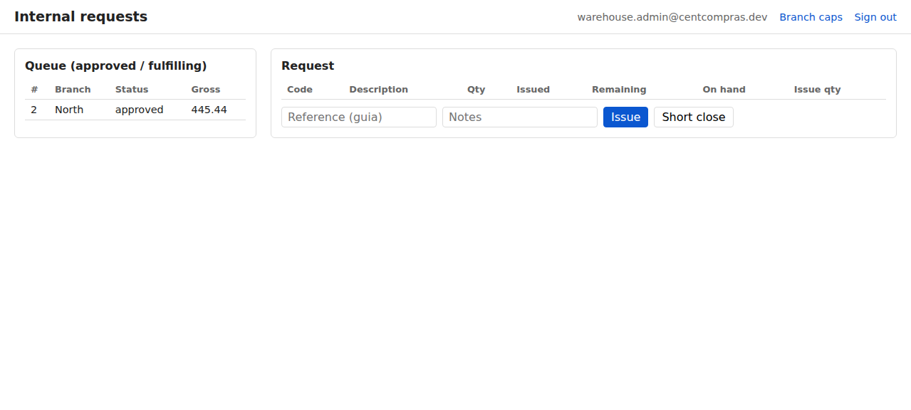

# CentCompras — User Manual: Branches & Requisição interna

**Branch ordering** · Version 1.0 · For branch staff (operator / manager / admin) **and** warehouse staff

> **Also available:** the [Item Console manual](01-items.md) · [Purchase Orders](02-purchase-orders.md) · [Goods receipt & stock](03-goods-receipts.md) · [Manager catalog](07-manager-catalog.md) · [Edge cases & limits](05-edge-cases-and-limits.md) · [Admin & Superuser Reference](06-admin-reference.md).
>
> This manual covers everything a **satellite branch** does, plus the **warehouse** side of the same loop. Read it end-to-end once — the loop only makes sense as a whole.

---

## The big picture

A branch orders from the central warehouse through a **Requisição interna** (internal request). The loop:

```text
Branch browses catalogue   (no selling prices; cost hidden; stock as a hint)
        ↓
Branch raises a requisição (draft — quantities)
        ↓
Branch manager/admin agrees  (yes/no on the quantities; no euro cap)
        ↓
Warehouse ships            (goods issue — central stock goes DOWN)
        ↓
Branch confirms arrival    (branch receipt — branch stock goes UP)
```

A superuser can switch the company to **priced** mode in `/admin/` (Branch commercial settings). Then the branch catalogue shows selling prices again, and manager approval uses EUR caps — the previous behaviour. Warehouse consoles always keep cost and selling prices.

Out of stock? The warehouse raises a **purchase order** to a supplier first — see the [Purchase Orders](02-purchase-orders.md) and [Goods receipt](03-goods-receipts.md) manuals. That part is unchanged.

---

## Where do I go?

| Who | Page | What for |
|-----|------|----------|
| Branch (any role) | `/branch/` | Branch dashboard — cards to every branch tool |
| Branch (any role) | `/branch/select/` | Choose your branch (only when you belong to several) |
| Branch (any role) | `/branch/catalog/` | Read-only catalogue (no selling prices by default; cost always hidden; stock hint) |
| Branch (any role) | `/branch/requests/` | Raise & edit a requisição |
| Branch (any role) | `/branch/threads/` | Request items not in the catalogue |
| Branch (manager / admin) | `/branch/requests/` | Approve / reject |
| Branch (any role) | `/branch/receipts/` | Confirm arrival against a dispatch |
| Branch (manager / admin) | `/branch/receipts/` | Return an unbooked dispatch to the warehouse |
| Branch (any role) | `/branch/stock/` | See this branch's on-hand quantity |
| Branch (any role) | `/branch/consumption/` | Take items off this branch's stock |
| Branch (any role) | `/branch/send-to-warehouse/` | See sends to the warehouse (manager/admin send) |
| Branch (manager / admin) | `/branch/alerts/` | Receipt discrepancies and dispatch returns (unread until you open a row) |
| Branch (any role) | `/company-voice/` | Company-wide suggestion box |
| Warehouse | `/manage/internal-requests/` | Queue of approved requests + goods issue |
| Warehouse | `/manage/incoming-from-branches/` | Confirm items a branch sent to the warehouse |
| Warehouse | `/manage/returned-dispatches/` | Restock or write off a dispatch the branch sent back |
| Warehouse | `/manage/stock-at-branches/` | Read-only on-hand at every branch |
| Warehouse (admin, or manager grade 2+) | `/manage/alerts/` | Receipt discrepancies and dispatch returns from every branch |
| Warehouse admin | `/manage/branch-approval-limits/` | Branch manager approval caps |

*(During development on your own machine: `http://127.0.0.1:8015/…`.)*

> 📷 **[SCREENSHOT — branch dashboard with card grid]**

---

## 1. Your role — what you can do

There are **three branch roles** (set for you by the head office) and the usual **warehouse roles**. A button missing from your screen is **not a bug** — it is not part of your role.

### 1.1 Branch roles

| Capability | Operator | Manager | Admin |
|-----------|:---:|:---:|:---:|
| Browse catalogue | ✅ | ✅ | ✅ |
| Raise & edit a draft, submit, cancel a draft | ✅ | ✅ | ✅ |
| Approve / reject | ❌ | ✅ (yes/no; EUR caps only if priced mode is on) | ✅ (unlimited) |
| Cancel an **approved** request | ❌ | ✅ | ✅ |
| Confirm arrival (branch receipt) | ✅ | ✅ | ✅ |
| Return an unbooked dispatch to the warehouse | ❌ | ✅ | ✅ |
| View branch on-hand (`/branch/stock/`) | ✅ | ✅ | ✅ |
| Consume branch stock (`/branch/consumption/`) | ✅ | ✅ | ✅ |
| View sends to the warehouse | ✅ | ✅ | ✅ |
| Send surplus to the warehouse / cancel in transit | ❌ | ✅ | ✅ |
| Receipt discrepancy alerts | ❌ | ✅ | ✅ |
| Branch short-close | ❌ | ✅ | ✅ |
| Adjust branch stock | ❌ | ❌ | ✅ |

- **Operator** can do the day-to-day (catalogue, request, receipt, consume) but never approves and never short-closes.
- **Manager** adds approval/rejection/short-close. By default approval is **yes/no on quantities** (no euro cap). If the superuser turns on **priced** mode, managers are limited by **EUR gross caps** (self vs others — see §8).
- **Admin** is the branch power user: unlimited approval, plus **branch stock adjustments**.
- The Django **`/admin/`** screen is for the **site superuser only**. Branch staff never log into `/admin/`. Head office creates your login and your branch role there.

### 1.2 Warehouse roles (the other half of the loop)

| Capability | Who |
|-----------|-----|
| See the request queue + issue goods | Operator grade 2+, manager, admin |
| Confirm incoming from branches | Operator grade 2+, manager, admin |
| See stock at branches (read-only) | Anyone who can open goods receipts |
| Process returned dispatches (`/manage/returned-dispatches/`) | Operator grade 2+, manager, admin |
| Receipt discrepancy and dispatch-return alerts (`/manage/alerts/`) | Manager grade 2+ or admin |
| Warehouse short-close | Manager grade 2+ or admin |
| Edit branch approval caps | Warehouse admin (`/manage/branch-approval-limits/`) |

---

## 2. Choosing your branch (the picker)

You may belong to **one branch, several branches, or none**. After signing in:

| Your situation | What happens |
|----------------|--------------|
| **One branch** | You go straight to **`/branch/`** (branch dashboard). Your branch is selected automatically — no picker. |
| **Several branches** | You land on `/branch/select/` — pick one, then continue to the dashboard. |
| **No branch** | The picker says *"You have no active branch access."* Ask your administrator. |

From the dashboard, **Your branch** has **Catalog**, **Internal request**, **Receipts**, **Branch stock**, **Consume**, and **Send to warehouse**. **Communication** has **Threads**, then **Parle**. On **Catalog**, **Requests**, **Receipts**, **Stock**, **Consume**, **Send**, and **Threads**, the top bar also has **Home**, **Catalog**, **Requests**, **Receipts**, **Stock**, **Consume**, **Send**, and **Threads** (Threads is last) — not on the dashboard itself.

**Switch branch** appears only when you belong to **more than one** branch. If you see only one branch in your life, that link is hidden — you cannot browse other branches.

**Sign out** is a small link on the **Settings** title row (gear, top-right). **Help** is the blue **?** icon next to the gear (placeholder). **Language** and **theme** are on the staff dashboard (`/`) and branch dashboard (`/branch/`) only — not on branch work pages.

> 📷 **[SCREENSHOT — branch picker with two branches listed]**

---

## 3. The branch catalogue (read-only)

Open **`/branch/catalog/`**. This is the same product catalogue the warehouse manages, but with two deliberate differences:

1. **Prices on the branch.** **Unpriced** (the default): you see identity, unit, family, and availability — **no** selling price/wholesale/special, and never the supplier cost. **Priced** (superuser switch in `/admin/`): you see the **selling prices** (Selling price / Wholesale / Special), still never the supplier cost.
2. **Stock is only a hint** — never an exact number.

Warehouse staff see exact stock **and** cost on the [manager catalog](07-manager-catalog.md) at `/manage/catalog/`.

### 3.1 Filters and sort

The toolbar stays visible while you scroll. Search, family, and sub-family combine as you type or pick. Family and sub-family lists are **A–Z** (*All families* / *All sub-families* stay first). Click a column title to sort; click again to reverse. Default order is **Description** (A–Z). Column titles stay visible at the top of the table.

Branch staff do **not** get **Below reorder only** or **Include inactive**. The catalogue shows **active** items only. You never see reorder amounts, exact on-hand, reserved, available, buying cost, or suppliers.

### 3.2 The availability hint

| Hint | Meaning |
|------|---------|
| **In stock** | Something is **free to ship today** (available stock above the reorder level). |
| **Low** | Free-to-ship quantity is at or below the reorder level — request soon. |
| **None** | Nothing is free to ship **today** (the shelf is empty, or everything on the shelf is already held for earlier approved requisições). You may still raise a requisição — the warehouse will procure and you wait in line. |

You will **not** see the exact on-hand quantity — that is a warehouse figure. **None does not block a requisição.**

---

## 4. Raising a requisição

Open **`/branch/requests/`**.

### 4.1 Create a draft

1. Click **New request** (*Nova requisição*).
2. Confirm **Start a new request?** (*Iniciar uma nova requisição?*). **Cancel** does nothing; **OK** creates the draft.
3. The request starts as a **draft**.

### 4.2 Add lines

1. In the line form, pick an **item** from the catalogue picker (A–Z by the code — description shown). The picker starts on `-----`; no catalogue row is pre-selected.
2. Enter the **quantity** as a **whole number** of the item’s unit (greater than zero; no decimals). Quantity **defaults to 1** and **resets to 1 after each Add**.
3. Click **Add**.

A line is **rejected** if:

- the item has **no selling price**, or
- the item is **already** on this request (edit the existing line instead), or
- the item (or its family) is **inactive**.

You can **remove** a line while the request is still a draft.

### 4.3 Submit

When the request has at least one line and everything is active, click **Submit** (*Submeter*). The request becomes **submitted** and waits for a manager.

- You can no longer edit lines after submitting.
- A **draft** can be **cancelled** by any branch role (no reason needed). Click **Cancel Internal Request** and confirm — cancellation is **permanent** and cannot be undone.

---

## 5. Approve / reject (manager or admin)

Open a **submitted** request.

### 5.1 Approve

1. Click **Approve** (*Aprovar*).
2. Confirm. In **unpriced** mode (default) the confirmation is on the **quantities**, not a euro total. In **priced** mode the confirmation shows the **gross** (retail × quantity + VAT).
3. Confirm.

In both modes the warehouse still **freezes the totals** internally (retail + VAT snapshot) so later price changes don't rewrite history. Branch staff only **see** those numbers when priced mode is on.

Approving also **holds whatever warehouse stock is currently free** for this request (see §7). A later branch cannot take those units. If the hub has less than you asked for, the request is still approved: the free portion is held, and the rest waits for incoming stock (first approved wins).

| Approver | Limit |
|----------|-------|
| **Admin** | Unlimited |
| **Manager** | **Unpriced:** no euro cap — agree or refuse the request. **Priced:** EUR gross caps, one for **your own** requests, one for **other people's** (set by the warehouse admin, §8) |

### 5.2 Reject

Click **Reject** (*Rejeitar*) and give a **reason**. The request ends as **rejected** — raise a new one if you still need the goods.

> 📷 **[SCREENSHOT — approve confirmation showing gross]**

---

## 6. Cancelling a request

Click **Cancel Internal Request**. Confirm the dialog (`Cancel internal request #… permanently? This cannot be undone.` in English; Portuguese UI: `Cancelar a requisição interna n.º … de forma permanente? Isto não pode ser anulado.`). The dialog’s **OK / Cancel** buttons follow the **browser** language, not the site language. Cancellation is **permanent** — the request cannot be reopened; raise a new one if you still need the goods.

| From | Who | Reason required? |
|------|-----|:---:|
| **Draft** | Any branch role | No |
| **Approved** | Manager / admin | Yes (after the confirm) |

Cancelling an **approved** request (no dispatch yet) **releases the hold** immediately; those units are offered to the next waiting requisição (oldest `approved_at` first).

Once the warehouse has **shipped** (issued goods), a request can no longer be cancelled — only **short-closed** (§7 / §8). That rule stops stock from being dispatched and then "un-dispatched".

---

## 7. Warehouse — ship (goods issue)

Open **`/manage/internal-requests/`**. This queue shows **approved** and **fulfilling** requests only — never drafts, submitted, rejected, or cancelled. The header matches other warehouse consoles: **CentCompras** (links to **`/`**), **Branch caps**, and **Settings** (sign out).

### 7.1 Issue goods

1. Select a request from the queue on the left. **Issue** without a selected request shows *Enter at least one approved internal request.*
2. For each line you are shipping now, type the **issue quantity**.
3. (Optional) **Reference** (your *guia* / dispatch number) and **Notes**.
4. Click **Issue** (*Emitir*). *Enter at least one issue quantity.* appears only when a request is selected but every issue quantity is empty.

After a successful issue, the page refreshes the queue. If the request is fully shipped (or otherwise no longer in the queue), the detail panel clears so you only see queued items. Partial issues keep the request selected with updated quantities.

**Cancel** — shown only when a request is selected in the detail panel. Clears the detail view without reloading, showing only the queue (no request selected).

Rules:

- You cannot issue **more than is reserved for this request** (the quantity held at approve, plus any later incoming stock allocated to it).
- You cannot issue **more than the request's remaining** quantity.
- **Partial issue** is fine — the request becomes **fulfilling** and the rest ships later. Each issue creates its own dispatch (*guia*) number, which appears immediately on the branch **Receipts** page.
- A **complete** issue marks the request **shipped**.

The queue shows **reserved**, **backorder** (still waiting for stock), **on hand**, and **available** (on hand minus all holds) per line. Issue quantity defaults to the reserved amount.

Issuing **decrements central stock** and the hold together.

If another branch is first in line for free stock, you cannot ship to a later request until that hold is issued, cancelled, or short-closed (reason required).

### 7.2 Warehouse short-close

If you can't (or won't) ship the rest, click **Short close** and give a **reason**. The unshipped remainder is written off and any hold on that remainder is **released** to the next waiting requisição (oldest `approved_at` first).

- If **nothing was dispatched yet** (request still **approved**), the request becomes **closed** — there is nothing for the branch to receive.
- If you already **partially issued** goods (request **fulfilling**), the request becomes **shipped** so the branch can short-close any unreceived remainder. If the branch already received every unit you issued, the request becomes **closed**.

Only a **manager grade 2+ or admin** can do this.



---

## 8. Branch — confirm arrival (receipt)

Open **`/branch/receipts/`**. It lists the **dispatches** (*guias*) for your branch as soon as the warehouse issues them — including while the request is still **fulfilling** (more still to ship). Each warehouse issue has its own dispatch **#**. **Receive** is enabled once you select a dispatch. **Return to sender** is shown to **managers and admins** when this dispatch has **no** branch receipt yet. **Short close** stays disabled until the warehouse has finished (request **shipped** or **received**).

### 8.1 Receive against a dispatch

1. Select a dispatch.
2. **Receive qty** is pre-filled with **Remaining** (the still-unreceived part of what was shipped on this dispatch — the full shipped quantity when nothing has been received yet). The field is **view-only**.
3. If every line arrived as shipped, click **Receive** (*Receber*).
4. If a count does not match, click **Report discrepancies** (*Comunicar discrepâncias*). An **Actual received** column and a **Reorder** (*Requisitar em falta*) checkbox appear. Change only the wrong lines (you may enter **0**). Tick **Reorder** on a line if you still need some of the missing units — a **Reorder qty** field appears, pre-filled with the shortfall (Remaining − Actual received). You may lower it (minimum **1**); you cannot order more than the shortfall. To order none, untick Reorder.
5. Click **Receive**. If any actual qty is less than Remaining, you must give **one reason** for the dispatch. **Cancel** on that prompt does nothing.

Rules:

- **Receive qty** cannot exceed **Remaining** on that line (issued on this dispatch minus already received, minus any earlier discrepancy write-off). Leave the pre-filled number and click Receive to book the full remaining quantity.
- A discrepancy **finishes that dispatch line**. You cannot receive the missing units later on this guia. The warehouse issue document is **not** changed. If you still need some of the missing units, tick **Reorder** — the app creates **one new already-approved** requisição (warehouse queue, not the branch manager queue) for the **Reorder qty** on each ticked line (the full shortfall unless you lower it); several ticked lines go on the same new request. The write-off on this guia is still the full shortfall. This auto-approve happens even when an operator reports the discrepancy, and even when Reorder qty is less than the shortfall.
- While the request is still **fulfilling**, receiving a dispatch does **not** change the request status (the warehouse still has remainder). Branch stock still goes up by the actual qty.
- After the warehouse is done (**shipped**): if every issued unit is received or settled as a discrepancy → **closed**. If another dispatch still has unreceived qty → **received**.

Receiving **increments branch stock** immediately. The booked receipt appears in the **Receipts** table at the bottom of this page (BR #, dispatch, request, who, when, total, whether it was a discrepancy). A matching row appears in **Stock movements** (positive qty, type Receipt, reference **BR #**). After a full receive the dispatch may leave the open list (the request is **closed**) — the history and movements stay. Open **`/branch/stock/`** to see the new on-hand quantity.

### 8.2 Return to sender

If the pallet must **not** enter branch stock — damaged, wrong load, refused on the dock — a **manager or admin** clicks **Return to sender** (*Devolver ao armazém*). Operators do not see this button.

This is **not** a count dispute (use **Report discrepancies**) and **not** surplus you already own (use **Send to warehouse**). Return is allowed only when this dispatch has **no** branch receipt yet (nothing booked, nothing discrepancy-written-off). After any receipt on this *guia*, the button is disabled.

1. Select the dispatch. Remaining must still be open.
2. Confirm, then type a **reason** (required). **Cancel** on that prompt does nothing. Needs Wi-Fi.
3. The app returns **all remaining** on that dispatch (every open line on that *guia*). Later warehouse issues keep their own dispatch numbers.
4. Branch stock does **not** go up. The warehouse issue document is **not** reversed. The return appears in the **Returns** table (DR #). The dispatch leaves the open list once remaining is 0.
5. You cannot cancel a return in transit.

While the request is still **fulfilling**, returning a dispatch does **not** change the request status. After the warehouse is done (**shipped** / **received**): if nothing remains to receive on any GI (received + discrepancy write-off + returned), the request is **closed**.

The warehouse processes the pallet on **`/manage/returned-dispatches/`** (dashboard card **Returned dispatches**, nav **Returns**). That page is **not** mixed with surplus incoming from branches or supplier goods receipts. Staff who can view inventory can open it; processing needs the same permission as booking a goods receipt (operator grade 2+, manager, admin). The warehouse cannot refuse or bounce the pallet back.

For each line: leave **Write off** unticked to **Restock** the whole remaining quantity into the warehouse FIFO pool. Tick **Write off** to show **Write-off qty**, pre-filled with remaining, minimum **1**, maximum the remaining returned qty. Lowering the qty restocks the rest. A **reason** is required if any line is written off. One **Restock** click processes every line. Restocked units can be held for a *different* waiting requisição (oldest first). Written-off units stay off the warehouse shelf (they were already issued); there is no second stock movement — only an audit row. There is **no** auto-reorder.

### 8.3 Branch short-close

If the warehouse has finished and remaining qty on the request will **not** be booked into branch stock (lost in transit, abandoned on the dock with no return), click **Short close** and give a **reason**. That is not the “we counted 4, they shipped 5” case — use **Report discrepancies** for a count dispute. It is also not “send this unbooked *guia* back” — use **Return to sender** for that. Short close writes off the unreceived remainder of the **whole request** and the request becomes **closed**. Only a **manager or admin** can do this, and only after the warehouse has fully issued or short-closed (request **shipped** or **received**). While the request is still **fulfilling**, Short close is disabled (*Cannot short-close while the warehouse still has remaining to ship.*).

> 📷 **[SCREENSHOT — branch receipt with received quantities]**

### 8.4 Manager alerts (receipt discrepancies and dispatch returns)

When a branch books **fewer** units than the warehouse shipped on that dispatch, the receipt is stored as a discrepancy. **Managers** on both sides see it as an **Alerts** card on their dashboard (not on the work-page nav strip):

- Warehouse: **`/`** → **Alerts** → `/manage/alerts/` (every branch). Shown to warehouse **admins** and **managers grade 2+**.
- Branch: **`/branch/`** → **Alerts** → `/branch/alerts/` (the **active branch** only). Shown to branch **managers** and **admins**.

The card shows how many alerts you have not opened yet (for example a badge **3**). Opening the page does **not** clear that number. Click a card to mark it seen **for you**; other people still see it unread. Seen cards stay in the list.

Each discrepancy is its own card: **when**, the **request** number, the **dispatch** (*guia*) number, the qty mismatch (code, shipped, received, missing), and the **reason**. The warehouse list also shows the **branch** name. **See more** (*Ver mais*) always shows **Reorder** as **true** or **false**. When **true**, it also shows the **follow-up request** number and each reordered item with its qty (which may be less than the shortfall). **See less** (*Ver menos*) hides that block again.

The same Alerts pages also list **dispatch returns**. A card titled **Dispatch returned** shows when, branch, request #, dispatch #, and DR # — **no item or qty**. After the warehouse restocks, a **Returned stock restocked** card lists code and qty. After a write-off, **Returned stock written off** lists code, qty, and the warehouse reason. Only the **returning** branch (managers/admins) and warehouse alerts staff see these; other branches do not. Operators have no dashboard card; the URL returns **403**.

There is **no email** for this. The warehouse issue document is not changed.

### 8.4a New documents on Home

The **Home** dashboards (`/` warehouse, `/branch/` branch) show a number on a card when a **new** document arrived in that section since **you** last opened the work page. The work-page nav strip does **not** show these numbers.

| Home card | What counts as new | Cleared when |
|-----------|--------------------|--------------|
| **Internal requests** (warehouse) | A requisição becomes **approved** (including a discrepancy follow-up). Still counts while **fulfilling**. | You open `/manage/internal-requests/` |
| **Incoming from branches** (warehouse) | A branch send is **in transit**. | You open `/manage/incoming-from-branches/` |
| **Returned dispatches** (warehouse) | A dispatch return is **in transit**. | You open `/manage/returned-dispatches/` |
| **Branch receipts** (branch) | A warehouse dispatch (*guia*) still has remaining to book. | You open `/branch/receipts/` |
| **Request threads** / **Conversas** | Same unread rule as the **"new"** row on the thread list. | You **click the thread** (not merely open the list) |
| **Alerts** | Unchanged — click the alert card. Opening Alerts does **not** clear the Home number. | You click that alert |

Opening **Home** only *shows* the number; it does not mark anything seen. Another person still sees their own number. Documents that were already in the pile before you first used Home do **not** badge — the number is forward-looking. There is **no live refresh**: go back to Home (or reload) to see a new arrival. This is not the same as “how many are still in the queue”; the list is the queue.

Operators see the same Home numbers on Requests / Incoming / Returns / Receipts / Threads as anyone else who can open those pages. They still have no Alerts card.

### 8.5 Branch stock (on-hand)

Open **`/branch/stock/`** (any branch role). This lists **this branch's** received stock only (not the warehouse catalogue):

- Only items this branch has **received** or an admin has **adjusted** are listed. A new item is added on first receive (or first admin adjust). Quantity **0 stays listed**.
- `/branch/catalog/` remains the warehouse catalogue for ordering. This page is the branch's local stock list, not a copy of every warehouse item.
- Columns: code, description, family, sub-family, unit, **on-hand**. Search and family / sub-family filters work in the browser. Click a column header to sort.
- You never see warehouse quantity, cost, or selling prices here — those stay on `/branch/catalog/` (hint + optional prices).
- The page needs Wi-Fi. It does not cache on-hand offline.

### 8.6 Consume (take stock off the branch)

Open **`/branch/consumption/`** (any branch role). This books a numbered **consumption ticket** (BC #) and immediately takes quantity off **this branch's** on-hand.

1. Add one or more lines. The item picker lists only local stock with on-hand **greater than 0** (A–Z, `-----` first — nothing pre-selected).
2. Enter **Qty** (whole number, at least 1, not more than on-hand) and a **Reason** (required).
3. Click **Record**. Each line becomes a negative **Consumption** movement (reference **BC #**). `/branch/stock/` shows the new on-hand. Quantity **0 stays listed**.
4. The ticket appears in the history table. Click a row to reopen its lines.

You cannot consume an item this branch has never received (or that an admin has never adjusted onto the local list). One item per ticket line — do not add the same item twice. There is no draft and no void: if you booked the wrong qty, a branch **admin** uses **Adjust stock** on `/branch/receipts/` to put it back. This page needs Wi-Fi.

### 8.7 Send to warehouse (surplus, not a return)

Open **`/branch/send-to-warehouse/`**. This is **not** a return of a warehouse dispatch and it is **not** booked on `/branch/receipts/`.

A manager or admin sends on-hand items back to the **central warehouse** so another branch can be served from there.

1. Add lines from **active** items with on-hand greater than 0 (A–Z, `-----` first).
2. Enter **Qty** (whole number, at least 1, not more than on-hand) and a **Reason** (required).
3. Click **Send**. Branch stock goes **down** immediately. The send is **in transit** (BWS #).
4. The warehouse confirms arrival on `/manage/incoming-from-branches/`. Then warehouse stock goes **up** and waiting requisições can take a hold (oldest first).
5. While **in transit**, the same manager/admin may **Cancel send** with a reason — stock returns to this branch. The warehouse cannot cancel or refuse (stock does not bounce back from the warehouse screen).

Operators can read the history. Inactive catalogue items cannot be sent even if they still appear on `/branch/stock/`. This page needs Wi-Fi.

The warehouse also has a read-only **Stock at branches** page at `/manage/stock-at-branches/` so staff can see which branch has surplus before asking them to send.

---

## 9. Branch stock adjustment (admin only)

Branch **admin** may correct branch stock directly — for counts, damage, or mistakes.

1. On `/branch/receipts/`, click **Adjust stock**.
2. Choose the **Item** from the list, enter **Quantity** (positive to add, negative to remove — `0` is rejected), and a **Reason**.
3. Click **Adjust**. The movement appears in **Stock movements** on the same page; `/branch/stock/` shows the new on-hand.

Managers and operators do not see this button. Branch stock is a ledger like warehouse stock — every receipt and adjustment is recorded and the balance is computed, never typed onto the item.

---

## 10. Branch approval caps (warehouse admin)

Open **`/manage/branch-approval-limits/`** (warehouse **admin** only). This sets how much a branch **manager** may approve, in **EUR gross**, **when the company is in priced mode**. In **unpriced** mode (the default) these caps are stored but **not applied** — a manager simply agrees or refuses. The superuser turns priced mode on or off at **`/admin/` → Branch commercial settings**.

The header matches other warehouse consoles: **CentCompras** (links to **`/`**), **Requests**, and **Settings** (sign out).

- **Others** — the cap when the manager approves someone else's request.
- **Self** — the (lower) cap when the manager approves their **own** request.

Branch **admins** have no cap (unlimited). Operators never approve. These caps are global across all branches in this phase.

> 📷 **[SCREENSHOT — branch approval limits editor]**

---

## 11. The request life (status cheat-sheet)

```text
draft ──submit──▶ submitted ──approve──▶ approved ──issue──▶ fulfilling ──issue──▶ shipped
   │                  │                     │                                     │
   │ cancel (no       │ reject (reason)      │ cancel (reason, no shipments yet)  │
   │  reason)         ▼                     ▼                                     ▼
   └──────────────▶ cancelled            rejected                    shipped ──receive──▶ received ──receive──▶ closed
                                                                                       │                     ▲
                                                                                       └── short-close ──────┘
```

Issued *guias* can be received while the request is still **fulfilling**; that receipt does not change the header status. A **Reorder** follow-up from **Report discrepancies** is created already **approved** (it never sits in **submitted**).

| Status | Meaning |
|--------|---------|
| **draft** | Branch is building it |
| **submitted** | Waiting for a branch manager |
| **approved** | Visible to the warehouse; not yet shipped |
| **rejected** | Manager rejected it (terminal) |
| **fulfilling** | Partly shipped; warehouse remainder still open. Issued *guias* are already on `/branch/receipts/` |
| **shipped** | Warehouse done (fully issued or short-closed) |
| **received** | Partly arrived; branch remainder still open |
| **closed** | Branch done (fully received or short-closed) |
| **cancelled** | Voided before any goods issue |

---

## 12. What you cannot do here

- See the supplier **cost** from a branch account (never). Selling prices appear only in **priced** mode.
- See the **exact** warehouse stock from a branch account (hint only).
- Approve as an **operator**. In **priced** mode, a manager also cannot approve over their **EUR cap**.
- Request an **inactive** item, or a line with **no selling price**, or the **same item twice** on one request.
- Edit a request after **submit**.
- **Issue** more than is reserved for that request, or more than the request's remaining.
- **Receive** more than the line's remaining (issued on this dispatch minus already received, minus any discrepancy write-off). A count short of Remaining must go through **Report discrepancies** and finishes that dispatch line.
- **Cancel** a request after goods have been issued (short-close instead).
- **Short-close** a branch receipt while the warehouse still has remainder (**fulfilling**).
- Short-close as an **operator** (either side).
- Adjust branch stock unless you are the branch **admin**.
- **Consume** more than this branch has on hand, or an item that is not on the local stock list.
- **Send to warehouse** as an operator, send an **inactive** item, send more than on-hand, or cancel a send after the warehouse has already received it.

---

## 13. Dates, timezone, language & theme

Same as the other consoles:

- **Dates:** DD/MM/YYYY, 24-hour time (e.g. `20/08/2026 14:05`).
- **Timezone:** your local time (new users default to **Europe/Lisbon**).
- **Language:** defaults to **Português**; English is optional — set on the staff dashboard (`/`) or branch dashboard (`/branch/`); remembered in this browser.
- **Theme:** light / dark — same bar as language on those dashboards; remembered.

---

## 14. Related consoles

- [Item Console](01-items.md) — where the warehouse manages the catalogue (items, families, suppliers, prices).
- [Manager catalog](07-manager-catalog.md) — warehouse read-only stock + prices (`/manage/catalog/`; cost visible).
- [Purchase Orders](02-purchase-orders.md) — how the warehouse restocks from suppliers.
- [Goods receipt & stock](03-goods-receipts.md) — booking supplier deliveries into central stock.

---

## 15. FAQ

**Q1. Why can't I see prices in the branch catalogue?**
By default the company is in **unpriced** mode: branches request **quantities**, not money. Supplier **cost** is never shown on the branch (warehouse-confidential). If the superuser switches to **priced** mode, selling prices (retail / wholesale / special) appear again — still never cost. Warehouse staff see cost on the [manager catalog](07-manager-catalog.md) at `/manage/catalog/`.

**Q2. The catalogue says "None" for an item — can I still request it?**
Yes. **None** means nothing is free to ship *today* (empty shelf, or stock already held for earlier approved requisições). Raise the requisição anyway — you join the wait. Incoming stock is offered to the oldest approved request first.

**Q3. Why was my line rejected?**
The three rules: the item must have a **selling price**, it must be **active**, and it must not already be on the request. Check which one applies.

**Q4. I approved a request and the prices changed later — did my request change?**
No. Approving **freezes** the totals (retail + VAT snapshot). Later price changes don't touch an approved request.

**Q5. The warehouse shipped less than I asked — what do I do?**
Each partial dispatch appears on `/branch/receipts/` as soon as it is issued — confirm what arrived against that dispatch **#**. A later warehouse issue gets a **new** dispatch number. Branch **short-close** is only available after the warehouse has finished (full issue or warehouse short-close).

**Q6. I can't see "Approve" — why?**
You're an **operator** (operators never approve), or the request isn't **submitted**. Ask a manager, or submit first.

**Q7. I can't see "Short close" — why?**
Short-close is manager/admin only, on both the warehouse and branch side.

**Q7a. I can't see "Return to sender" — why?**
The button is **manager/admin** only (operators keep Receive and Report discrepancies). It is also hidden or disabled when this dispatch already has a branch receipt, remaining is 0, or it has already been returned. Use **Send to warehouse** for surplus you already booked.

**Q8. Can I request the same item twice?**
No — one line per item per request. **Edit** the line's quantity instead of adding a second line.

**Q9. My branch login says "no active branch access" — what's wrong?**
Head office hasn't assigned you to a branch (or your branch is inactive). Contact your administrator — branch access is set up in Django `/admin/`, not by you.

**Q10. What does "gross" mean on the approve button?**
Only in **priced** mode. It is the request's total **including VAT** (retail × quantity, plus VAT) — the figure your approval cap is measured against. In **unpriced** mode the approve confirmation has no euro amount.

**Q11. Another branch asked for the same item after us — will they take our stock?**
No, once your requisição is **approved**. The warehouse holds the free quantity for you. A later branch can still approve (and wait), but they cannot be issued those held units.

**Q12. We cancelled an approved request — what happens to the hold?**
The hold is released immediately and offered to the next waiting requisição (oldest first).

**Q13. Why can't I cancel an approved request after the warehouse shipped?**
Stock is already in motion. After the first goods issue the only way to finish early is **short-close** (warehouse side) or **branch short-close** (branch side).

**Q14. How is branch stock different from warehouse stock?**
Two separate ledgers. Warehouse stock lives on the item; **branch stock** lives per `(branch, item)` and only moves when you receive a dispatch, you **consume**, you **send to the warehouse**, or an admin adjusts it. `/branch/stock/` lists **only those local rows** — not the full warehouse catalogue. After you receive, the item appears there (or its on-hand goes up if it was already listed). Receipts / Returns / Stock movements at the bottom of `/branch/receipts/` are the ledger. **Consume** at `/branch/consumption/` is how on-hand goes down in day-to-day use. **Send to warehouse** at `/branch/send-to-warehouse/` is how surplus goes back to the warehouse (not a return of a *guia*). **Return to sender** on `/branch/receipts/` sends an **unbooked** *guia* back without raising branch stock. The open dispatch list only shows guias still in progress.

**Q14a. I received goods — why doesn't `/branch/stock/` show every catalogue item?**
It is not the warehouse catalogue. A row appears the first time this branch receives that item (or an admin adjusts it). Quantity 0 stays listed. Order from `/branch/catalog/` as before.

**Q15. Can I build a requisição while offline?**
Yes, for **drafts only**. Open `/branch/requests/` after you have visited the catalogue online at least once (so the item list is cached). While offline you can start a **New request** (confirm first) and add lines from the cached catalogue. The request shows **pending sync** until Wi-Fi returns; it then uploads automatically when you open any branch page that loads the offline scripts (catalog, requisição, dashboard, etc.). **Submit**, **Approve**, **Reject**, and **Cancel Internal Request** still require Wi-Fi.

**Q16. The catalogue offline banner says availability may be outdated — why?**
Offline mode shows the **last downloaded** catalogue for the **active branch**. Warehouse stock and availability hints can change while you were disconnected. Selling-price columns follow that last successful download: if it was **unpriced** (or the cache has no mode flag), prices stay hidden. After you reconnect once, the app drops stored price fields from the offline cache; until then, columns still follow the last download. Connect once after a commercial-mode change so the cache matches. If you switch branch while offline, the app warns that the cache belongs to another branch — connect to Wi-Fi on the current branch to download its catalogue.

**Q17. I switched branch with a pending offline draft — why won't it sync?**
Offline drafts are tied to the branch where you created them. If you switch to another branch, sync is **skipped** until you switch back and open `/branch/requests/` on that branch. Do not reuse the same offline draft UUID across branches — the server rejects it with `client_uuid is already in use on another branch.`

**Q18. Shared tablet: will the next person upload my offline draft?**
No, if you **Sign out**. Sign out clears this browser's offline draft queue. Drafts are also tied to your user id: another person who signs in on the same tablet will not auto-sync your leftover rows. Always sign out at the end of a shift.

**Q19. I reported a discrepancy — who is told?**
Nobody is emailed. Warehouse **admins** and **managers grade 2+** get an **Alerts** card on `/`; branch **managers** and **admins** get one on `/branch/`. Open the card to mark it seen for yourself. Operators do not see the card.

**Q20. I ticked Reorder on a discrepancy — why isn't the new request waiting for a manager?**
That's intended. A follow-up from **Report discrepancies** is created already **approved** and goes to `/manage/internal-requests/`, even if you lowered Reorder qty, and even if an operator reported it. Branch EUR caps do not apply on this path. The original request still closes out as usual.

**Q21. I received goods — how do I take them off branch stock when we use them?**
Open **`/branch/consumption/`**, add lines from this branch's on-hand, type a **Reason**, and **Record**. That writes a BC ticket and a negative consumption movement. It does not touch warehouse stock (that already fell at goods issue). You cannot go below on-hand.

**Q22. Branch B has surplus cement and Branch A is waiting — is that a return?**
No. Do **not** use `/branch/receipts/`. A North/South **manager** or **admin** opens **`/branch/send-to-warehouse/`**, sends the surplus, and the warehouse confirms it on **`/manage/incoming-from-branches/`**. Warehouse stock rises; Branch A's approved requisição can then take a hold automatically. The warehouse can look up surplus first on **`/manage/stock-at-branches/`**.

**Q23. What does the number on a Home card mean?**
A **new** document arrived in that section since **you** last opened the work page (for example an approved requisição on **Internal requests**, or a new *guia* on **Branch receipts**). Open the work page to clear it for yourself. **Alerts** still need a click on the alert. **Threads** still need a click on the conversation. The number is not “how many are waiting in the queue,” and it does not appear on the work-page nav strip. Reloading Home is how you see a later arrival — there is no live badge.
