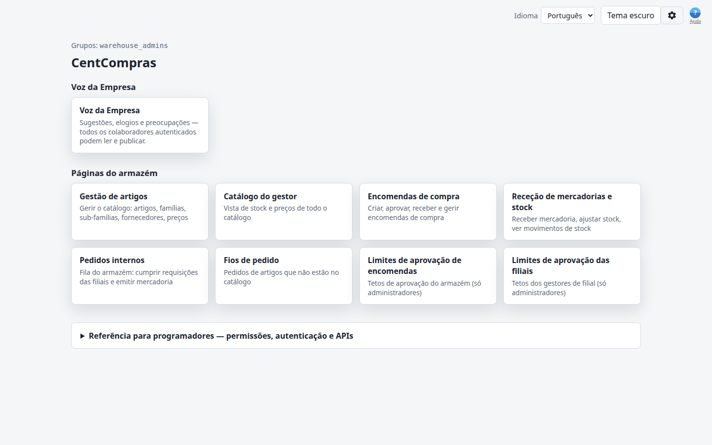
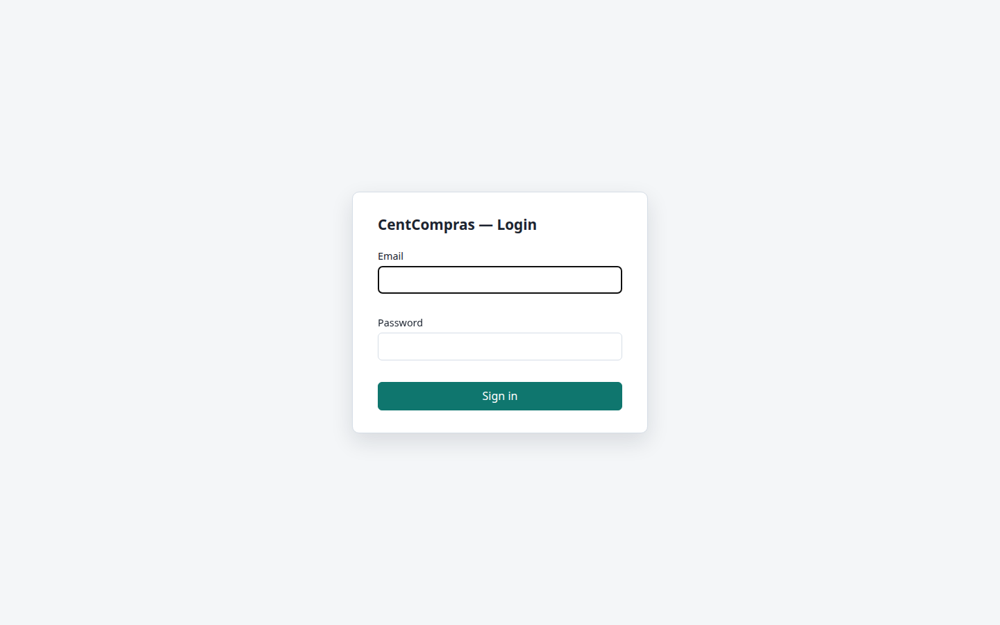
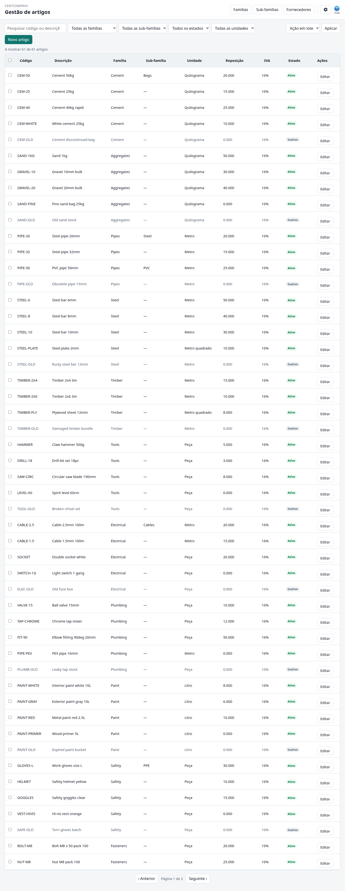
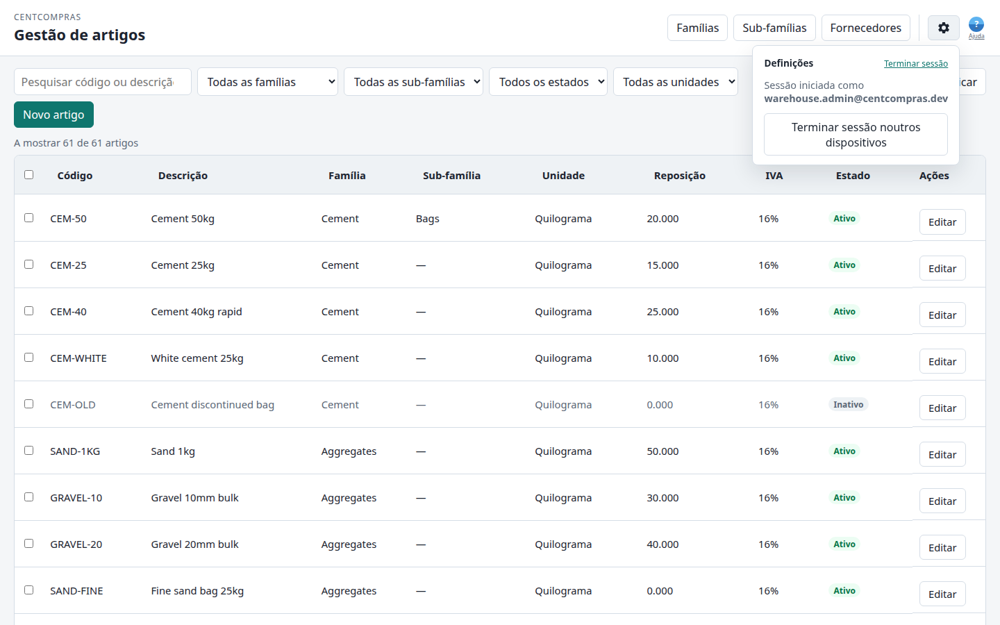

# CentCompras — Manual do utilizador

**Gestão de artigos** · Versão 1.0 · Para pessoal de armazém (administrador / gestor / operador)

> **Consulte também:** [Encomendas de compra](02-purchase-orders.md) em `/manage/purchase-orders/` · [Receção de mercadorias e stock](03-goods-receipts.md) em `/manage/goods-receipts/` · [Catálogo do gestor](07-manager-catalog.md) em `/manage/catalog/` · [Filiais e requisição interna](04-internal-requests.md) em `/branch/…` · [Casos limite e limites](05-edge-cases-and-limits.md) · [Referência de administração e superutilizador](06-admin-reference.md).

---

## Onde ir?

> **Abra o navegador e aceda a:**
>
> **`https://<your-domain>/`**
>
> *(Durante o desenvolvimento no seu próprio computador, use: `http://127.0.0.1:8015/`)*

Será direcionado à **página de início de sessão**. Depois de iniciar sessão, chega ao painel (`/`). Essa página lista todas as consolas de armazém (artigos, catálogo, encomendas de compra, **limites de aprovação**, receções de mercadorias, **requisições internas**, **limites de aprovação de filial**) mais as páginas de filial (`/branch/select/`, catálogo, requisição, receções) e as APIs JSON.

 A principal área de trabalho do catálogo é a **Gestão de artigos** em:

> **`https://<your-domain>/manage/items/`**

Guarde a URL da consola nos favoritos — é onde se faz o trabalho quotidiano do catálogo.

---

## 1. Primeiros passos

### 1.1 Iniciar sessão

1. Introduza o seu **email** no campo *Email*.
2. Introduza a sua **palavra-passe** (a que o administrador lhe atribuiu).
3. Clique em **Iniciar sessão**.

Se errar, verá *"Email ou palavra-passe inválidos."*

### 1.2 Terminar sessão

Abra o ícone **Definições** (canto superior direito da consola). **Terminar sessão** é uma ligação pequena na mesma linha do título **Definições** (à extrema direita). **Ajuda** fica ao lado do ícone Definições como um **?** azul (fora do pop-up).

### 1.3 Idioma

A consola completa funciona em dois idiomas. Defina **Idioma** no painel do pessoal (`/`) — o controlo está na barra superior direita, ao lado do tema:

- **Inglês**
- **Português**

A escolha é memorizada neste navegador e aplica-se a todas as consolas de armazém, Company Voice e threads de pedido. O pessoal de filial usa o mesmo controlo no catálogo de filial (`/branch/catalog/`). O ícone **Definições** mostra o email com sessão iniciada, uma ligação pequena **Terminar sessão** e **Terminar sessão noutros dispositivos**. **Ajuda** é o ícone **?** azul ao lado do ícone.

### 1.4 Tema claro / escuro

Use o botão de **tema** no painel do pessoal (`/`) — ao lado de **Idioma** — para alternar entre **Tema claro** e **Tema escuro**. Também é memorizado neste navegador. O pessoal de filial usa o mesmo controlo no catálogo de filial (`/branch/catalog/`).

---

## 2. O seu papel — o que pode fazer

Existem três papéis de armazém. Os botões que vê dependem do seu papel — uma funcionalidade que falta no ecrã simplesmente **não faz parte do seu papel**, não é um erro.

| Papel | Ver artigos | Adicionar / editar | Desativar / reativar | Eliminar |
|------|:---:|:---:|:---:|:---:|
| **Administrador** (`warehouse_admins`) | ✅ | ✅ | ✅ | ✅ |
| **Gestor** (`warehouse_managers`) | ✅ | ✅ | ✅ | ❌ |
| **Operador** (`warehouse_data_operators`) | ✅ (só leitura) | ❌ | ❌ | ❌ |

- O **Operador** vê a mesma lista, mas com **Ver** em vez de **Editar**, sem caixas de seleção e sem botões de guardar.
- A interface Django **`/admin/`** é **apenas para o superutilizador do site** — *não* faz parte deste manual.

---

## 3. A consola num relance

A consola é uma única página, dividida em três áreas.

**A. Barra superior**
- Nome da aplicação (**CentCompras**) e título (**Gestão de artigos**)
- **Famílias**, **Sub-famílias** e **Fornecedores** — abrem os painéis de dados mestres. Em janela estreita, ficam sob **Dados mestres**.
- Ícone **Definições** (canto superior direito) — abre um painel com "Sessão iniciada como *voce@empresa*", uma ligação pequena **Terminar sessão** na linha do título Definições e **Terminar sessão noutros dispositivos**. **Ajuda** é o ícone **?** azul ao lado do ícone (placeholder). Idioma e tema estão no [painel do pessoal](01-items.md#13-idioma) (`/`).

**B. Barra de ferramentas (filtros e ações)**

| Controlo | Função |
|---------|--------------|
| Caixa **Pesquisar** | Encontrar por código ou descrição |
| Lista **Família** | Filtrar por família |
| Lista **Sub-família** | Filtrar por sub-família (limitada à família selecionada quando uma está definida) |
| Lista **Estado** | Todos / Ativo / Inativo |
| Lista **Unidade** | Filtrar por unidade de medida |
| **Ação em lote** + **Aplicar** | Desativar/reativar vários artigos de uma vez |
| **Novo artigo** | Criar um novo artigo |

**C. Tabela de artigos**
- Uma linha por artigo, com colunas: **Código, Descrição, Família, Sub-família, Unidade, Reposição, IVA, Estado, Ações**
- **Ações** é **Editar** (ou **Ver** se não pode alterar artigos). Desativar / Reativar não está na linha — abra o painel do artigo ou use **Ação em lote** para vários artigos.
- Uma coluna de caixas de seleção (se o seu papel pode editar) para ações em lote
- Clique em qualquer linha para abrir

**Fechar um painel:** pressione **Escape** para fechar a sobreposição mais à frente — o menu **Dados mestres**, o ícone Definições, um diálogo (**Cancelar**) ou um painel lateral (**Fechar**). Se um diálogo está aberto sobre um painel lateral, o primeiro Escape fecha o diálogo; um segundo Escape fecha o painel lateral.

---

## 4. Navegar e filtrar artigos

### 4.1 Pesquisa
Escreva na caixa **Pesquisar** para filtrar por **código interno** ou **descrição**. Filtra enquanto escreve.

### 4.2 Filtrar por família
Escolha uma família na lista **Família** (*Todas as famílias* = todas as famílias). Só são mostrados artigos dessa família.

### 4.3 Filtrar por sub-família
Escolha uma sub-família na lista **Sub-família** (*Todas as sub-famílias* = todas as sub-famílias). Se já há uma família selecionada, só aparecem sub-famílias dessa família. Deixe vazio para mostrar todas as sub-famílias (ou todas na família escolhida).

### 4.4 Filtrar por estado
- **Todos os estados** — todos os artigos
- **Ativo** — artigos atualmente disponíveis
- **Inativo** — artigos removidos do catálogo

### 4.5 Filtrar por unidade
Escolha uma unidade (*peça, kg, g, m, m², m³, l*) para ver só artigos medidos dessa forma.

### 4.6 Ordenação
Clique em qualquer cabeçalho de coluna para ordenar — clique de novo para inverter. Colunas ordenáveis: **Código, Descrição, Família, Sub-família, Unidade, Reposição, IVA, Estado**.

### 4.7 Contagem de resultados
Acima da tabela verá **"A mostrar X de Y artigos"** para saber sempre quantos correspondem.

---

## 5. Trabalhar com artigos

### 5.1 Criar um novo artigo

1. Clique em **Novo artigo**.
2. Preencha o formulário (campos abaixo). **Código interno** e **preço de retalho superior a zero** são obrigatórios antes da Génese.
3. Clique em **Guardar**.
4. Confirme **Génese** no diálogo — o artigo é criado e ativado num único passo.

> **Importante:** não pode ignorar a Génese. Se cancelar o diálogo, nada é guardado. Não há linha órfã inativa.

> 📷 **[CAPTURA DE ECRÃ — diálogo "Confirmar Génese" (antes de guardar)]**

**Campos do formulário do artigo:**

| Campo | Obrigatório | Notas |
|-------|:---:|-------|
| **Código interno** | Sim (novos artigos) | A sua referência, por exemplo `CEM-50` ou `CABLE-2.5`. Tem de ser **único** (sem distinção entre maiúsculas e minúsculas). Apenas **letras, algarismos, pontos (`.`), hífens (`-`) e sublinhados (`_`)** — sem espaços nem outros símbolos. Máximo **64** caracteres. **Guardado em maiúsculas** (`cem-50` torna-se `CEM-50`). **Não pode ser alterado depois do primeiro guardar** (artigos antigos com código vazio podem definir o código uma vez). |
| **Descrição** | Sim | O que é o artigo. |
| **Família** | Sim | O grupo a que pertence (ver §7). |
| **Sub-família** | Não | Agrupamento opcional mais fino sob a família (ver §7). Deixe vazio para nenhuma. |
| **Unidade** | Sim | peça / kg / g / m / m² / m³ / l |
| **Taxa de IVA** | Sim | 1%, 3%, 7%, 16%, Isento |
| **Nível de reposição** | Sim | O nível que mais tarde dispara a reposição. |
| **Em armazém / Disponível** | (só leitura, na edição) | Stock físico de armazém e o que ainda está livre para prometer após reservas. Não editável aqui. |
| **Preço de retalho** | Sim (> 0) | Preço de venda para a Génese (ver §6). Tem de ser **superior a zero** na criação. |
| **Preço de grossista** | Não | Preço de venda (ver §6). |
| **Preço especial** | Não | Preço de venda (ver §6). |
| **Motivo** | Não | Uma nota que explique por que está alterando isto (guardada no histórico). |

### 5.2 Editar um artigo
Clique na linha do artigo (ou no botão **Editar**), altere qualquer campo exceto **código interno** (só leitura após guardar) e **Guardar**. O campo motivo é opcional mas recomendado.

### 5.3 Desativar um artigo
A desativação **remove o artigo do catálogo ativo** (não é eliminado — o histórico é mantido).

- Abra o artigo (clique na linha ou em **Editar**).
- No painel lateral, clique em **Desativar**.
- Escolha um motivo:
  - **Indisponível temporariamente**
  - **Deixou de ser comercializado**
  - **Outro** — descreva
- Confirme.

Vários artigos de uma vez: use **Ação em lote** → **Desativar** na barra de ferramentas (ver §5.5).

### 5.4 Reativar um artigo
Abra o artigo inativo e clique em **Reativar** no painel lateral. Indique um motivo. Volta ao catálogo. Vários artigos: **Ação em lote** → **Reativar**.

### 5.5 Ações em lote
1. Marque as caixas de seleção de vários artigos.
2. Escolha **Desativar** ou **Reativar** na lista **Ação em lote**.
3. Clique em **Aplicar**.
4. Indique um motivo quando solicitado.

---

## 6. Preços de venda vs preço de compra

Dois tipos diferentes de preço — fáceis de confundir.

| | **Preços de venda** | **Preço de compra / custo** |
|---|---|---|
| O que é | O que *nós* vendemos o artigo por | O que *nós* pagamos ao fornecedor |
| Quantos | 3 (retalho, grossista, especial) | 1 por fornecedor |
| Quem define | Uma pessoa sénior, **manualmente** | Obtido **automaticamente** da lista de preços do fornecedor |
| Onde | No formulário do artigo | Nos preços de fornecedor (ver §9) |

- **Retalho / Grossista / Especial** são três níveis de preço que escreve no próprio artigo. *Não* mudam por si.
- O **preço de custo (compra)** é o oposto: é *dinâmico*. Vem da **lista de preços de fornecedor** (§9), por isso quando o preço de um fornecedor muda ali, o custo segue automaticamente.

---

## 7. Famílias

Uma **família** agrupa artigos relacionados (por exemplo *Cimento*, *Tubos*, *Eletricidade*). Cada artigo tem de pertencer a uma família.

1. Clique em **Famílias** na barra superior. Em janela estreita, abra primeiro **Dados mestres**.
2. Clique em **Nova família**, escreva o nome, confirme.
3. Os nomes de família são únicos (sem distinção entre maiúsculas e minúsculas) — não pode criar duas famílias com o mesmo nome.

**Desativar uma família:** abra-a e escolha desativar. Os artigos existentes mantêm a família; só não pode adicionar novos artigos a ela.

**Ver histórico:** use a ação **Histórico** numa linha de família para ver quem criou ou alterou o registo.

### 7.1 Sub-famílias

Uma **sub-família** é um segundo nível opcional sob uma família (por exemplo *Cimento → Sacos*, *Tubos → PVC*). Os artigos **não** exigem sub-família — a família sozinha basta para Génese e ativação.

1. Clique em **Sub-famílias** na barra superior. Em janela estreita, abra primeiro **Dados mestres**.
2. Clique em **Nova sub-família**, escolha a **família-mãe**, escreva o nome, confirme.
3. Os nomes de sub-família são únicos **dentro de cada família** (sem distinção entre maiúsculas e minúsculas) — o mesmo nome sob duas famílias diferentes é permitido.
4. No formulário do artigo, escolha uma sub-família só depois de escolher a família; mudar a família limpa sub-famílias incompatíveis.

**Desativar uma sub-família:** abra o painel lateral e desative a linha. Os artigos existentes mantêm a sub-família; não pode atribuir **novos** artigos a uma sub-família inativa ou a uma sub-família cuja família-mãe está inativa.

**Ver histórico:** use **Histórico** numa linha de sub-família (mesmo padrão que famílias).

---

## 8. Fornecedores

Um **fornecedor** é uma empresa da qual compramos — dados mestres que serão usados nas compras.

1. Clique em **Fornecedores** na barra superior. Em janela estreita, abra primeiro **Dados mestres**.
2. Clique em **Novo fornecedor**, preencha o formulário:
   - **Nome** (obrigatório, único)
   - **Nome do contacto**, **Email**, **Telefone**, **Notas** (opcionais)
3. Guarde.

**Desative um fornecedor** para parar de encomendar (mantido no histórico, não eliminado).

---

## 9. Preços de fornecedor (preços de custo)

Cada par fornecedor × artigo pode ter um **preço de custo** — quanto esse fornecedor cobra por esse artigo.

### 9.1 Adicionar um preço de custo
1. Abra **Fornecedores**.
2. Na linha do fornecedor, clique em **Preços de fornecedor**.
3. Clique em **Adicionar preço**.
4. Escolha o **Artigo**, introduza o **Preço de custo** e, opcionalmente, marque **Principal**.
5. Guarde.

### 9.2 O indicador "Principal" — o que significa

**Principal** marca este fornecedor como o **fornecedor preferido para esse artigo**.

- Só **um** fornecedor pode ser principal por artigo. Se marca um segundo fornecedor como principal, o primeiro é automaticamente desmarcado.
- O **preço de compra** do artigo vem do fornecedor **principal** (se nenhum é principal, usa o fornecedor mais barato).
- No futuro, ao criar encomendas de compra, o fornecedor **principal** será **sugerido automaticamente** — e ainda poderá alterá-lo.

> 💡 *Exemplo:* se **AquaFlow** é principal para **VALVE-15** e mais tarde adiciona um segundo fornecedor para VALVE-15, AquaFlow continua a ser a escolha predefinida (e o seu preço é o preço de compra do artigo) até marcar o outro como principal.

### 9.3 Editar um preço de custo
Abra os preços do fornecedor, altere o custo ou o indicador **Principal** e guarde.

### 9.4 Ver os fornecedores de um artigo
Abra qualquer artigo — o painel lateral mostra uma secção **Preços de fornecedor** com todos os fornecedores e custos desse artigo (só leitura). É aqui que verifica "quem fornece isto e a que custo".

---

## 10. Histórico de auditoria

Cada alteração é registada — **quem** fez, **o que** mudou e **quando** (com motivo opcional).

- **Histórico do artigo:** abra um artigo → secção **Histórico** no fundo do painel lateral.
- **Histórico de família / fornecedor:** abra o painel lateral → ação **Histórico** na linha.

É a sua rede de segurança: nada é silenciosamente substituído.

---

## 11. Datas, fuso horário, idioma e tema

- **Datas** são mostradas como **DD/MM/AAAA** (dia, mês, ano), com hora em 24 horas — por exemplo `20/08/2026 10:30`.
- **Fuso horário:** as horas são mostradas no *seu* horário local, onde quer que esteja. Um colega em Singapura vê o mesmo evento no horário de Singapura; você vê no horário de Portugal. (O sistema guarda tudo em UTC e converte automaticamente.) Novos utilizadores usam por defeito **Europe/Lisbon**.
- **Idioma:** Inglês / Português — definido no painel do pessoal (`/`) ou no catálogo de filial (`/branch/catalog/`); memorizado neste navegador.
- **Tema:** claro / escuro — mesma barra que o idioma; memorizado.

---

## 12. Consolas relacionadas

- [Encomendas de compra](02-purchase-orders.md) — criar e aprovar encomendas a fornecedores.
- [Receção de mercadorias e stock](03-goods-receipts.md) — registar entregas; o stock é um livro-razão, nunca digitado no artigo.
- [Catálogo do gestor](07-manager-catalog.md) — visão geral só de leitura de stock + preços (`/manage/catalog/`).
- [Filiais e requisição interna](04-internal-requests.md) — como as filiais satélite consultam o catálogo, criam requisições e confirmam chegadas.
- [Casos limite, limites e resolução de problemas](05-edge-cases-and-limits.md) — referência para mensagens de erro, limites numéricos, regras de estados e lacunas conhecidas.
- [Referência de administração e superutilizador](06-admin-reference.md) — criar utilizadores, papéis, permissões, filiais e membros de filial.

---

## 13. FAQ

**P1. O que significa "Principal" num preço de fornecedor?**
Marca o **fornecedor preferido** para esse artigo. Só um por artigo; é a fonte do preço de compra do artigo e (no futuro) o fornecedor sugerido na compra. Sempre alterável.

**P2. Qual é a diferença entre preço de venda e preço de compra?**
Os preços de venda (retalho / grossista / especial) são o que *vendemos por* — introduzidos manualmente por uma pessoa sénior. O preço de compra/custo é o que *pagamos ao fornecedor* — obtido automaticamente da lista de preços de fornecedor.

**P3. Porque as datas aparecem como DD/MM/AAAA?**
É a convenção europeia usada em toda a aplicação. `05/08/2026` significa **5 de agosto de 2026**, não 8 de maio.

**P4. Se alguém em Singapura usa isto, as horas ficam erradas?**
Não. As horas adaptam-se automaticamente ao fuso horário local de cada utilizador. O sistema guarda UTC e converte na apresentação.

**P5. Criei um artigo mas diz "Inativo" — porquê?**
Os novos artigos são criados **ativos** quando confirma **Génese** ao guardar. Se cancela o diálogo de Génese, nada é guardado. Para adicionar uma linha inativa para testes, use o admin Django (superutilizador) ou a CLI `add_item` sem `--activate` (com `--activate`, passe `--retail-price` superior a 0).

**P6. Não vejo o botão editar / caixas de seleção — porquê?**
O seu papel é **operador** (só leitura) ou não tem permissão de edição. Consulte §2. Peça ao administrador se acha que o papel está errado.

**P7. Esqueci a palavra-passe.**
Ainda não há redefinição automática. Peça ao administrador, que pode redefini-la por si.

**P8. O que acontece quando "desativo" algo?**
É removido da lista ativa mas **não eliminado** — o histórico é preservado e pode ser reativado mais tarde.

**P9. Dois artigos podem ter o mesmo código interno?**
Não — os códigos internos são únicos (sem distinção entre maiúsculas e minúsculas). Receberá um erro se tentar reutilizar um.

**P10. Que caracteres posso usar num código interno?**
Letras (`A–Z`, `a–z`), algarismos (`0–9`), pontos (`.`), hífens (`-`) e sublinhados (`_`) apenas — por exemplo `CEM-50`, `CABLE-2.5` ou `TIMBER_2X4`. Espaços e símbolos como `@` ou `#` são rejeitados. **O código é guardado em maiúsculas** — escrever `cem-50` guarda como `CEM-50`. **O código interno é obrigatório em novos artigos** e **não pode ser alterado depois do primeiro guardar** (linhas antigas com código **vazio** podem definir o código **uma vez**).

**P11. Posso alterar um código interno mais tarde?**
Não — depois de o artigo ser guardado, o código fica bloqueado. Planeie o código antes da Génese. Exceção: um artigo antigo que ainda tem código **vazio** pode definir o código **uma vez**.

**P12. Em armazém e Disponível diferem — qual é o stock na prateleira?**
**Em armazém** é o stock físico de armazém (o livro-razão). **Disponível** é o que ainda está livre para prometer depois de requisições aprovadas ter reservado a sua parte. Não pode digitar qualquer dos números aqui — altere o stock com uma [receção de mercadorias](03-goods-receipts.md) ou (administrador) Ajustar stock. Consulte [Filiais e requisição interna](04-internal-requests.md) §7.

---

## 14. Referência rápida — unidade e IVA

**Unidades de medida:** peça · kg (quilograma) · g (grama) · m (metro) · m² (metro quadrado) · m³ (metro cúbico) · l (litro)

**Taxas de IVA:** 1% · 3% · 7% · 16% · Isento
