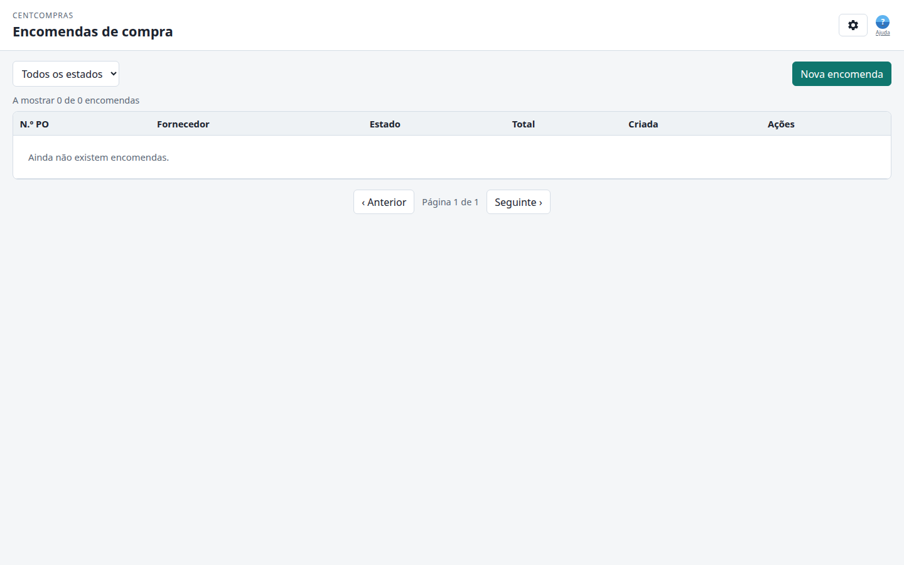

# CentCompras — Manual do utilizador: Encomendas de compra

**Consola de encomendas de compra** · Versão 1.0 · Para pessoal de armazém (administrador / gestor / operador)

> **Complemento:** [Casos limite, limites e resolução de problemas](05-edge-cases-and-limits.md) — referência para mensagens de erro, limites numéricos e lacunas conhecidas. [Catálogo do gestor](07-manager-catalog.md) — stock + preços só de leitura. [Referência de administração e superutilizador](06-admin-reference.md) — utilizadores, papéis, permissões, filiais.

---

## Onde ir?

> **Abra o navegador e acesse a:**
>
> **`https://<your-domain>/manage/purchase-orders/`**
>
> *(Durante o desenvolvimento no seu próprio computador: `http://127.0.0.1:8015/manage/purchase-orders/`)*

Inicie sessão com o seu email + palavra-passe (a que o administrador lhe atribuiu). Este manual assume que já conhece o catálogo de artigos; consulte o [manual de Gestão de artigos](01-items.md) para artigos, famílias, fornecedores e preços de fornecedor. Depois de uma encomenda ser **aprovada**, registe a entrega com o [manual de Receção de mercadorias e stock](03-goods-receipts.md).

---

## 1. O seu papel — o que pode fazer

| Papel | Ver encomendas | Criar / editar | Aprovar |
|------|:---:|:---:|:---:|
| **Administrador** (`warehouse_admins`) | ✅ | ✅ | ✅ |
| **Gestor** (`warehouse_managers`) | ✅ | ✅ (sem aprovar no grau 1) | ✅ (grau 2+ dentro dos limites em EUR) |
| **Operador** (`warehouse_data_operators`) | ✅ (só leitura) | ❌ | ❌ |

- O **Operador** vê a lista mas não tem botão "Nova encomenda" nem botões de edição/estado.
- **Aprovar** é o passo financeiro — **administradores** de armazém aprovam qualquer montante; **gestores grau 2+** aprovam dentro dos limites brutos em EUR (próprios vs outros); operadores nunca aprovam.

---

## 2. A consola num relance

**Barra de ferramentas:** um **filtro de estado** (Todos / Rascunho / Submetido / Aprovado / Recebido / Fechado / Rejeitado) e um botão **Nova encomenda**.

**Colunas da tabela:**

| Coluna | Significado |
|--------|---------|
| **N.º PO** | Número da encomenda de compra |
| **Fornecedor** | De quem compramos |
| **Estado** | Onde a encomenda está no fluxo de trabalho |
| **Total** | O montante **bruto** (líquido + IVA) — o custo total a financiar |
| **Criada** | Data/hora (DD/MM/AAAA) |
| **Ações** | **Abrir** |

Clique numa linha (ou **Abrir**) para ver a encomenda completa num painel lateral. Pressione **Escape** para fechar (igual a **Fechar**). Se um diálogo está aberto por cima (**Nova encomenda**, **Adicionar linha**), Escape fecha primeiro esse diálogo.

---

## 3. Criar uma encomenda de compra

1. Clique em **Nova encomenda**.
2. Escolha o **Fornecedor**.
3. (Opcional) adicione **Ref. fornecedor** e **Notas**.
4. Clique em **Criar**.

A encomenda começa como **Rascunho**.

---

## 4. Adicionar linhas

1. Abra a encomenda (clique na linha).
2. Clique em **Adicionar linha**.
3. Escolha o **Artigo**, introduza uma **Quantidade** e (opcionalmente) um **Custo unitário**.
4. Deixe **Custo unitário em branco** para preencher automaticamente da lista de preços do fornecedor.
5. (Opcional) defina os três descontos (ver §5).
6. **Guardar**.

> ⚠️ **O fornecedor tem de ter preço para o artigo.** Se o fornecedor não tem preço para o artigo que escolheu, a linha é **rejeitada** com a mensagem — *"Este fornecedor não tem preço para este artigo. Adicione-o em Fornecedores → Preços de fornecedor primeiro."* Isto é intencional: uma encomenda de compra a um fornecedor específico só deve conter artigos que esse fornecedor fornece. Para encomendar tal artigo, adicione primeiro o preço na Gestão de artigos (Fornecedores → Preços de fornecedor).

- **Editar / remover** uma linha só é possível enquanto a encomenda é **Rascunho** (e exige permissão de edição).

---

## 5. Descontos (comercial / financeiro / rappel)

Cada linha pode ter três descontos percentuais:

| Desconto | Significado |
|----------|---------|
| **Desc. com. %** | Desconto comercial sobre o preço unitário |
| **Desc. fin. %** | Desconto financeiro / pronto pagamento |
| **Rappel %** | Rappel por volume (mantido simples por agora) |

Regras:
- Cada desconto é **0–100%**.
- **Combinados**, não podem ultrapassar **100%** — a aplicação rejeita se o total tornaria o preço negativo.
- Aplicam-se ao custo unitário líquido **antes do IVA**.

---

## 6. Totais líquido / IVA / bruto

Cada linha e a encomenda inteira mostram três valores:

| Valor | Significado |
|-------|---------|
| **Líquido** | após descontos, antes do IVA |
| **IVA** | o montante de imposto |
| **Bruto (Total)** | líquido + IVA — **o montante total a financiar** |

A coluna **Total** da lista mostra o **bruto**.

---

## 7. O fluxo de aprovação

| De | Ação | Para | Quem |
|------|--------|----|-----|
| Rascunho | **Submeter** | Submetido | gestor/administrador |
| Submetido | **Aprovar** | Aprovado | gestor grau 2+ / administrador (dentro dos limites) |
| Submetido | **Rejeitar** | Rejeitado | gestor/administrador |
| Aprovado | **Receber mercadoria** | Recebido | gestor/administrador |
| Aprovado (sem receções) | **Cancelar encomenda** | Cancelada | gestor/administrador (motivo obrigatório) |
| Recebido (entrega parcial) | **Encerramento parcial** | Fechado | gestor/administrador (motivo obrigatório se houver quantidade em falta) |
| Recebido | *(automático quando totalmente recebido)* | Fechado | automático (“Fully received”) |

- **Submeter** exige pelo menos uma linha.
- Depois de submetida, as linhas ficam **bloqueadas** — não pode editá-las.
- **Aprovar** congela os totais (ver §8).

> **Receber mercadoria** abre a [consola de receção de mercadorias](03-goods-receipts.md) (`/manage/goods-receipts/?po=<id>`). Registar uma receção escreve stock e move a encomenda a **Recebido**. Quando cada linha está totalmente recebida, a encomenda **fecha automaticamente**. Se o fornecedor entregar a menos, receba o que chegou e depois faça **Encerramento parcial** do restante (motivo obrigatório).

### 7.1 Cancelar vs encerramento parcial

| Situação | Ação | Onde |
|-----------|--------|-------|
| O fornecedor **não entrega nada** (ainda sem receção) | **Cancelar encomenda** | Painel lateral da encomenda em **Aprovado** |
| O fornecedor entregou **parte** da encomenda | **Receber mercadoria**, depois **Encerramento parcial** | Consola de receção e/ou painel lateral em **Recebido** |
| O fornecedor entregou **tudo** | Só **Receber mercadoria** | A encomenda fecha automaticamente |

Depois de **Aprovar**, a tabela de linhas mostra colunas **Recebido** e **Em falta** para acompanhar o progresso.

Se o fornecedor **deixar de fornecer um artigo** depois da aprovação: não pode remover a linha. Receba o que chegar (ou zero nessa linha), depois **cancele** (sem receções) ou faça **encerramento parcial** (após receção parcial). A receção não volta a validar a lista de preços — usa o instantâneo da linha aprovada.

---

## 8. Instantâneo dos totais aprovados

Quando um gestor ou administrador **aprova** uma encomenda de compra, os valores **Líquido / IVA / Bruto** são **congelados** e guardados com a encomenda. Daí em diante o painel lateral mostra esses valores congelados, por isso o registo aprovado é imutável — mesmo que as regras de desconto ou IVA mudem mais tarde.

---

## 9. Histórico

Cada ação é registada — quem fez e quando: criação, linha adicionada/atualizada/removida e cada mudança de estado. Abra uma encomenda e role até **Histórico**.

---

## 10. FAQ

**P1. Escolhi um artigo mas a linha foi rejeitada — porquê?**
O fornecedor desta encomenda não tem preço para esse artigo (ver §4). Adicione o preço na Gestão de artigos primeiro, ou escolha outro fornecedor.

**P2. O que significa "Principal" num preço de fornecedor?**
Marca o fornecedor como o fornecedor *preferido* para esse artigo. **Artigos novos:** a Génese exige fornecedor e preço de custo — essa primeira linha fica **Principal**. Se mais tarde marcar outro preço de fornecedor como principal, o anterior é automaticamente desmarcado (só um principal por artigo). Na encomenda de compra, o custo vem do preço do fornecedor **desta encomenda** — nunca de outro fornecedor.

**P3. Porque não posso editar uma linha?**
As linhas só são editáveis enquanto a encomenda é **Rascunho**. Depois de **Submeter** ficam bloqueadas.

**P4. Não vejo o botão "Aprovar" — porquê?**
Só **gestores grau 2+** e **administradores** podem aprovar (dentro dos limites para gestores). Gestores grau 1 e operadores não podem aprovar.

**P5. Qual é a diferença entre Líquido e Bruto?**
Líquido é antes do IVA; Bruto é líquido + IVA — o montante que efetivamente paga.

**P6. O fornecedor não vai enviar o resto — o que faço?**
Se **nada** foi recebido, abra a encomenda e **Cancele a encomenda** com um motivo. Se já registou uma entrega **parcial**, use **Encerramento parcial** (no painel lateral ou no diálogo de receção) com um motivo — a quantidade restante é dada como baixa.

**P7. Datas e fuso horário?**
As datas aparecem como DD/MM/AAAA, no seu fuso horário local (por defeito Europe/Lisbon). **Terminar sessão** é uma ligação pequena na linha do título Definições; **Ajuda** é o ícone **?** azul ao lado do ícone (placeholder). Pressione **Escape** para fechar Definições. **Idioma** (Inglês / Português) e **tema** são definidos no painel do pessoal (`/`) e memorizados neste navegador.
