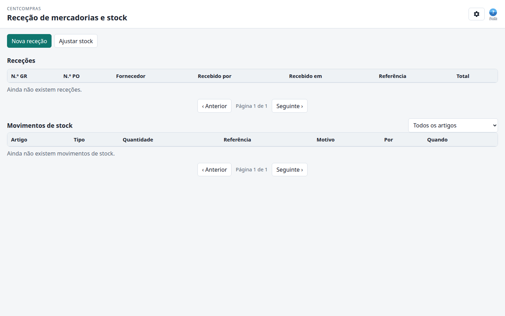

# CentCompras — Manual do utilizador: Receção de mercadorias e stock

**Consola de receção de mercadorias** · Versão 1.0 · Para pessoal de armazém (administrador / gestor / operador)

> **Consulte também:** o [manual de Gestão de artigos](01-items.md), o [manual de Encomendas de compra](02-purchase-orders.md), o [Catálogo do gestor](07-manager-catalog.md) em `/manage/catalog/`, o [manual de Filiais e requisição interna](04-internal-requests.md), a referência [Casos limite e limites](05-edge-cases-and-limits.md) e a [Referência de administração e superutilizador](06-admin-reference.md).

---

## Onde ir?

> **Abra o navegador e acesse a:**
>
> **`https://<your-domain>/manage/goods-receipts/`**
>
> *(Durante o desenvolvimento no seu próprio computador: `http://127.0.0.1:8015/manage/goods-receipts/`)*

Inicie sessão com o seu email + palavra-passe. Este manual assume que já cria encomendas de compra; consulte o [manual de Encomendas de compra](02-purchase-orders.md) para rascunho → submeter → aprovar.

Também pode abrir este ecrã a partir de uma encomenda de compra **aprovada**: clique em **Receber mercadoria** no painel lateral da encomenda. Isso leva-o aqui com a encomenda já selecionada (`?po=<number>`).

---

## 1. O seu papel — o que pode fazer

| Papel | Ver receções e movimentos | Registar receção | Ajustar stock |
|------|:---:|:---:|:---:|
| **Administrador** (`warehouse_admins`) | ✅ | ✅ | ✅ |
| **Gestor** (`warehouse_managers`) | ✅ | ✅ | ❌ |
| **Operador** (`warehouse_data_operators`) | ✅ (só leitura) | ❌ | ❌ |

- O **Operador** vê as mesmas listas mas não tem botões **Nova receção** nem **Ajustar stock**.
- **Ajustar stock** é a ferramenta de correção — **apenas administrador**. A receção quotidiana é uma receção de mercadorias, não um ajuste.
- A interface Django **`/admin/`** é **apenas para o superutilizador do site** — *não* faz parte deste manual.

Um botão que falta no seu ecrã **não é um erro**; simplesmente não faz parte do seu papel.

---

## 2. Como funciona o stock (leia isto uma vez)

O stock **nunca é digitado no artigo**. Não abre um artigo e preenche uma quantidade.

```text
Encomenda de compra aprovada
        ↓
  Receção de mercadorias  (esta consola)
        ↓
  Movimento de stock  (+ quantidade, com signo)
        ↓
  Quantidade do artigo   (saldo em cache — atualizado automaticamente)
```

- Cada receção escreve um **movimento de stock** por linha recebida. O movimento tem **signo**: receções são positivas (`+10`), ajustes podem ser positivos ou negativos (`+2` ou `−2`).
- O número que vê no artigo mais tarde é um **saldo em cache** desses movimentos. Se os dois parecem errados, confie na tabela **Movimentos de stock** — esse é o livro-razão.
- Não pode editar nem eliminar uma receção depois de confirmar. Um erro é corrigido com uma **nova receção** (se a encomenda ainda tem quantidade restante) ou um **ajuste de stock por administrador**.

---

## 3. A consola num relance



O ecrã é uma página com barra superior, dois botões de ação e depois duas tabelas.

**A. Barra superior**
- Título: **Receção de mercadorias e stock**
- Ícone **Definições** (canto superior direito) — sessão iniciada como *voce@empresa*, ligação pequena **Terminar sessão** na linha do título Definições. **Ajuda** é o ícone **?** azul ao lado do ícone (placeholder). Idioma e tema são definidos no painel do pessoal (`/`).
- Pressione **Escape** para fechar o painel Definições, ou o diálogo **Nova receção** / **Ajustar stock** (**Cancelar**)

**B. Barra de ferramentas**

| Botão | Quem vê | Função |
|--------|-------------|--------------|
| **Nova receção** | gestor / administrador | Registar mercadoria contra uma encomenda aprovada |
| **Ajustar stock** | apenas administrador | Correção manual (contagem, dano, erro) |

**C. Tabela de receções** — uma linha por receção de mercadorias (uma entrega que registou).

| Coluna | Significado |
|--------|---------|
| **N.º GR** | Número da receção de mercadorias |
| **N.º PO** | A encomenda de compra a que esta entrega pertence |
| **Fornecedor** | Quem enviou a mercadoria |
| **Recebido por** | Quem registou a entrada |
| **Recebido em** | Data/hora (DD/MM/AAAA, 24h) |
| **Referência** | Guia de entrega do fornecedor (se escreveu uma) |
| **Total** | Soma das quantidades **nesta** receção (não dinheiro) |

A lista de receções é um registo. Não há painel lateral "abrir / editar" numa linha de receção.

**D. Tabela de movimentos de stock** — o livro-razão: cada `+` e `−` contra um artigo.

| Coluna | Significado |
|--------|---------|
| **Artigo** | Código interno — descrição |
| **Tipo** | Receção / Ajuste / Saída de mercadoria |
| **Quantidade** | Montante com signo (`+10` entrada, `−2` saída) |
| **Referência** | Para uma receção: `GR #12` e o texto da guia de entrega se introduziu um |
| **Motivo** | Preenchido nos ajustes |
| **Por** / **Quando** | Quem e quando |

Use o **filtro de artigo** (*Todos os artigos*) acima da tabela de movimentos para ver o histórico de um artigo.

---

## 4. Registar uma receção de mercadorias

Só pode receber contra uma encomenda de compra **Aprovada** ou já **Recebida** (uma entrega parcial anterior). Rascunhos, submetidas, rejeitadas e fechadas não aparecem na lista.

### 4.1 Nesta consola

1. Clique em **Nova receção**.
2. Escolha a **Encomenda de compra** — mostrada como `#12 — Nome do fornecedor`.
3. As linhas dessa encomenda aparecem com **Encomendado / Recebido / Em falta / A receber**.
4. **A receber** é pré-preenchido com a quantidade **em falta**. Altere se esta entrega é só parte da encomenda. Defina uma linha como **0** (ou limpe) para ignorá-la nesta receção.
5. (Opcional) **Referência (guia de entrega)** — o número da GR / *guia* do fornecedor. Recomendado: aparece na linha da receção e no movimento de stock.
6. (Opcional) **Notas**.
7. Clique em **Receber**.

Deverá ver: *"Receção registada e stock atualizado."*

A nova linha aparece em **Receções** e linhas **+** correspondentes aparecem em **Movimentos de stock**.

> 📷 **[CAPTURA DE ECRÃ — diálogo de nova receção com encomendado / em falta / a receber]**

### 4.2 Na consola de encomendas de compra

1. Abra a encomenda aprovada (ou já recebida).
2. Clique em **Receber mercadoria**.
3. Chega a este ecrã com essa encomenda já escolhida — continue do passo 3 acima.

### 4.3 Entregas parciais

Várias receções contra a mesma encomenda são normais.

| Esta entrega | O que escrever em **A receber** |
|---------------|--------------------------------|
| Quantidade restante completa | Deixe os números pré-preenchidos |
| Só parte de uma linha | Escreva a quantidade que realmente chegou (tem de ser **superior a zero** e **não mais que em falta**) |
| Uma linha que não veio neste camião | Deixe **0** — essa linha é omitida nesta receção |

- Tem de receber **pelo menos uma** linha com quantidade superior a zero.
- A aplicação **rejeita** uma quantidade que ultrapassaria o montante em falta. Não pode receber mais do que foi encomendado.
- Linhas já totalmente recebidas ficam ocultas (verá *"Todas as linhas desta encomenda já estão totalmente recebidas."*).

### 4.4 O que acontece à encomenda de compra

| Depois desta receção | Estado da encomenda |
|--------------------|-----------|
| Primeira (ou mais) entrega **parcial** | **Recebido** |
| A quantidade restante de cada linha é agora **0** | **Fechado** (automático) |
| Entrega parcial e o resto não chega | **Encerramento parcial** no painel lateral da encomenda ou no diálogo de receção (motivo obrigatório) |

Receber tudo fecha a encomenda automaticamente. **Encerramento parcial** serve para aceitar uma entrega incompleta depois de pelo menos uma receção de mercadorias.

As novas unidades também ficam **disponíveis para prometer** a requisições de filial em espera: a requisição aprovada mais antiga que ainda precisa do artigo recebe a reserva primeiro. Consulte [Filiais e requisição interna](04-internal-requests.md) §7.

Se a lista de encomendas de compra está vazia: *"Não existem encomendas aprovadas ou parcialmente recebidas."* Aprove uma encomenda primeiro, ou as abertas já estão fechadas.

---

## 5. Ler o livro-razão de movimentos de stock

Esta tabela é o rasto de auditoria de quantidade.

| Tipo | Quando aparece | Quantidade |
|------|-----------------|----------|
| **Receção** | Registou uma receção de mercadorias | Positiva (`+`) |
| **Ajuste** | Um administrador usou **Ajustar stock** | Positiva ou negativa |
| **Saída de mercadoria** | Uma requisição de filial foi expedida (consulte o [manual de filiais](04-internal-requests.md)) | Negativa (`−`) |

Filtre por artigo quando investiga um produto. A coluna **Referência** de um movimento de receção aponta à GR (`GR #4 — DN-001`).

---

## 6. Ajustar stock (apenas administrador)

Use isto para **correções**, não para entregas de fornecedor. Motivos típicos: contagem de stock, mercadoria danificada, receção registada com quantidade errada sem quantidade restante na encomenda para corrigir.

1. Clique em **Ajustar stock**.
2. Escolha o **Artigo**.
3. Introduza **Quantidade**:
   - **Positiva** (por exemplo `5`) — acrescenta stock
   - **Negativa** (por exemplo `-5`) — remove stock
   - **0** é rejeitado
4. (Recomendado) **Motivo** — guardado no movimento.
5. Clique em **Ajustar**.

Deverá ver: *"Stock ajustado."* Uma nova linha de tipo **Ajuste** aparece no livro-razão.

Um ajuste **negativo** não pode levar o stock em armazém **abaixo da quantidade já reservada** para requisições aprovadas / em cumprimento. Para dano ou contagem inferior ao stock retido: feche parcialmente ou cancele essas reservas (motivo obrigatório), depois ajuste.

Um ajuste **positivo** (e uma receção de mercadorias) oferece as novas unidades a requisições em espera, primeiro o `approved_at` mais antigo.

Gestores e operadores não veem este botão. Se a contagem está errada, peça a um administrador.

---

## 7. O que não pode fazer aqui

- Receber contra uma encomenda que não está **Aprovada** ou **Recebida**.
- Receber mais do que a quantidade encomendada restante.
- Digitar stock no formulário do artigo na Gestão de artigos — esse campo não é editável ali.
- Editar ou eliminar uma receção de mercadorias depois de guardada.
- Expedir stock a uma filial daqui — isso é feito no [manual de Filiais e requisição interna](04-internal-requests.md).
- Alterar preços de venda ou custos de fornecedor — isso fica na [Gestão de artigos](01-items.md).

---

## 8. Datas, fuso horário, idioma e tema

Igual às outras consolas:

- **Datas:** DD/MM/AAAA, hora em 24 horas (por exemplo `20/08/2026 14:05`).
- **Fuso horário:** o seu horário local (novos utilizadores usam por defeito **Europe/Lisbon**).
- **Idioma:** Inglês / Português — definido no painel do pessoal (`/`) ou no catálogo de filial (`/branch/catalog/`); memorizado neste navegador.
- **Tema:** claro / escuro — mesma barra que o idioma; memorizado.

---

## 9. FAQ

**P1. Não vejo a minha encomenda de compra na lista — porquê?**
Tem de estar **Aprovada** (ou já **Recebida** de uma entrega parcial anterior). Rascunhos e submetidas não podem ser recebidas. Encomendas fechadas e rejeitadas também não podem ser recebidas.

**P2. Posso receber uma entrega em vários camiões?**
Sim. Registe uma receção de mercadorias por entrega. A quantidade em falta diminui cada vez. Quando em falta é 0 em cada linha, a encomenda **fecha**.

**P3. Escrevi demasiado numa receção — posso editar?**
Não. As receções são permanentes. Se a encomenda ainda tem quantidade restante, não "corrija" recebendo menos da próxima vez a menos que corresponda à realidade. Se a quantidade em armazém do artigo está errada, um **administrador** usa **Ajustar stock** com motivo.

**P4. Porque a coluna Total não é dinheiro?**
É a **soma das quantidades** nessa receção (peças, kg, …), não o valor bruto da encomenda. O dinheiro está na encomenda de compra.

**P5. Onde vejo o stock atual do artigo?**
O saldo em cache está no **[catálogo do gestor](07-manager-catalog.md)** em `/manage/catalog/` (stock + nível de reposição + preços de compra/venda). Também pode somar as linhas **+** e **−** desse artigo em **Movimentos de stock**, ou pedir a um administrador para confirmar no admin Django (superutilizador). Não digite um número no artigo.

**P6. Não vejo "Ajustar stock" — porquê?**
Só **administradores** podem ajustar. Gestores registam receções; operadores são só leitura. Consulte §1.

**P7. Não vejo "Nova receção" — porquê?**
O seu papel é **operador**, ou não tem permissão para adicionar receções. Ainda pode ler as tabelas.

**P8. O que devo colocar em Referência?**
O número da guia de entrega / *guia de entrega* do fornecedor. É opcional mas é como associa um registo de armazém a um documento em papel (ou PDF) do fornecedor.

**P9. Receber altera os totais da encomenda de compra (líquido / IVA / bruto)?**
Não. Esses valores foram **congelados na aprovação**. Receber só escreve stock e move o estado da encomenda a Recebido / Fechado.

**P10. O fornecedor entregou a menos — como fecho a encomenda?**
Depois de registar a entrega parcial, clique em **Encerramento parcial** no diálogo de receção (ou abra a encomenda e clique em **Encerramento parcial**). É obrigatório um motivo. Use **Cancelar encomenda** na encomenda só quando **não** houve receção de mercadorias.

**P11. As datas parecem 05/08/2026 — é 5 de agosto ou 8 de maio?**
**5 de agosto de 2026.** A aplicação usa dia/mês/ano em todo o lado.
