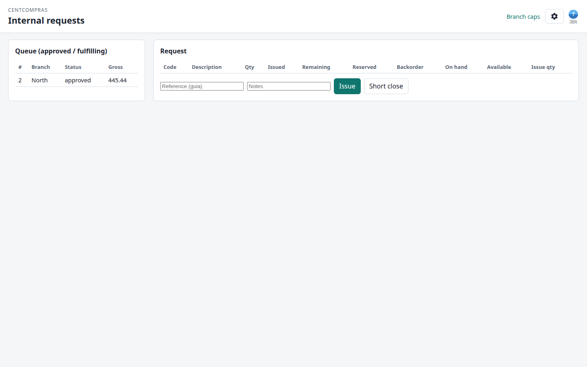

# CentCompras — Manual do utilizador: Filiais e Requisição interna

**Encomendas da filial** · Versão 1.0 · Para pessoal de filial (operador / gestor / administrador) **e** pessoal do armazém

> **Também disponível:** [Manual da Gestão de artigos](01-items.md) · [Encomendas de compra](02-purchase-orders.md) · [Receção de mercadorias e stock](03-goods-receipts.md) · [Catálogo do gestor](07-manager-catalog.md) · [Casos limite e resolução de problemas](05-edge-cases-and-limits.md) · [Referência de administração e superutilizador](06-admin-reference.md).
>
> Este manual cobre tudo o que uma **filial satélite** faz, mais o lado do **armazém** do mesmo circuito. Leia-o de ponta a ponta uma vez — o circuito só faz sentido como um todo.

---

## O panorama geral

Uma filial encomenda ao armazém central através de uma **Requisição interna**. O circuito:

```text
A filial consulta o catálogo   (sem preços de venda; custo oculto; stock como indicação)
        ↓
A filial levanta uma requisição (rascunho — quantidades)
        ↓
O gestor/administrador da filial concorda  (sim/não às quantidades; sem teto em euros)
        ↓
O armazém expede                (saída de mercadoria — stock central DESCE)
        ↓
A filial confirma a chegada     (receção na filial — stock da filial SOBE)
```

Um superutilizador pode passar a empresa para o modo **com preços** em `/admin/` (Branch commercial settings). O catálogo da filial volta a mostrar os preços de venda e a aprovação dos gestores usa tetos em EUR — o comportamento anterior. As consolas do armazém mantêm sempre o custo e os preços de venda.

Sem stock? O armazém levanta primeiro uma **encomenda de compra** a um fornecedor — consulte os manuais [Encomendas de compra](02-purchase-orders.md) e [Receção de mercadorias](03-goods-receipts.md). Essa parte mantém-se inalterada.

---

## Para onde vou?

| Quem | Página | Para quê |
|-----|------|----------|
| Filial (qualquer função) | `/branch/` | Painel da filial — cartões para todas as ferramentas da filial |
| Filial (qualquer função) | `/branch/select/` | Escolher a filial (só quando pertence a várias) |
| Filial (qualquer função) | `/branch/catalog/` | Catálogo só de leitura (sem preços de venda por omissão; custo sempre oculto; indicação de stock) |
| Filial (qualquer função) | `/branch/requests/` | Levantar e editar uma requisição |
| Filial (qualquer função) | `/branch/threads/` | Pedir artigos que não estão no catálogo |
| Filial (gestor / administrador) | `/branch/requests/` | Aprovar / rejeitar |
| Filial (qualquer função) | `/branch/receipts/` | Confirmar chegada face a uma expedição |
| Filial (qualquer função) | `/company-voice/` | Caixa de sugestões da empresa |
| Armazém | `/manage/internal-requests/` | Fila de requisições aprovadas + saída de mercadoria |
| Administrador do armazém | `/manage/branch-approval-limits/` | Tetos de aprovação dos gestores de filial |

*(Durante o desenvolvimento na sua máquina: `http://127.0.0.1:8015/…`.)*

> 📷 **[CAPTURA DE ECRÃ — painel da filial com grelha de cartões]**

---

## 1. A sua função — o que pode fazer

Existem **três funções de filial** (definidas pela sede) e as habituais **funções de armazém**. Um botão em falta no ecrã **não é um erro** — não faz parte da sua função.

### 1.1 Funções de filial

| Capacidade | Operador | Gestor | Administrador |
|-----------|:---:|:---:|:---:|
| Consultar o catálogo | ✅ | ✅ | ✅ |
| Levantar e editar rascunho, submeter, cancelar rascunho | ✅ | ✅ | ✅ |
| Aprovar / rejeitar | ❌ | ✅ (sim/não; tetos em EUR só se o modo com preços estiver ligado) | ✅ (ilimitado) |
| Cancelar requisição **aprovada** | ❌ | ✅ | ✅ |
| Confirmar chegada (receção na filial) | ✅ | ✅ | ✅ |
| Encerramento parcial na filial | ❌ | ✅ | ✅ |
| Ajustar stock da filial | ❌ | ❌ | ✅ |

- O **operador** faz o dia a dia (catálogo, requisição, receção) mas nunca aprova nem faz encerramento parcial.
- O **gestor** acrescenta aprovação/rejeição/encerramento parcial. Por omissão a aprovação é **sim/não às quantidades** (sem teto em euros). Se o superutilizador ligar o modo **com preços**, os gestores ficam limitados por **tetos em EUR bruto** (próprio vs outros — ver §8).
- O **administrador** é o utilizador avançado da filial: aprovação ilimitada, mais **ajustes de stock da filial**.
- O ecrã Django **`/admin/`** é **só para o superutilizador do sítio**. O pessoal de filial nunca entra em `/admin/`. A sede cria o seu início de sessão e a função de filial aí.

### 1.2 Funções de armazém (a outra metade do circuito)

| Capacidade | Quem |
|-----------|-----|
| Ver a fila de requisições + emitir mercadoria | Operador grau 2+, gestor, administrador |
| Encerramento parcial no armazém | Gestor grau 2+ ou administrador |
| Editar tetos de aprovação das filiais | Administrador do armazém (`/manage/branch-approval-limits/`) |

---

## 2. Escolher a filial (o seletor)

Pode pertencer a **uma filial, várias filiais ou a nenhuma**. Depois de iniciar sessão:

| A sua situação | O que acontece |
|----------------|--------------|
| **Uma filial** | Vai diretamente para **`/branch/`** (painel da filial). A filial fica selecionada automaticamente — sem seletor. |
| **Várias filiais** | Aterra em `/branch/select/` — escolha uma, depois continue para o painel. |
| **Sem filial** | O seletor diz *"You have no active branch access."* (Não tem acesso ativo a nenhuma filial.) Peça ajuda ao administrador. |

No painel, abra **Catálogo**, **Requisição interna**, **Fios**, **Receções** ou **Voz da Empresa** a partir dos cartões. Em **Catálogo**, **Pedidos**, **Receções** e **Fios**, a barra superior também tem **Início**, **Catálogo**, **Pedidos**, **Receções** e **Fios** (Fios é o último) — não no painel em si.

**Mudar filial** só aparece quando pertence a **mais do que uma** filial. Se só viu uma filial na sua vida, essa ligação fica oculta — não pode consultar outras filiais.

**Terminar sessão** é uma ligação pequena na linha do título **Definições** (engrenagem, canto superior direito). **Ajuda** é o ícone azul **?** junto à engrenagem (placeholder). **Idioma** e **tema** estão apenas no painel do pessoal (`/`) e no painel da filial (`/branch/`) — não nas páginas de trabalho da filial.

> 📷 **[CAPTURA DE ECRÃ — seletor de filial com duas filiais listadas]**

---

## 3. O catálogo da filial (só de leitura)

Abra **`/branch/catalog/`**. É o mesmo catálogo de produtos que o armazém gere, mas com duas diferenças deliberadas:

1. **Preços na filial.** **Sem preços** (omissão): vê identidade, unidade, família e disponibilidade — **sem** retalho/grossista/especial, e nunca o custo do fornecedor. **Com preços** (interruptor do superutilizador em `/admin/`): vê os **preços de venda** (Retalho / Grossista / Especial), continua sem o custo do fornecedor.
2. **O stock é apenas uma indicação** — nunca um número exato.

O pessoal do armazém vê stock exato **e** custo no [catálogo do gestor](07-manager-catalog.md) em `/manage/catalog/`.

### 3.1 A indicação de disponibilidade

| Indicação | Significado |
|------|---------|
| **In stock** (Em stock) | Há algo **livre para expedir hoje** (stock disponível acima do ponto de encomenda). |
| **Low** (Baixo) | A quantidade livre para expedição está no ou abaixo do ponto de encomenda — peça em breve. |
| **None** (Nenhum) | Nada está livre para expedição **hoje** (a prateleira está vazia, ou tudo o que está na prateleira já está reservado para requisições aprovadas anteriores). Pode mesmo assim levantar uma requisição — o armazém compra e fica na fila de espera. |

**Não** verá a quantidade exata em armazém — isso é um valor do armazém. **Nenhum não bloqueia uma requisição.**

---

## 4. Levantar uma requisição

Abra **`/branch/requests/`**.

### 4.1 Criar um rascunho

1. Clique em **New request** (Nova requisição).
2. A requisição começa como **rascunho** (`draft`).

### 4.2 Adicionar linhas

1. No formulário de linha, escolha um **artigo** no seletor do catálogo.
2. Indique a **quantidade** (maior que zero).
3. Clique em **Add** (Adicionar).

Uma linha é **rejeitada** se:

- o artigo **não tiver preço de grossista**, ou
- o artigo **já** estiver nesta requisição (edite a linha existente), ou
- o artigo (ou a respetiva família) estiver **inativo**.

Pode **remover** uma linha enquanto a requisição for rascunho.

### 4.3 Submeter

Quando a requisição tiver pelo menos uma linha e tudo estiver ativo, clique em **Submit** (Submeter). A requisição passa a **submitted** (submetida) e aguarda um gestor.

- Já não pode editar linhas depois de submeter.
- Um **rascunho** pode ser **cancelado** por qualquer função de filial (sem motivo).

---

## 5. Aprovar / rejeitar (gestor ou administrador)

Abra uma requisição **submitted** (submetida).

### 5.1 Aprovar

1. Clique em **Approve** (Aprovar).
2. Confirme. No modo **sem preços** (omissão) a confirmação é sobre as **quantidades**, não um total em euros. No modo **com preços** a confirmação mostra o **bruto** (grossista × quantidade + IVA).
3. Confirme.

Em ambos os modos o armazém **congela os totais** internamente (instantâneo de grossista + IVA) para alterações de preço posteriores não reescreverem o histórico. O pessoal da filial só **vê** esses números quando o modo com preços está ligado.

Aprovar também **reserva o stock de armazém atualmente livre** para esta requisição (ver §7). Uma filial posterior não pode levar essas unidades. Se o hub tiver menos do que pediu, a requisição continua aprovada: a parte livre fica reservada e o resto aguarda stock entrante (primeiro aprovado ganha).

| Aprovador | Limite |
|----------|-------|
| **Administrador** | Ilimitado |
| **Gestor** | **Sem preços:** sem teto em euros — concorda ou recusa a requisição. **Com preços:** tetos em EUR bruto, um para requisições **suas**, outro para requisições **de outras pessoas** (definidos pelo administrador do armazém, §8) |

### 5.2 Rejeitar

Clique em **Reject** (Rejeitar) e indique um **motivo**. A requisição termina como **rejected** (rejeitada) — levante uma nova se ainda precisar da mercadoria.

> 📷 **[CAPTURA DE ECRÃ — confirmação de aprovação a mostrar o bruto]**

---

## 6. Cancelar uma requisição

| De | Quem | Motivo obrigatório? |
|------|-----|:---:|
| **Rascunho** (`draft`) | Qualquer função de filial | Não |
| **Aprovada** (`approved`) | Gestor / administrador | Sim |

Cancelar uma requisição **aprovada** (ainda sem expedição) **liberta a reserva** de imediato; essas unidades são oferecidas à requisição seguinte em espera (primeiro `approved_at` mais antigo).

Depois de o armazém ter **expedido** (mercadoria emitida), a requisição já não pode ser cancelada — só **encerramento parcial** (§7 / §8). Esta regra impede que stock seja expedido e depois "des-expedido".

---

## 7. Armazém — expedir (saída de mercadoria)

Abra **`/manage/internal-requests/`**. Esta fila mostra requisições **approved** (aprovadas) e **fulfilling** (em cumprimento) — nunca rascunhos, submetidas, rejeitadas ou canceladas. O cabeçalho coincide com as outras consolas do armazém: **CentCompras** (liga a **`/`**), **Branch caps** (Tetos das filiais) e **Settings** (Definições — terminar sessão).

### 7.1 Emitir mercadoria

1. Selecione uma requisição.
2. Para cada linha que está a expedir agora, indique a **quantidade a emitir**.
3. (Opcional) **Reference** (Referência — o número da sua *guia* / expedição) e **Notes** (Notas).
4. Clique em **Issue** (Emitir).

Depois de uma emissão bem-sucedida, a página atualiza a fila. Se a requisição estiver totalmente expedida (ou deixar de estar na fila por outro motivo), o painel de detalhe limpa-se para só ver itens em fila. Emissões parciais mantêm a requisição selecionada com quantidades atualizadas.

**Cancel** (Cancelar) — mostrado só quando uma requisição está selecionada no painel de detalhe. Limpa a vista de detalhe sem recarregar, mostrando apenas a fila (nenhuma requisição selecionada).

Regras:

- Não pode emitir **mais do que está reservado para esta requisição** (a quantidade retida na aprovação, mais stock entrante posteriormente alocado a ela).
- Não pode emitir **mais do que o restante** da requisição.
- **Emissão parcial** é aceite — a requisição passa a **fulfilling** e o resto expede mais tarde.
- Uma emissão **completa** marca a requisição como **shipped** (expedida).

A fila mostra **reserved** (reservado), **backorder** (ainda à espera de stock), **on hand** (em armazém) e **available** (disponível — em armazém menos todas as reservas) por linha. A quantidade a emitir vem por defeito com o valor reservado.

Emitir **decrementa o stock central** e a reserva em conjunto.

Se outra filial estiver primeiro na fila para stock livre, não pode expedir para uma requisição posterior até essa reserva ser emitida, cancelada ou encerrada parcialmente (motivo obrigatório).

### 7.2 Encerramento parcial no armazém

Se não puder (ou não quiser) expedir o resto, clique em **Short close** (Encerramento parcial) e indique um **motivo**. O restante não expedido é dado como baixa e qualquer reserva sobre esse restante é **libertada** para a requisição seguinte em espera (primeiro `approved_at` mais antigo).

- Se **nada foi expedido ainda** (requisição ainda **approved**), a requisição passa a **closed** (fechada) — não há nada para a filial receber.
- Se já **emitiu parcialmente** mercadoria (requisição **fulfilling**), a requisição passa a **shipped** para a filial poder receber o que foi enviado e encerrar parcialmente o restante.

Só um **gestor grau 2+ ou administrador** pode fazer isto.



---

## 8. Filial — confirmar chegada (receção)

Abra **`/branch/receipts/`**. Lista as **expedições** (*guias*) da sua filial — requisições **shipped** (expedidas) ou **received** (recebidas) (ou seja, a caminho ou parcialmente chegadas).

### 8.1 Receber face a uma expedição

1. Selecione uma expedição.
2. Para cada linha, indique a **quantidade recebida** (o que chegou de facto — dano ou falta significa indicar menos).
3. Clique em **Receive** (Receber).

Regras:

- Não pode receber **mais do que foi expedido** nessa linha.
- **Receção parcial** → a requisição mantém-se **received** (ainda se espera mais).
- **Receção completa** → a requisição passa a **closed** (fechada).

Receber **incrementa o stock da filial** de imediato.

### 8.2 Encerramento parcial na filial

Se o resto não chegar, clique em **Short close** (Encerramento parcial) e indique um **motivo**. O restante não recebido é dado como baixa e a requisição passa a **closed**. Só um **gestor ou administrador** pode fazer isto.

> 📷 **[CAPTURA DE ECRÃ — receção na filial com quantidades recebidas]**

---

## 9. Ajuste de stock da filial (só administrador)

O **administrador** da filial pode corrigir o stock da filial diretamente — para contagens, estragos ou erros.

1. Em `/branch/receipts/`, use a área **Adjust stock** (Ajustar stock).
2. Indique **Item**, **Quantity** (Quantidade — positivo para acrescentar, negativo para retirar — `0` é rejeitado) e um **Reason** (Motivo).
3. Clique em **Adjust stock** (Ajustar stock).

Gestores e operadores não veem esta opção. O stock da filial é um livro-razão como o stock do armazém — cada receção e ajuste fica registado e o saldo é calculado, nunca digitado no artigo.

---

## 10. Tetos de aprovação das filiais (administrador do armazém)

Abra **`/manage/branch-approval-limits/`** (só **administrador** do armazém). Define quanto um **gestor** de filial pode aprovar, em **EUR bruto**, **quando a empresa está no modo com preços**. No modo **sem preços** (omissão) estes tetos ficam guardados mas **não se aplicam** — o gestor simplesmente concorda ou recusa. O superutilizador liga ou desliga o modo com preços em **`/admin/` → Branch commercial settings**.

O cabeçalho coincide com as outras consolas do armazém: **CentCompras** (liga a **`/`**), **Requests** (Pedidos) e **Settings** (Definições — terminar sessão).

- **Others** (Outros) — o teto quando o gestor aprova a requisição de outra pessoa.
- **Self** (Próprio) — o teto (mais baixo) quando o gestor aprova a **própria** requisição.

Os **administradores** de filial não têm teto (ilimitado). Operadores nunca aprovam. Estes tetos são globais a todas as filiais nesta fase.

> 📷 **[CAPTURA DE ECRÃ — editor de limites de aprovação das filiais]**

---

## 11. O ciclo de vida da requisição (referência rápida de estados)

```text
draft ──submit──▶ submitted ──approve──▶ approved ──issue──▶ fulfilling ──issue──▶ shipped
   │                  │                     │                                     │
   │ cancel (sem      │ reject (motivo)      │ cancel (motivo, sem expedições)  │
   │  motivo)         ▼                     ▼                                     ▼
   └──────────────▶ cancelled            rejected                    shipped ──receive──▶ received ──receive──▶ closed
                                                                                       │                     ▲
                                                                                       └── short-close ──────┘
```

| Estado | Significado |
|--------|---------|
| **draft** | A filial está a construí-la |
| **submitted** | À espera de um gestor de filial |
| **approved** | Visível para o armazém; ainda não expedida |
| **rejected** | O gestor rejeitou (terminal) |
| **fulfilling** | Parcialmente expedida; restante do armazém ainda aberto |
| **shipped** | Armazém concluído (totalmente emitida ou encerrada parcialmente) |
| **received** | Parcialmente chegada; restante da filial ainda aberto |
| **closed** | Filial concluída (totalmente recebida ou encerrada parcialmente) |
| **cancelled** | Anulada antes de qualquer saída de mercadoria |

---

## 12. O que não pode fazer aqui

- Ver o **custo** do fornecedor a partir de uma conta de filial (nunca). Os preços de venda só aparecem no modo **com preços**.
- Ver o stock **exato** do armazém a partir de uma conta de filial (só indicação).
- Aprovar como **operador**. No modo **com preços**, um gestor também não pode aprovar acima do **teto em EUR**.
- Pedir um artigo **inativo**, ou uma linha **sem preço de grossista**, ou o **mesmo artigo duas vezes** numa requisição.
- Editar uma requisição depois de **submeter**.
- **Emitir** mais do que está reservado para essa requisição, ou mais do que o restante da requisição.
- **Receber** mais do que foi expedido.
- **Cancelar** uma requisição depois de mercadoria emitida (use encerramento parcial).
- Encerramento parcial como **operador** (em qualquer dos lados).
- Ajustar stock da filial a menos que seja **administrador** da filial.

---

## 13. Datas, fuso horário, idioma e tema

Igual às outras consolas:

- **Datas:** DD/MM/AAAA, hora 24 h (ex.: `20/08/2026 14:05`).
- **Fuso horário:** hora local (novos utilizadores têm por defeito **Europe/Lisbon**).
- **Idioma:** English / Português — defina no painel do pessoal (`/`) ou no painel da filial (`/branch/`); fica memorizado neste browser.
- **Tema:** claro / escuro — mesma barra que o idioma nessas páginas de entrada; fica memorizado.

---

## 14. Consolas relacionadas

- [Gestão de artigos](01-items.md) — onde o armazém gere o catálogo (artigos, famílias, fornecedores, preços).
- [Catálogo do gestor](07-manager-catalog.md) — stock só de leitura + preços do armazém (`/manage/catalog/`; custo visível).
- [Encomendas de compra](02-purchase-orders.md) — como o armazém reabastece junto de fornecedores.
- [Receção de mercadorias e stock](03-goods-receipts.md) — registar entregas de fornecedores no stock central.

---

## 15. FAQ

**P1. Porque não vejo preços no catálogo da filial?**
Por omissão a empresa está no modo **sem preços**: as filiais pedem **quantidades**, não dinheiro. O **custo** do fornecedor nunca aparece na filial (confidencial do armazém). Se o superutilizador passar ao modo **com preços**, os preços de venda (retalho / grossista / especial) voltam a aparecer — continua sem o custo. O pessoal do armazém vê o custo no [catálogo do gestor](07-manager-catalog.md) em `/manage/catalog/`.

**P2. O catálogo diz "None" para um artigo — posso mesmo assim pedi-lo?**
Sim. **None** (Nenhum) significa que nada está livre para expedição *hoje* (prateleira vazia, ou stock já reservado para requisições aprovadas anteriores). Levante a requisição na mesma — entra na fila de espera. O stock entrante é oferecido primeiro à requisição aprovada mais antiga.

**P3. Porque foi a minha linha rejeitada?**
As três regras: o artigo tem de ter **preço de grossista**, tem de estar **ativo** e não pode já estar na requisição. Verifique qual se aplica.

**P4. Aprovei uma requisição e os preços mudaram depois — a minha requisição mudou?**
Não. Aprovar **congela** os totais (instantâneo de grossista + IVA). Alterações de preço posteriores não tocam numa requisição aprovada.

**P5. O armazém expediu menos do que pedi — o que faço?**
Confirme a **quantidade recebida** que chegou de facto em `/branch/receipts/`. Se o resto não vier, um **gestor/administrador** faz encerramento parcial. A requisição fecha depois.

**P6. Não vejo "Approve" — porquê?**
É **operador** (operadores nunca aprovam), ou a requisição não está **submitted**. Peça a um gestor, ou submeta primeiro.

**P7. Não vejo "Short close" — porquê?**
Encerramento parcial é só para gestor/administrador, tanto no armazém como na filial.

**P8. Posso pedir o mesmo artigo duas vezes?**
Não — uma linha por artigo por requisição. **Edite** a quantidade da linha em vez de acrescentar uma segunda linha.

**P9. O meu início de sessão de filial diz "no active branch access" — o que se passa?**
A sede ainda não o atribuiu a uma filial (ou a filial está inativa). Contacte o administrador — o acesso à filial configura-se no Django `/admin/`, não por si.

**P10. O que significa "gross" no botão de aprovar?**
Só no modo **com preços**. É o total da requisição **incluindo IVA** (grossista × quantidade, mais IVA) — o valor que o teto de aprovação mede. No modo **sem preços** a confirmação de aprovar não tem montante em euros.

**P11. Outra filial pediu o mesmo artigo depois de nós — vão levar o nosso stock?**
Não, depois da nossa requisição estar **approved**. O armazém reserva a quantidade livre para nós. Uma filial posterior pode ainda aprovar (e esperar), mas não lhe podem ser emitidas essas unidades reservadas.

**P12. Cancelámos uma requisição aprovada — o que acontece à reserva?**
A reserva é libertada de imediato e oferecida à requisição seguinte em espera (mais antiga primeiro).

**P13. Porque não posso cancelar uma requisição aprovada depois de o armazém ter expedido?**
O stock já está em movimento. Depois da primeira saída de mercadoria a única forma de terminar cedo é **encerramento parcial** (lado armazém) ou **encerramento parcial na filial** (lado filial).

**P14. Em que difere o stock da filial do stock do armazém?**
Dois livros-razão separados. O stock do armazém vive no artigo; o **stock da filial** vive por `(filial, artigo)` e só se move quando recebe uma expedição ou um administrador ajusta.

**P15. Posso construir uma requisição offline?**
Sim, **só rascunhos**. Abra `/branch/requests/` depois de ter visitado o catálogo online pelo menos uma vez (para a lista de artigos ficar em cache). Offline pode iniciar **New request** (Nova requisição) e adicionar linhas a partir do catálogo em cache. A requisição mostra **pending sync** (sincronização pendente) até o Wi-Fi voltar; depois carrega automaticamente quando abrir qualquer página da filial que carregue os scripts offline (catálogo, requisição, painel, etc.). **Submit**, **Approve**, **Reject** e **Cancel** continuam a exigir Wi-Fi.

**P16. O aviso offline do catálogo diz que a disponibilidade pode estar desatualizada — porquê?**
O modo offline mostra o **último catálogo descarregado** para a **filial ativa**. O stock do armazém e as indicações de disponibilidade podem mudar enquanto estava desligado. As colunas de preço de venda seguem esse último descarregamento: se foi **sem preços** (ou a cache não tem flag de modo), os preços ficam ocultos. Depois de se ligar uma vez, a app remove os campos de preço guardados na cache offline; até lá, as colunas seguem o último descarregamento. Ligue-se uma vez depois de uma mudança de modo comercial para a cache coincidir. Se mudar de filial offline, a app avisa que a cache pertence a outra filial — ligue o Wi-Fi na filial atual para descarregar o respetivo catálogo.

**P17. Mudei de filial com um rascunho offline pendente — porque não sincroniza?**
Rascunhos offline ficam ligados à filial onde os criou. Se mudar para outra filial, a sincronização é **ignorada** até voltar e abrir `/branch/requests/` nessa filial. Não reutilize o mesmo UUID de rascunho offline entre filiais — o servidor rejeita com `client_uuid is already in use on another branch.`

**P18. Tablet partilhado: a pessoa seguinte vai carregar o meu rascunho offline?**
Não, se **Terminar sessão**. Terminar sessão limpa a fila de rascunhos offline deste browser. Os rascunhos também ficam ligados ao seu id de utilizador: outra pessoa que inicie sessão no mesmo tablet não sincroniza automaticamente as suas linhas pendentes. Termine sempre sessão no fim do turno.
