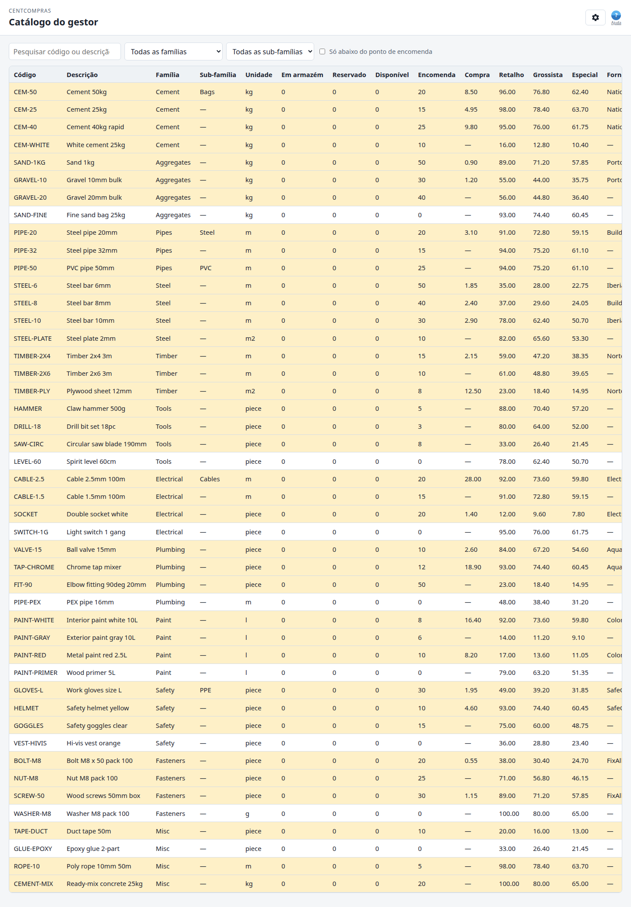

# CentCompras — Manual do utilizador: Catálogo do gestor

**O catálogo do gestor** · Versão 1.0 · Para pessoal do armazém (admin / gestor / operador)

> **Também disponível:** [Gestão de artigos](01-items.md) em `/manage/items/` · [Encomendas de compra](02-purchase-orders.md) · [Receção de mercadorias e stock](03-goods-receipts.md) · [Filiais e Requisição interna](04-internal-requests.md) · [Casos limite e limites](05-edge-cases-and-limits.md) · [Referência de administração e superutilizador](06-admin-reference.md).

Esta é a vista **só de leitura** do armazém: stock, ponto de encomenda, preços de venda, preço de compra e fornecedores numa só página. **Não** edita artigos aqui — isso é na [Gestão de artigos](01-items.md).

---

## Para onde vou?

> **Abra o browser e aceda a:**
>
> **`https://<o-seu-domínio>/manage/catalog/`**
>
> *(Em desenvolvimento na sua máquina: `http://127.0.0.1:8015/manage/catalog/`)*

Inicie sessão com o email e palavra-passe do armazém. O painel em `/` lista esta página (e as outras consolas de armazém / filial) como *catálogo do gestor (stock + preços)*.

O pessoal de filial **não** usa este URL. Consulta o [catálogo da filial](04-internal-requests.md) em `/branch/catalog/` (custo sempre oculto; preços de venda só se o superutilizador ligar o modo com preços; stock apenas como indicação).

---

## 1. A sua função — o que pode fazer

| Função | Abrir a página | Ver custo (preço de compra) | Editar algo aqui |
|------|:---:|:---:|:---:|
| **Admin** (`warehouse_admins`) | ✅ | ✅ | ❌ |
| **Gestor** (`warehouse_managers`) | ✅ | ✅ | ❌ |
| **Operador** (`warehouse_data_operators`) | ✅ | ✅ | ❌ |
| **Pessoal de filial** | ❌ | — | — |

- A página inteira é **só de leitura** para todas as funções de armazém — não há Guardar, nem Novo artigo, nem Ajustar stock.
- **O custo é confidencial do armazém.** Por isso esta página existe separada de `/branch/catalog/`.
- Um botão ou coluna em falta **não é um bug**; utilizadores de filial que abram `/manage/catalog/` são recusados (*Catalogue view permission required*).
- O ecrã Django **`/admin/`** é só para o **superutilizador do sítio** — *não* faz parte deste manual.

Para alterar um artigo, um preço ou o stock, use as consolas na §7.

---

## 2. O que esta página é (e o que não é)

```text
Gestão de artigos (/manage/items/)     →  criar / editar catálogo
Receção de mercadorias (/manage/goods-receipts/)  →  o stock SOBE
Emissão de mercadorias (/manage/internal-requests/) →  o stock DESCE
        ↓
Catálogo do gestor (/manage/catalog/)  →  ler o quadro conjunto
```

| Esta página **faz** | Esta página **não faz** |
|--------------------|------------------------|
| Mostrar artigos **ativos** em famílias **ativas** por defeito | Deixar editar artigos, preços ou stock |
| Mostrar artigos desativados e artigos cuja família está inativa quando **Incluir inativos** está marcado | Abrir gaveta ou histórico |
| Mostrar a quantidade **em cache** em armazém | Criar encomenda de compra (use [encomendas de compra](02-purchase-orders.md)) |
| Mostrar compra + três preços de venda | |
| Sinalizar artigos no ou abaixo do ponto de encomenda | |
| Listar fornecedores com preço para o artigo (principal em primeiro, marcado com ★) | |
| Ordenar qualquer coluna ao clicar no cabeçalho | |

Clicar numa linha não faz nada — não há gaveta de detalhe.

---

## 3. A consola num relance



**A. Barra superior**
- Título: **Catálogo do gestor** (*Manager catalog*)
- Engrenagem **Definições** (canto superior direito) — sessão iniciada como *voce@empresa*, ligação pequena **Terminar sessão** na linha do título Definições. Prima **Escape** para fechar o painel Definições. **Ajuda** é o ícone azul **?** junto à engrenagem (placeholder). Idioma e tema definem-se no painel do pessoal (`/`).

**B. Barra de ferramentas (filtros)**

| Controlo | EN | pt-PT | O que faz |
|---------|----|-------|----------------|
| Pesquisa | *Search code or description…* | *Pesquisar código ou descrição…* | Filtra enquanto escreve (código interno **ou** descrição) |
| Família | *All families* | *Todas as famílias* | Restringe a uma família |
| Sub-família | *All sub-families* | *Todas as sub-famílias* | Restringe a uma sub-família (lista limitada ao filtro de família quando definido) |
| Caixa de verificação | **Below reorder only** | **Só abaixo do ponto de encomenda** | Oculta artigos OK |
| Caixa de verificação | **Include inactive** | **Incluir inativos** | Recarrega a lista com artigos desativados e artigos cuja família está inativa (desligado por defeito) |

Os filtros combinam-se. Pesquisa, família, sub-família e **Só abaixo do ponto de encomenda** correm no browser sobre a lista carregada — não precisa de clicar em Pesquisar. **Incluir inativos** recarrega a partir do servidor.

**C. Colunas da tabela** — clique em qualquer cabeçalho para ordenar (clique de novo para inverter). A ordem por defeito é **Descrição** (ascendente).

| Coluna | Significado |
|--------|---------|
| **Código** | Código interno (ou — se vazio numa linha antiga) |
| **Descrição** | O que é o artigo |
| **Família** | Nome da família |
| **Sub-família** | Nome da sub-família, ou **—** se nenhuma |
| **Unidade** | Unidade de medida |
| **Em armazém** | Quantidade física em cache (do livro-razão de stock) |
| **Reservado** | Quantidade retida para requisições aprovadas / em cumprimento |
| **Disponível** | Em armazém menos reservado — o que ainda está livre para expedir hoje |
| **Encomenda** | Ponto de encomenda definido no artigo |
| **Compra** | Custo que pagamos — ver §5 |
| **Retalho / Grossista / Especial** | Os três preços de venda **manuais** |
| **Fornecedores** | Fornecedores ativos com preço para este artigo; o **principal** aparece **em primeiro** e está marcado com ★ |
| **Estado** | **Inativo** (pílula discreta) para artigos desativados; caso contrário **Abaixo do ponto de encomenda** (pílula de aviso) ou **OK** |

As linhas no ou abaixo do ponto de encomenda ficam realçadas com um tom de aviso **e** uma pílula de Estado (salvo se o artigo estiver inativo). Artigos desativados e artigos sob família inativa usam texto de linha discreto. O tom segue o tema: âmbar claro no claro, âmbar escuro no escuro, para o texto da linha se manter legível.

---

## 4. Stock e «abaixo do ponto de encomenda»

**Em armazém** é o mesmo saldo físico em cache que em todo o lado: as receções somam, as emissões subtraem, **Ajustar stock** (admin) corrige. **Reservado** é stock já prometido a requisições aprovadas. **Disponível** é em armazém menos reservado. Esta página só **mostra** estes valores. Se em armazém parecer errado, confie nos **Movimentos de stock** na [consola de receção de mercadorias](03-goods-receipts.md) — esse é o livro-razão.

**Abaixo do ponto de encomenda** é verdadeiro quando:

- o **ponto de encomenda do artigo é maior que zero**, **e**
- **disponível ≤ ponto de encomenda**.

Um ponto de encomenda de **0** significa «sem disparador de encomenda» — o estado mantém-se **OK** mesmo que disponível seja 0.

Use **Só abaixo do ponto de encomenda** quando quiser uma lista curta de artigos a reabastecer.

---

## 5. Preço de compra e fornecedores

Os preços de venda (retalho / grossista / especial) são **manuais** — vêm do artigo. O preço de compra é **dinâmico** — vem da lista de preços do fornecedor.

A coluna **Compra** é um número por artigo:

1. Se o artigo tiver um fornecedor **principal** (★) ainda ativo, mostra-se o custo desse fornecedor.
2. Caso contrário mostra-se o custo **mais barato** entre fornecedores **ativos**.
3. Se nenhum fornecedor ativo tiver preço, Compra é **—**.

A coluna **Fornecedores** lista nomes (separados por vírgula). O fornecedor **principal** aparece sempre **em primeiro**, depois os restantes por ordem alfabética. Fornecedores desativados são omitidos. **—** significa que ainda não há preço de fornecedor ativo — adicione um na gestão de artigos antes de poder criar encomenda de compra para esse fornecedor.

Os preços aqui **não** são um instantâneo congelado de encomenda; seguem a lista viva de fornecedores. Os totais aprovados da encomenda de compra mantêm-se congelados na encomenda — ver [encomendas de compra](02-purchase-orders.md) §8.

---

## 6. Estados vazios e erros

| Mensagem (exata, EN) | Porquê | O que fazer |
|---------------------|-----|------------|
| `No items to show.` | Não há artigos ativos em famílias ativas | Crie/ative artigos na [gestão de artigos](01-items.md) |
| `No items match these filters.` | Pesquisa, família, sub-família ou «só abaixo do ponto de encomenda» ocultaram todas as linhas | Limpe a pesquisa, defina família/sub-família em *Todas*, desmarque a caixa |
| `Could not load the catalog.` | A API do catálogo falhou | Atualize a página; se persistir, fale com um administrador |
| `The request could not be completed.` | Um pedido falhou sem mensagem específica | Atualize; tente de novo |
| `Catalogue view permission required` | Não é utilizador de armazém (típico de logins só de filial) | Use `/branch/catalog/` em alternativa, ou peça à sede um grupo de armazém |

A lista pendente de famílias pode incluir famílias **inativas** (reutiliza a lista de famílias). A tabela nunca lista artigos sob família inativa; escolher uma dessas famílias dá *No items match these filters.*

| Mensagem (pt-PT, quando o idioma é Português) | Equivalente |
|-----------------------------------------------|-------------|
| `Sem artigos para mostrar.` | `No items to show.` |
| `Nenhum artigo corresponde a estes filtros.` | `No items match these filters.` |
| `Não foi possível carregar o catálogo.` | `Could not load the catalog.` |
| `Não foi possível concluir o pedido.` | `The request could not be completed.` |

---

## 7. Consolas relacionadas

- [Gestão de artigos](01-items.md) — criar/editar artigos, famílias, fornecedores, preços de venda, preços de fornecedor.
- [Encomendas de compra](02-purchase-orders.md) — reabastecer de fornecedores quando o catálogo mostra stock baixo.
- [Receção de mercadorias e stock](03-goods-receipts.md) — registar entregas; é isso que atualiza o **Stock**.
- [Filiais e Requisição interna](04-internal-requests.md) — catálogo da filial (custo oculto) e o ciclo pedido / emissão / receção.
- [Casos limite, limites e resolução de problemas](05-edge-cases-and-limits.md) — mensagens de erro e limites numéricos.
- [Referência de administração e superutilizador](06-admin-reference.md) — quem pode usar cada URL.

---

## 8. Idioma, tema e datas

Igual às outras consolas do armazém:

- **Idioma:** English / Português — definido no painel do pessoal (`/`) ou catálogo da filial (`/branch/catalog/`); memorizado neste browser.
- **Tema:** claro / escuro — mesma barra que o idioma; memorizado. O realce de linhas abaixo do ponto de encomenda segue o tema (não é amarelo pálido fixo).
- **Datas** não aparecem nesta página (sem coluna criado/atualizado). Quantidade e dinheiro usam formato decimal simples.

---

## 9. FAQ

**P1. Porque não consigo editar um preço ou o número de stock aqui?**
Esta página é uma vista geral. Altere preços de venda e custos de fornecedor na [gestão de artigos](01-items.md). Altere stock com uma [receção de mercadorias](03-goods-receipts.md) ou (só admin) **Ajustar stock**.

**P2. Porque é que Compra é «—» quando sei que temos fornecedor?**
Esse fornecedor está **inativo**, ou não há preço de fornecedor para este artigo. Adicione um preço de fornecedor ativo na gestão de artigos (Fornecedores → Preços de fornecedor).

**P3. O que significa a estrela (★) num fornecedor?**
Esse fornecedor é o **principal** (preferido) do artigo. O custo dele é o valor de Compra. Só um principal por artigo.

**P4. Porque é que esta página mostra stock exato mas o catálogo da filial não?**
De propósito. O pessoal do armazém vê em armazém, reservado e disponível aqui. O pessoal de filial vê só **Em stock / Baixo / Nenhum** em `/branch/catalog/` (a partir do **disponível**, não do em armazém bruto) — ver [Filiais e Requisição interna](04-internal-requests.md) §3.

**P5. Desativei um artigo e desapareceu desta lista — foi eliminado?**
Não. Artigos desativados (e artigos cuja família está inativa) ficam de fora da vista por defeito. Marque **Incluir inativos** para os ver de novo, ou reative na gestão de artigos.

**P6. Em armazém é 0 mas o Estado diz OK — é um bug?**
Não se **Encomenda** for 0. Ponto de encomenda zero significa «não sinalizar». Defina ponto de encomenda maior que 0 no artigo se quiser o aviso. O estado usa **disponível**, por isso 10 em armazém com 10 reservados também sinaliza abaixo do ponto de encomenda quando encomenda > 0.

**P7. Em armazém é 10 mas Disponível é 0 — para onde foi o stock?**
Está **reservado** para requisições aprovadas. A fila do armazém em `/manage/internal-requests/` mostra quem o retém.

**P8. Sou operador de armazém — devo ver o custo?**
Sim. Todos os grupos de armazém que podem abrir esta página veem o preço de compra. O custo só fica oculto no catálogo da **filial**.

**P9. Podem dois artigos ter o mesmo código interno?**
Não — os códigos são únicos (sem distinção de maiúsculas/minúsculas) e guardados em **maiúsculas**. Essa regra aplica-se na gestão de artigos, não aqui. Ver FAQ da [Gestão de artigos](01-items.md).

**P10. Porque estão algumas linhas com tom âmbar?**
Esses artigos estão **Abaixo do ponto de encomenda**. Estado **OK** mantém o fundo normal da tabela. O tom segue o tema (âmbar claro no claro, âmbar escuro no escuro) para o texto se manter legível.

---

## 6. Evolução de custos (gráfico demo)

**URL:** `/manage/cost-trends/` — cartão **Evolução de custos** na secção **Visualizações** do painel.

Gráfico só de leitura do **custo de compra de referência** (custo de catálogo do fornecedor principal) ao longo do tempo, reconstruído a partir dos registos de alteração de preços de fornecedor. Use o filtro **Período** (ano civil, últimos 6/3 meses, 30 dias, 7 dias, 24 horas) e o seletor **Artigo**. A linha de resumo mostra custo inicial, custo final e variação percentual na janela escolhida — base prevista para um futuro gráfico de inflação.

Se o fornecedor principal mudou dentro do período, a nota por baixo do gráfico avisa que os degraus podem reflectir mudança de abastecimento, não só mercado.
