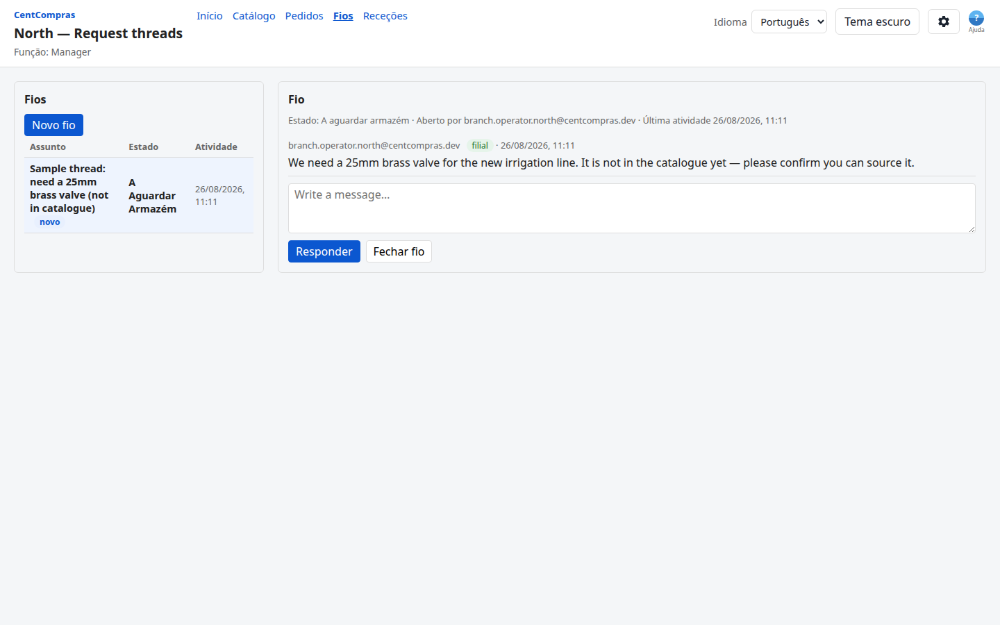
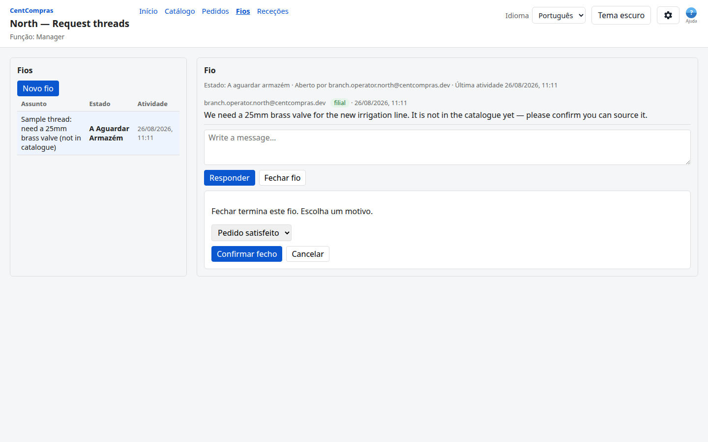
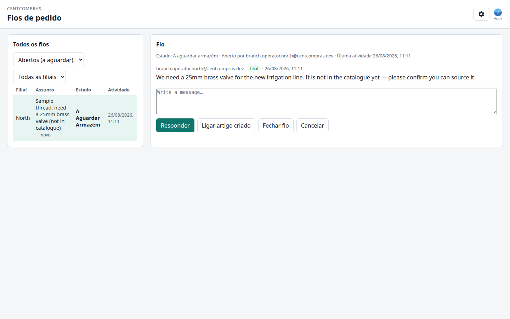

# CentCompras — Manual do utilizador: Conversas de pedido

**Pedidos escritos de artigos que não estão no catálogo** · Versão 1.0 · Para pessoal de filial **e** pessoal do armazém

> **Também disponível:** o [manual de Gestão de artigos](01-items.md) · [Encomendas de compra](02-purchase-orders.md) · [Receção de mercadorias e stock](03-goods-receipts.md) · [Filiais e Requisição interna](04-internal-requests.md) · [Casos limite e limites](05-edge-cases-and-limits.md) · [Referência de administração e superutilizador](06-admin-reference.md) · [Catálogo do gestor](07-manager-catalog.md).
>
> Este manual cobre a consola de **Conversas de pedido** — o canal escrito que uma filial usa quando o artigo de que precisa **ainda não existe no catálogo**.

---

## Para onde vou?

> **Abra o browser e aceda a:**
>
> **`/branch/threads/`** (lado filial) ou **`/manage/threads/`** (lado armazém)
>
> *(Em desenvolvimento na sua máquina: `http://127.0.0.1:8015/branch/threads/` e `http://127.0.0.1:8015/manage/threads/`.)*

| Quem | Página | Para quê |
|-----|------|----------|
| Filial (qualquer função) | `/branch/threads/` | Abrir uma conversa, ler respostas, responder, fechar a sua própria conversa |
| Armazém (qualquer grupo) | `/manage/threads/` | Ver conversas de **todas** as filiais, responder, ligar artigos criados |
| Administrador de armazém | `/manage/threads/` | Fecho forçado de conversa abandonada / duplicada (override) |

O cabeçalho coincide com as outras consolas do armazém: **CentCompras** (liga a **`/`**), **Ajuda** (**?** azul junto a Definições) e **Definições** (ligação pequena **Terminar sessão** na linha do título). As conversas de filial mantêm **Catálogo** / **Mudar de filial** no cabeçalho.

---

## O quadro geral

Uma **Requisição interna** normal (ver [04](04-internal-requests.md)) só funciona para artigos que **já existem** na tabela `Item` — escolhe o artigo no catálogo. Mas por vezes uma filial precisa de algo que o armazém nunca catalogou. Nesse caso:

```text
A filial abre uma conversa   (assunto + primeira mensagem, por escrito)
        ↓
O armazém interage        (responde, faz perguntas, vai e vem)
        ↓
Ambos percebem            (o armazém vai criar / procurar o artigo)
        ↓
O armazém cria o artigo       (via a gestão de artigos normal)
        ↓
A filial fecha a conversa          (motivo + classificação de satisfação)
```

A conversa é uma **conversa**, não uma encomenda de compra nem uma requisição. O artigo é criado pelo armazém no fluxo normal do catálogo — nunca dentro da conversa.



---

## 1. A sua função — o que pode fazer

### 1.1 Funções de filial

| Capacidade | Operador | Gestor | Admin |
|-----------|:---:|:---:|:---:|
| Abrir uma conversa, responder, ler a conversa | ✅ | ✅ | ✅ |
| Fechar uma conversa **que abriu** | ✅ | ✅ | ✅ |
| Fecho forçado de qualquer conversa (override, com motivo) | ❌ | ✅ | ✅ |

### 1.2 Funções de armazém

| Capacidade | Operador | Gestor | Admin |
|-----------|:---:|:---:|:---:|
| Ver conversas de todas as filiais, responder | ✅ | ✅ | ✅ |
| Ligar artigo(s) criado(s) a uma conversa | ✅ | ✅ | ✅ |
| Fecho forçado de qualquer conversa (override, com motivo) | ❌ | ❌ | ✅ |

---

## 2. Abrir uma conversa (filial)

1. Aceda a **`/branch/threads/`**.
2. Clique em **Nova conversa** (*New thread*).
3. **Assunto** — um título curto, p. ex. *«Preciso de uma válvula de latão 25 mm»*.
4. **Primeira mensagem** — descreva o artigo com as suas palavras: o que é, para que serve, quantidade aproximada. **Não há seletor de artigo** — o artigo ainda não existe.
5. Clique em **Criar**.

A conversa abre no estado **A aguardar armazém** — a bola está no court da sede.

> Só se pode abrir uma conversa a partir de uma filial **ativa**. Se a filial estiver desativada, novas conversas são bloqueados.

---

## 3. A conversa

**Qualquer pessoa com acesso pode publicar**: todos os utilizadores da filial de origem e todos os utilizadores do armazém.

Cada mensagem mostra **quem** a escreveu, **de que lado** veio (filial / armazém) e **quando**.

A conversa mostra sempre de quem é a vez:

| Estado | Significado |
|-------|---------|
| **A aguardar armazém** | O armazém deve responder a seguir |
| **A aguardar filial** | A filial deve responder a seguir |
| **Fechado** | Concluído — sem mais mensagens |

Uma publicação passa a vez para o outro lado. Duas publicações seguidas do mesmo lado mantêm o estado (o outro lado continua a dever resposta).

**Não lidos:** atividade nova numa conversa que ainda não abriu mostra um distintivo **«novo»** ao lado. **Clicar na conversa na lista** marca como lido e limpa o distintivo. O primeira conversa é pré-visualizado quando a página carrega, mas essa pré-visualização **não** marca como lido (para uma fila partilhada do armazém não perder o distintivo só porque alguém abriu a página).

---

## 4. Fechar uma conversa

Só quem **abriu** a conversa pode fechá-lo — com um **motivo** e uma **classificação de satisfação**:

| Motivo | Quando |
|--------|------|
| **Pedido satisfeito** | O artigo foi criado / obtido e a necessidade está satisfeita (predefinição) |
| **Outro** + caixa de texto | Qualquer outro motivo (duplicado, já não é necessário, …) |

**Satisfação (1–5 estrelas):** o diálogo de fecho inclui sempre classificação por estrelas. **Predefine-se em 1 estrela** e é editável — assim, mesmo quando o pedido não foi bem atendido, a filial pode sinalizá-lo pela classificação. Escolha o número de estrelas que corresponde a como o pedido foi tratado e confirme.



Fechar termina a conversa — **não podem ser publicadas mais mensagens**. Se a necessidade voltar mais tarde, abra uma conversa nova.

> **Porque predefinir 1 estrela?** Um pedido sem resposta ou mal tratado deve poder *sinalizar* insatisfação sem passos extra. Quem abriu pode sempre subir a classificação antes de confirmar.

### Fecho forçado (excecional)

Em circunstâncias excecionais uma conversa pode ser fechado à força por alguém que **não** o abriu:

| Quem | Quando |
|-----|------|
| **Gestor / admin** de filial dessa filial | Abandonado, duplicado, já não é necessário |
| **Administrador** de armazém | Conversas abandonadas / duplicadas do lado do armazém |

O override exige na mesma um motivo, e o histórico da conversa regista **quem** fechou à força e porquê, para quem abriu ver sempre o que aconteceu. O fecho forçado **não** regista classificação de satisfação (as estrelas são só de quem abriu; quem fecha não classifica em nome de quem abriu).

---

## 5. Lado armazém (`/manage/threads/`)

O pessoal do armazém vê **todos** as conversas de todas as filiais numa fila:

- **Abertos (a aguardar)** é a vista predefinida — conversas a aguardar o armazém listados **do mais antigo primeiro** para nada ficar esquecido. Conversas fechados ficam de fora.
- Filtros: **estado** (aberto / a aguardar armazém / a aguardar filial / fechado) e **filial** (A–Z pelo nome; *Todas as filiais* primeiro).
- Conversas de filial **inativa** ainda aparecem, marcados como *filial inativa* — a conversa pode terminar, só não há trabalho novo.
- **Cancelar** (mostrado quando uma conversa está aberto no painel de detalhe) limpa o rascunho de resposta, fecha diálogos de ligação/fecho abertos e desseleciona a conversa para o painel de detalhe ficar vazio. Clique numa linha da fila para continuar.



### Ligar artigos criados (rastreabilidade)

Quando o armazém cria o(s) artigo(s) a partir da conversa (via a gestão de artigos normal):

1. Abra a conversa.
2. Clique em **Ligar artigo criado**.
3. Pesquise o artigo e ligue-o.

A ligação aparece dos dois lados («Artigos criados: …»). Pode ligar **depois** de a conversa estar fechado — quem abre costuma fechar a conversa quando o artigo chega. Cada ligação fica no histórico da conversa (quem/quando).

---

## 6. Conversa → requisição: sem conversão automática

Uma conversa **não** se transforma automaticamente numa Requisição interna. Quando o artigo existe no catálogo, a filial faz uma **requisição normal** sobre ele (ver [04-internal-requests.md](04-internal-requests.md)) — esse é o fluxo que expede stock. O trabalho da conversa é só acordar **o quê** criar.

---

## 7. O que não pode fazer aqui

- **Publicar numa conversa fechado** — fechado é terminal. Abra uma conversa nova.
- **Fechar uma conversa que não abriu** — salvo se for gestor/admin de filial ou administrador de armazém (override, com motivo).
- **Fechar sem motivo** — o motivo é obrigatório («Pedido satisfeito» vem pré-selecionado; «Outro» precisa de texto).
- **Ver conversas de outra filial** — outras filiais são invisíveis (404), tal como as requisições.
- **Ligar artigo em falta** — ids de artigo desconhecidos ou obsoletos são rejeitados (`One or more items were not found.`). Voltar a ligar um artigo já na conversa é no-op (sem linha extra de histórico).
- **Criar o artigo dentro da conversa** — o armazém cria-o na gestão de artigos.
- **Editar ou eliminar uma mensagem** — as mensagens são só de acrescento (auditoria).

---

## 8. FAQ

**P1. O artigo não existe — como o peço?**
Abra uma **conversa** em `/branch/threads/` e descreva-o por escrito. O armazém responde e, quando estiver claro, cria o artigo.

**P2. Quando é que a conversa fecha?**
Quando **você** (quem abriu) o fecha, com motivo — normalmente depois de o armazém confirmar/criar o artigo e a necessidade estar satisfeita.

**P3. Não vejo o botão Fechar — porquê?**
Só o **autor da abertura** o vê (mais gestores/admins de filial e administradores de armazém como override). Se não abriu, peça a quem abriu para fechar.

**P4. Acordámos no artigo — e agora?**
O armazém cria-o no catálogo; depois a filial faz uma **Requisição interna** normal sobre ele. A conversa não converte automaticamente.

**P5. O armazém vê a nossa conversa?**
Sim — é para isso. O pessoal do armazém vê conversas de todas as filiais. Outras **filiais** nunca veem o vosso.

**P6. Alguém fechou a nossa conversa à força. Porquê?**
Um gestor/admin de filial ou administrador de armazém pode fechar qualquer conversa em casos excecionais (abandonado, duplicado). O histórico da conversa mostra quem o fez e o motivo.

**P7. O que significa o distintivo «novo»?**
Atividade por ler — chegou uma resposta desde a última vez que abriu a conversa. **Clicar na conversa na lista** limpa o distintivo. Carregar a página (que pré-visualiza o primeira conversa) não limpa.

**P8. Precisamos outra vez mais tarde — podemos reabrir?**
Não — fechado é terminal. Abra uma conversa nova.

**P9. O que são as estrelas no diálogo de fecho?**
A sua **classificação de satisfação** (1–5 estrelas) sobre como o pedido foi tratado. Predefine-se em **1 estrela** — suba se foi bem atendido, ou deixe baixo para sinalizar mau tratamento. A classificação fica guardada com o fecho e visível no histórico da conversa. **Só quem abriu** classifica; um fecho forçado de gestor/admin não define estrelas.

---

## 9. Datas, fuso horário, idioma e tema

Igual às outras consolas:

- **Datas:** DD/MM/AAAA, hora 24 h (p. ex. `20/08/2026 14:05`).
- **Fuso horário:** a sua hora local (novos utilizadores predefinem **Europe/Lisbon**).
- **Idioma:** por defeito **Português**; o inglês é opcional — definido no painel do pessoal (`/`) ou no painel da filial (`/branch/`); memorizado neste browser.
- **Tema:** claro / escuro — mesma barra que o idioma nessas páginas de entrada; memorizado.

---

## 10. Consolas relacionadas

- [Gestão de artigos](01-items.md) — onde o armazém gere o catálogo.
- [Filiais e Requisição interna](04-internal-requests.md) — o ciclo normal de encomenda da filial sobre artigos existentes.
- [Catálogo do gestor](07-manager-catalog.md) — stock + preços só de leitura no armazém.
- [Encomendas de compra](02-purchase-orders.md) — como o armazém reabastece de fornecedores.
