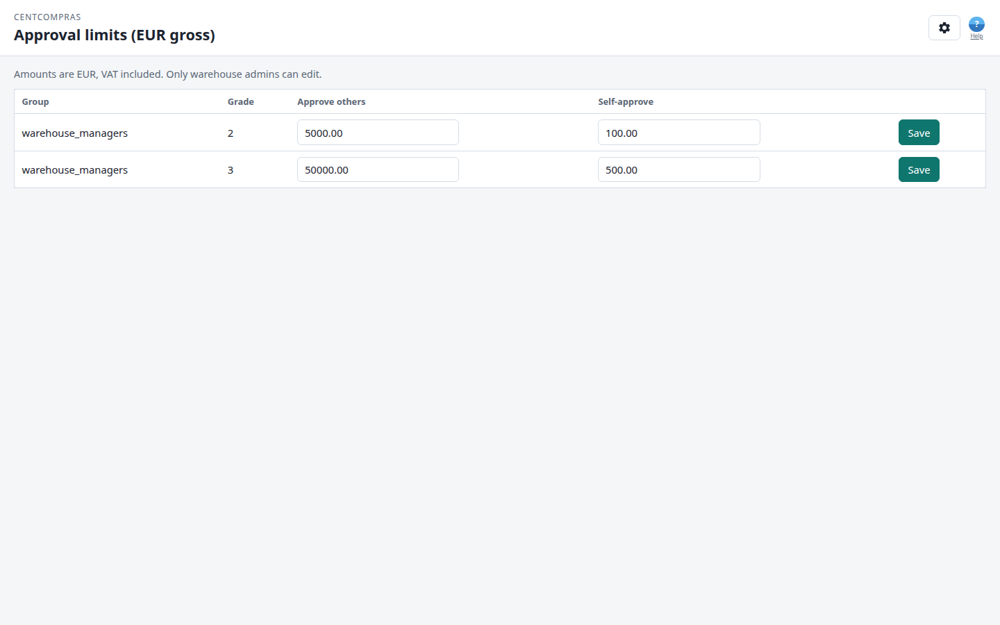

# CentCompras — Manual do utilizador: Limites de aprovação

**As consolas de limites de aprovação** · Versão 1.0 · Para pessoal do armazém (admin / gestor / operador)

> **Complemento:** [Casos limite, limites e resolução de problemas](05-edge-cases-and-limits.md) — referência de mensagens de erro e limites numéricos. [Encomendas de compra](02-purchase-orders.md) — onde se aplicam os tetos de encomendas de compra do armazém. [Filiais e requisição interna](04-internal-requests.md) — onde se aplicam os tetos dos gestores de filial. [Referência de administração e superutilizador](06-admin-reference.md) — utilizadores, funções, permissões.

---

## Para onde vou?

> **Abra o browser e aceda a:**
>
> - **Tetos de encomendas de compra do armazém:** **`https://<o-seu-domínio>/manage/approval-limits/`**
> - **Tetos dos gestores de filial:** **`https://<o-seu-domínio>/manage/branch-approval-limits/`**
>
> *(Em desenvolvimento na sua máquina: `http://127.0.0.1:8000/manage/approval-limits/` e `http://127.0.0.1:8000/manage/branch-approval-limits/`)*

Inicie sessão com o email e palavra-passe (os que o administrador lhe deu). Estas consolas são **só de leitura para a maior parte do pessoal** — só os **administradores** de armazém podem alterar os tetos (ver §3).

---

## 1. O que são limites de aprovação

Os limites de aprovação são **tetos monetários** (em **EUR, IVA incluído**) que controlam quem pode aprovar o quê:

| Teto | Aplica-se a | Modelo |
|-----|-----------|-------|
| **Teto de encomenda de compra do armazém** | Aprovar uma **encomenda de compra** (`/manage/purchase-orders/`) | `ApprovalLimit` (grupo + grau → outros/próprio) |
| **Teto do gestor de filial** | Aprovar um **pedido interno** (`/manage/internal-requests/` + `/branch/…`) | `BranchApprovalLimit` (função `manager` → outros/próprio) |

Cada teto tem **dois valores**:

- **Aprovar outros** — o montante bruto máximo que uma pessoa pode aprovar num documento **criado por outra pessoa**.
- **Auto-aprovação** — o montante bruto máximo que uma pessoa pode aprovar num documento **que ela própria criou**.

O teto **próprio** é sempre mais baixo — não se deve aprovar o próprio trabalho além de montantes pequenos.

---

## 2. As duas consolas num relance

### 2.1 Tetos de encomendas de compra do armazém — `/manage/approval-limits/`

Uma tabela com uma linha por **grupo + grau**:

| Coluna | Significado |
|--------|---------|
| **Group** | O grupo de armazém a que o teto se aplica (p. ex. `warehouse_managers`) |
| **Grade** | O grau dentro desse grupo (gestores: 1–3; operadores: 1–2) |
| **Approve others** | Máx. bruto (EUR) que este grau pode aprovar numa encomenda de compra de **outro utilizador** |
| **Self-approve** | Máx. bruto (EUR) que este grau pode aprovar na **própria** encomenda de compra |
| *(botão)* | **Save** — grava as suas edições (só administradores) |

As predefinições são criadas automaticamente e nunca sobrescrevem as suas edições:

| Group | Grade | Approve others | Self-approve |
|-------|:---:|---:|---:|
| `warehouse_managers` | 2 | € 5 000,00 | € 100,00 |
| `warehouse_managers` | 3 | € 50 000,00 | € 500,00 |

### 2.2 Tetos dos gestores de filial — `/manage/branch-approval-limits/`

Um único painel para o **único teto global de gestor**:

| Campo | Significado |
|-------|---------|
| **Others** | Máx. bruto (EUR) que um **gestor** de filial pode aprovar num pedido criado por **outra pessoa** |
| **Self** | Máx. bruto (EUR) que um gestor de filial pode aprovar num pedido **que criou** |
| **Save** | Grava as suas edições (só administradores) |

Predefinição:

| Role | Approve others | Self-approve |
|------|---:|---:|
| `manager` | € 5 000,00 | € 100,00 |

**Os administradores de filial não têm teto (ilimitados)** — não há linha para eles. **Os operadores nunca aprovam.** Estes tetos são **globais em todas as filiais** nesta fase.

---

## 3. A sua função — o que pode fazer

| Função | Ver os tetos | Editar os tetos |
|------|:---:|:---:|
| **Admin** (`warehouse_admins`) | ✅ | ✅ |
| **Gestor** (`warehouse_managers`) | ✅ | ❌ |
| **Operador** (`warehouse_data_operators`) | ✅ | ❌ |

- Todos com acesso ao armazém podem **ver** ambas as consolas.
- Só os **administradores** de armazém podem alterar limites — os campos ficam desativados para todos os outros, e a API rejeita edições com: *«Only warehouse admins can change approval limits.»*
- No Django `/admin/` estas tabelas são **só de leitura** — as alterações do dia a dia passam por estas duas consolas (que escrevem o registo de auditoria).

---

## 4. Como os tetos se aplicam

**Encomendas de compra (tetos de encomendas de compra do armazém):**

- Gestor **grau 1**: não pode aprovar de todo.
- Gestor **grau 2+**: pode aprovar uma encomenda de compra quando o **total bruto** está dentro do teto — `Approve others` para encomenda de outra pessoa, `Self-approve` para a própria.
- **Administradores** aprovam qualquer montante.

**Pedidos internos (tetos dos gestores de filial):**

- Estes tetos em EUR só se aplicam quando a empresa está no modo comercial de filial **com preços** (superutilizador: `/admin/` → Branch commercial settings). **Sem preços** (omissão): um gestor de filial concorda ou recusa **sem teto em euros**.
- No modo **com preços**, um **gestor** de filial pode aprovar um pedido dentro do teto global de gestor — `Others` para pedidos criados por outros utilizadores, `Self` para os próprios.
- **Administradores** de filial: ilimitados. **Operadores**: nunca aprovam.

Se um documento ultrapassar o teto, verá um erro como:

- *«Approval is limited to € … gross (this PO is …).»* — acima do teto **outros** → peça a um aprovador de grau superior.
- *«Self-approval is limited to € … gross …»* — acima do teto **próprio** → peça a outra pessoa para aprovar.
- *«No approval limit is configured for this grade.»* — falta uma linha `ApprovalLimit` → peça a um administrador de armazém para a definir.

---

## 5. Histórico (registo de auditoria)

Cada alteração a um limite fica registada: **quem** alterou, **quando**, e os valores **antigo → novo**, nas tabelas `ApprovalLimitChangeLog` / `BranchApprovalLimitChangeLog`. Estes registos são só de leitura em todo o lado — são o registo de auditoria.

---

## 6. FAQ

**P1. Vejo os tetos mas os campos estão cinzentos — porquê?**
Só os **administradores** de armazém podem editar limites de aprovação. Se for gestor ou operador, as consolas são só de leitura de propósito.

**P2. O que significa «bruto» aqui?**
O total **bruto** = líquido + IVA — o montante completo a financiar. Os tetos verificam-se contra o bruto, IVA incluído.

**P3. Posso aprovar a minha própria encomenda de compra / pedido?**
**Encomendas de compra:** só até ao teto de **auto-aprovação** (€ 100 / € 500 por predefinição). Acima disso, outro aprovador tem de aprovar. **Pedidos internos:** no modo **sem preços** (omissão) não há teto em euros — o gestor concorda ou recusa. No modo **com preços** o teto de auto-aprovação aplica-se da mesma forma que nas encomendas de compra.

**P4. Alterei um valor mas reverteu / mostra erro — porquê?**
Os valores têm de ser **zero ou superior**, com no máximo **2 casas decimais**. Valores negativos são rejeitados. Verifique também o banner no topo da consola para a mensagem exata.

**P5. Alterámos os tetos — as predefinições voltam?**
Não. As predefinições só são criadas **quando falta uma linha**; nunca sobrescrevem as suas edições.

**P6. Os tetos de filial são por filial ou globais?**
**Globais** nesta fase — um teto de gestor aplica-se a todas as filiais. Tetos por filial podem vir mais tarde.
